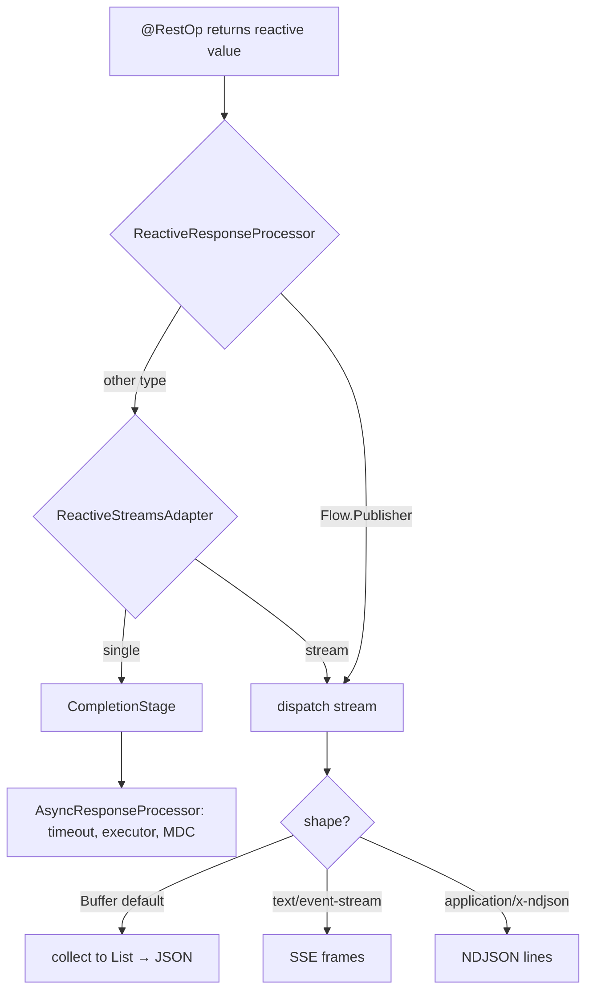

`@RestOp` handler methods may return reactive-streams values. **The feature is fully opt-in by adding a module to the classpath** — a bare `juneau-rest-server` has zero reactive behavior and its `DefaultConfig` wires no reactive processor.

Two layers stack on top of core:

| Classpath | Enables |
|---|---|
| bare `juneau-rest-server` | *(no reactive behavior — a `Flow.Publisher` return is serialized as an ordinary object)* |
| `+ juneau-rest-server-reactive` | JDK-native `java.util.concurrent.Flow.Publisher<T>` returns (dependency-free) |
| `+ juneau-rest-server-reactive-reactor` | Project Reactor (`Mono` / `Flux`), RxJava 3 (`Single` / `Maybe` / `Completable` / `Flowable` / `Observable`), and the generic `org.reactivestreams.Publisher<T>` |

Both modules are server-side only. `juneau-rest-server-reactive` is dependency-free; `juneau-rest-server-reactive-reactor` declares Reactor / RxJava / Reactive-Streams in `provided` scope.

This feature shares the [async-returns](/docs/topics/RestServerAsyncDispatch) plumbing: single-value reactive types collapse onto the existing `CompletableFuture` path, and multi-value streams are rendered as a buffered list, Server-Sent Events, or newline-delimited JSON.

## Quick start

```java
@Rest(path="/feed")
public class FeedResource extends BasicRestServlet {

    @Inject ArticleService articles;

    // Single value — uses the async (CompletableFuture) path under the hood.
    @RestGet("/{id}")
    public Mono<Article> get(@Path String id) {
        return articles.findById(id);
    }

    // Bounded stream — collected into a JSON array (the default shape).
    @RestGet("/recent")
    public Flux<Article> recent() {
        return articles.recent(20);
    }

    // Unbounded stream as Server-Sent Events.
    @RestGet("/live")
    public Flux<SseEvent> live(RestResponse res) {
        res.setContentType("text/event-stream");
        return articles.liveEvents();
    }
}
```

## Architecture

A single response processor — `ReactiveResponseProcessor` (`org.apache.juneau.rest.server.reactive`, shipped in the opt-in `juneau-rest-server-reactive` module) — is the shared spine for all reactive return-type support.

**Auto-registration (no manual wiring).** The processor is *not* listed in `DefaultConfig`. Instead, `juneau-rest-server-reactive` ships a `META-INF/services/org.apache.juneau.rest.server.processor.ResponseProcessor` provider file naming `ReactiveResponseProcessor`. `RestContext` discovers module-contributed response processors via `ServiceLoader` and front-loads them ahead of `AsyncResponseProcessor` in the chain. On a bare `juneau-rest-server` classpath this discovery finds nothing, so the chain is identical to its pre-feature state. Once the module is present, the processor:

1. Natively recognizes `java.util.concurrent.Flow.Publisher<T>` (no external dependency).
2. For any other return value, consults registered `ReactiveStreamsAdapter` providers (discovered via the same `ServiceLoader` mechanism). The `juneau-rest-server-reactive-reactor` module supplies adapters for Reactor, RxJava 3, and the generic Reactive-Streams `Publisher`.

Each adapter converts its library's type into one of two JDK-native shapes, expressed by the `Adaptation` value type:

- a **single-value** `java.util.concurrent.CompletionStage` (e.g. `Mono`, `Single`, `Maybe`, `Completable`), or
- a **multi-value** `Flow.Publisher` (e.g. `Flux`, `Flowable`, `Observable`, `Publisher`).

Single-value adaptations are handed back to the response chain as a `CompletionStage`, where the existing `AsyncResponseProcessor` picks them up — so they inherit its timeout, [`@Rest(asyncCompletionExecutor)`](/docs/topics/RestServerAsyncDispatch) routing (TODO-118), and [SLF4J MDC bridge](/docs/topics/RestServerAsyncDispatch) (TODO-117) for free.



## Response shapes for multi-value streams

A streaming publisher is rendered as one of three shapes, **selected by the negotiated response media type** — the handler's `Content-Type` (set via `res.setContentType(...)` or `@RestOp(produces=...)`), and failing that, the request `Accept` header:

| Shape | Trigger media type(s) | Behavior |
|---|---|---|
| **Buffer** (default) | anything else / unspecified | All elements collected into a `List` and serialized through the normal serializer chain (e.g. a JSON array). The collection is wrapped in a `CompletableFuture` and handed to the async path, so a slow producer never blocks the request thread. |
| **SSE** | `text/event-stream` | Each element emitted as a Server-Sent-Events frame. `SseEvent` elements are written verbatim; any other element type is JSON-encoded into the `data:` field. |
| **NDJSON** | `application/x-ndjson`, `application/jsonl`, `application/json-seq` | Each element JSON-encoded on its own line. |

The default-to-buffer choice is deliberate: a bare `Flux<Article>` with no content-type hint produces a normal JSON array, which is the least surprising result for the majority of callers. Streaming is an explicit opt-in via the content type.

### Choosing the shape

```java
// Buffer (default) — JSON array.
@RestGet("/page")
public Flux<Row> page() { return repo.page(50); }

// SSE — handler sets the content type.
@RestGet("/events")
public Flux<SseEvent> events(RestResponse res) {
    res.setContentType("text/event-stream");
    return bus.subscribe();
}

// NDJSON — via @RestOp(produces=...) instead of setting it imperatively.
@RestGet(path="/export", produces="application/x-ndjson")
public Flux<Row> export() { return repo.everything(); }

// Shape can also be driven by the client's Accept header when the handler
// leaves the content type unset.
```

## Backpressure

Streaming subscribers request **one element at a time** — `request(1)` on subscribe, and `request(1)` again after each frame is written and flushed. Because writing to the servlet output stream blocks until the socket accepts the bytes, this provides natural backpressure: the producer is paced by the client's drain rate and the server-side buffer does not grow without bound.

Buffer-shape subscribers request `Long.MAX_VALUE`, since the collection is bounded by the publisher's own completion. Apply your own bound (`.take(n)`, `.limitRequest(n)`, paging) before returning a publisher you intend to buffer — an unbounded `Flux` buffered to a `List` will accumulate in memory.

`Observable` (which has no native backpressure) is converted to a `Flowable` with `BackpressureStrategy.BUFFER` before adaptation.

## Threading, executors, and MDC

- **Buffer-shape** responses route through `AsyncResponseProcessor` and therefore honor `@Rest(asyncCompletionExecutor)` and the SLF4J MDC bridge exactly as a `CompletableFuture` return would.
- **Streaming-shape** frame writes happen on whichever thread the publisher emits on (the Reactor / RxJava scheduler). This processor does **not** impose a `subscribeOn(...)`, so it never fights the library's own scheduler model. When MDC propagation is enabled (`RestContext.isMdcAsyncPropagation()`), the request-thread MDC snapshot is reinstalled around each `onNext` / terminal callback so log statements emitted while writing a frame see the request's diagnostic context.

## Synchronous fallback

In environments where `HttpServletRequest.startAsync()` is unsupported — notably Juneau's `MockServletRequest` used by `MockRestClient` in unit tests — streaming subscribes synchronously and blocks the request thread until the publisher terminates (bounded by the configured async timeout), writing frames as they arrive. This keeps the unit-test surface working without a real servlet container.

## The modules

### `juneau-rest-server-reactive` (JDK-native core)

Dependency-free. Carries `ReactiveResponseProcessor`, the `ReactiveStreamsAdapter` SPI, the `Adaptation` value type, and the `META-INF/services/...ResponseProcessor` auto-registration file. Add this alone to enable `Flow.Publisher<T>` returns with no third-party library:

```xml
<dependency>
    <groupId>org.apache.juneau</groupId>
    <artifactId>juneau-rest-server-reactive</artifactId>
    <version>${juneau.version}</version>
</dependency>
```

### `juneau-rest-server-reactive-reactor` (third-party bridge)

The bridge module is **server-side only** and opt-in, and depends on `juneau-rest-server-reactive`. All three backing libraries are `provided`-scope: a `dependency:tree` on `juneau-rest-server` (or `juneau-rest-server-reactive`) never surfaces `reactor-core`, `rxjava`, or `reactive-streams`. Adapters are discovered lazily via `ServiceLoader` and skipped at runtime if their backing library is absent from the classpath, so you add the module plus **only the reactive library you actually use** (it transitively pulls `juneau-rest-server-reactive`, so you do not need to declare the reactive module separately):

```xml
<dependency>
    <groupId>org.apache.juneau</groupId>
    <artifactId>juneau-rest-server-reactive-reactor</artifactId>
    <version>${juneau.version}</version>
</dependency>
<dependency>
    <groupId>io.projectreactor</groupId>
    <artifactId>reactor-core</artifactId>
    <version>3.6.11</version>
</dependency>
```

| Adapter | Handles | Adapts to |
|---|---|---|
| `ReactorReactiveAdapter` | `Mono<T>` / `Flux<T>` | `Mono` → `CompletionStage` (`Mono.toFuture()`); `Flux` → `Flow.Publisher` (`FlowAdapters`) |
| `RxJavaReactiveAdapter` | `Single` / `Maybe` / `Completable` / `Flowable` / `Observable` | single types → `CompletionStage`; `Flowable` → `Flow.Publisher`; `Observable` → `Flowable(BUFFER)` → `Flow.Publisher` |
| `ReactiveStreamsPublisherAdapter` | generic `org.reactivestreams.Publisher<T>` | `Flow.Publisher` (`FlowAdapters`); registered last so `Mono`/`Flux` resolve as single/stream first |

An empty `Mono` / `Maybe` / `Completable` completes the response with a `null` body.

### Extending with your own adapter

Bridge any other reactive library by implementing `ReactiveStreamsAdapter` and registering it via `META-INF/services`:

```java
public class MyLibAdapter implements ReactiveStreamsAdapter {
    @Override public boolean canAdapt(Object v) { return v instanceof MyAsync || v instanceof MyStream; }
    @Override public Adaptation adapt(Object v) {
        if (v instanceof MyAsync<?> a) return Adaptation.single(a.toCompletionStage());
        return Adaptation.stream(FlowAdapters.toFlowPublisher(((MyStream<?>) v).toReactiveStreams()));
    }
}
```

```
# META-INF/services/org.apache.juneau.rest.server.reactive.ReactiveStreamsAdapter
com.example.MyLibAdapter
```

## Configuration summary

| Setting | Where | Effect |
|---|---|---|
| return `Flow.Publisher<T>` | `@RestOp` method (with `juneau-rest-server-reactive`) | JDK-native streaming, no third-party dependency |
| return `Mono` / `Single` / `Maybe` / `Completable` | `@RestOp` method (with `juneau-rest-server-reactive-reactor`) | single value via async path |
| return `Flux` / `Flowable` / `Observable` / `Publisher` | `@RestOp` method (with `juneau-rest-server-reactive-reactor`) | stream — shape by content type |
| `res.setContentType("text/event-stream")` | handler body | force SSE shape |
| `res.setContentType("application/x-ndjson")` | handler body | force NDJSON shape |
| (no content type) | — | buffer to list (JSON array) |

## Acceptance verification

The opt-in contract is verified from both sides:

| Behavior | Test | Module |
|---|---|---|
| **Bare** `juneau-rest-server` does NOT process `Flow.Publisher` reactively | `ReactiveOptIn_BareServer_Test` | `juneau-rest-mock` (no reactive module on its classpath) |
| `Flow.Publisher` buffered to JSON array (default) | `ReactiveResponseProcessor_Test` | `juneau-utest` |
| `Flow.Publisher<SseEvent>` → SSE frames | `ReactiveResponseProcessor_Test` | `juneau-utest` |
| POJO element stream → SSE / NDJSON | `ReactiveResponseProcessor_Test` | `juneau-utest` |
| Publisher error propagation | `ReactiveResponseProcessor_Test` | `juneau-utest` |
| Reactor `Mono` / `Flux` adaptation | `ReactiveBridge_Test` | `juneau-utest` |
| RxJava `Single` / `Maybe` / `Completable` / `Flowable` / `Observable` adaptation | `ReactiveBridge_Test` | `juneau-utest` |
| Generic `org.reactivestreams.Publisher` adaptation | `ReactiveBridge_Test` | `juneau-utest` |
