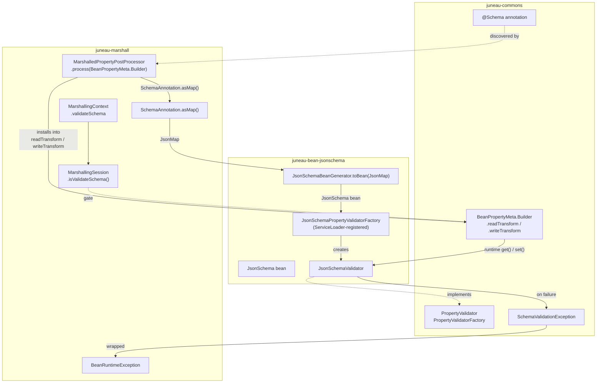

# Schema Validation Mode for Juneau Parsers and Serializers

## Overview

Add an opt-in `validateSchema` flag on `MarshallingContext` that, when enabled, validates bean
property values against the constraints declared by `@Schema` annotations on those properties.
Validation runs during both **parsing** (value set on the bean) and **serialization** (value read
from the bean).

The validation engine is built on top of **`juneau-bean-jsonschema`** — the typed `JsonSchema`
bean we already have (TODO-8, TODO-6) becomes the single source of truth for what a "schema" is.
A new `JsonSchemaValidator` walks the bean tree against a value. The marshall layer discovers the
validator via a thin SPI seam in commons and installs it into the existing
`readTransform` / `writeTransform` slots on `BeanPropertyMeta.Builder`.

`HttpPartSchema.validateOutput()` continues to exist for its current REST / OpenAPI uses; it is
**not** the engine for `MarshallingContext.validateSchema`.

## Why JSON Schema, not HttpPartSchema

- `JsonSchema` is the modern Draft 2020-12 standard and is the shape AI / LLM tooling already
  consumes (function-calling specs, structured output schemas).
- We just landed `JsonSchemaBeanGenerator`, `JsonSchema`, `JsonSchemaProperty`, and `JsonSchemaRef`
  (TODO-8) plus the `summary` field across `@Schema` and the bean (TODO-6). Validation against the
  same artifact closes the loop instead of opening a parallel `HttpPartSchema`-flavoured path.
- `JsonSchema` carries Draft 2020-12 keywords (`const`, `prefixItems`, `if`/`then`/`else`,
  `dependentSchemas`, `$defs`, etc.) that `HttpPartSchema` ignores. The validator we add today
  covers a documented v1 subset; future keywords are additive on the same bean.
- A `JsonSchemaValidator` is reusable outside marshalling — REST-server response validation, AI
  tool-call response validation, OpenAPI doc consistency checks — they can all share one
  implementation.

## Module direction rule

```
juneau-commons              ← no Juneau dependencies
   ↑
juneau-marshall             ← depends on juneau-commons only
   ↑
juneau-bean-jsonschema      ← depends on juneau-marshall
```

The dependency arrow points **away from** marshall toward `juneau-bean-jsonschema`. Marshall
therefore cannot import `JsonSchema` / `JsonSchemaValidator` by type. The bridge is a small
service-loader interface in commons.

After TODO-21 / TODO-30, the following types live in **`juneau-commons`** and can host the SPI:

- `BeanPropertyMeta`, `BeanMap`, `BeanMeta`, `BeanSession`, `BeanConfigContext`
- `BeanConfig` (annotation), `Schema` (annotation), `BeanRuntimeException`,
  `SchemaValidationException` (under `org.apache.juneau.commons.httppart`), `BasicRuntimeException`

The following remain in **`juneau-marshall`**:

- `MarshallingContext`, `MarshallingSession`, `MarshallingContextable`, `HttpPartSchema`,
  `ParseException`, `@MarshalledConfig`, `MarshalledPropertyPostProcessor`,
  `SchemaAnnotation.asMap()`

## Mechanism



## Plan

### Phase 1 — Property validation SPI in commons

**File:** `juneau-core/juneau-commons/src/main/java/org/apache/juneau/commons/bean/PropertyValidator.java` (new)

```java
public interface PropertyValidator {
    /**
     * Validates the given value against the schema this validator was built from.
     *
     * @param value The value to validate. May be null.
     * @throws SchemaValidationException If the value violates the schema.
     */
    void validate(Object value) throws SchemaValidationException;
}
```

**File:** `juneau-core/juneau-commons/src/main/java/org/apache/juneau/commons/bean/PropertyValidatorFactory.java` (new)

```java
public interface PropertyValidatorFactory {
    /**
     * Builds a validator from a JSON-Schema-shaped map of constraints.
     *
     * @param schemaMap A map mirroring the JSON Schema constraint shape (the same shape
     *                  produced by SchemaAnnotation.asMap()).
     * @param propertyType The Java type of the property being validated. May be used by
     *                     the factory to choose narrower numeric / collection validators.
     * @return A validator, or null if the map carries no actionable constraints.
     */
    PropertyValidator create(JsonMap schemaMap, Class<?> propertyType);
}
```

Discovery helper (also in commons):

```java
public final class PropertyValidators {
    private static final PropertyValidatorFactory FACTORY = ServiceLoader
        .load(PropertyValidatorFactory.class)
        .findFirst()
        .orElse(null);

    public static PropertyValidatorFactory factory() { return FACTORY; }
}
```

If no factory is on the classpath, `factory()` returns `null` and the marshall side becomes a
silent no-op (`validateSchema=true` simply does nothing). This keeps `juneau-marshall` usable
without `juneau-bean-jsonschema` on the classpath.

**Note on `JsonMap`:** `JsonMap` already lives in commons (`org.apache.juneau.commons.collections`),
so the SPI signature is commons-self-contained.

### Phase 2 — `JsonSchemaValidator` in `juneau-bean-jsonschema`

**File:** `juneau-bean/juneau-bean-jsonschema/src/main/java/org/apache/juneau/bean/jsonschema/JsonSchemaValidator.java` (new)

Walks a `JsonSchema` bean and validates a value. v1 coverage:

| Group | Keywords |
|-------|----------|
| Any type | `type`, `enum`, `const` |
| Numeric | `minimum`, `maximum`, `exclusiveMinimum`, `exclusiveMaximum`, `multipleOf` (all numeric form per Draft 2020-12) |
| String | `minLength`, `maxLength`, `pattern` |
| Array | `minItems`, `maxItems`, `uniqueItems`, `items` (recursive) |
| Object | `minProperties`, `maxProperties`, `required`, `properties` (recursive into nested beans / maps) |

API:

```java
public final class JsonSchemaValidator implements PropertyValidator {
    public static JsonSchemaValidator of(JsonSchema schema);
    public static JsonSchemaValidator of(JsonMap schemaMap);   // delegates to JsonSchemaBeanGenerator.toBean(map)

    public void validate(Object value) throws SchemaValidationException;
}
```

Deferred for follow-up TODOs (do **not** implement now — document in Javadoc):

- `format` validation (email/uri/date-time/uuid/etc. — informational by default).
- `pattern`Properties, `additionalProperties`, `prefixItems`, `contains`, `minContains`,
  `maxContains`, `dependentRequired`, `dependentSchemas`.
- `allOf`, `anyOf`, `oneOf`, `not`, `if`/`then`/`else`.
- `$ref` / `$defs` resolution.
- `summary` is descriptive metadata, not a constraint — always ignored.

Implementation notes:

- Each branch throws `SchemaValidationException` with a precise message (already used by
  `HttpPartSchema`; we mirror its message style).
- Numeric comparisons use `BigDecimal` to avoid float drift on `multipleOf`.
- `uniqueItems` uses `LinkedHashSet`-based deduplication on canonical values; collections of
  beans compare via JSON form to avoid identity surprises (mirror the heuristic in
  `HttpPartSchema.isValidUniqueItems`).
- `properties` recursion: if a property's declared schema is a `JsonSchemaProperty` /
  `JsonSchemaRef`, drill into the value's bean / map representation. `Object` values that look
  like Java beans are wrapped via `BeanContext.DEFAULT.toBeanMap(value)` (commons).

### Phase 3 — `JsonSchemaPropertyValidatorFactory` + ServiceLoader registration

**File:** `juneau-bean/juneau-bean-jsonschema/src/main/java/org/apache/juneau/bean/jsonschema/JsonSchemaPropertyValidatorFactory.java` (new)

```java
public final class JsonSchemaPropertyValidatorFactory implements PropertyValidatorFactory {
    @Override
    public PropertyValidator create(JsonMap schemaMap, Class<?> propertyType) {
        if (schemaMap == null || schemaMap.isEmpty())
            return null;
        var schema = JsonSchemaBeanGenerator.toBean(schemaMap);
        return JsonSchemaValidator.of(schema);
    }
}
```

**File:** `juneau-bean/juneau-bean-jsonschema/src/main/resources/META-INF/services/org.apache.juneau.commons.bean.PropertyValidatorFactory` (new)

Contents (single line):

```
org.apache.juneau.bean.jsonschema.JsonSchemaPropertyValidatorFactory
```

**`pom.xml` change:** none — the existing `maven-bundle-plugin` configuration already packages
`META-INF/services` resources into the OSGi bundle. Spot-check the generated bundle to confirm.

### Phase 4 — Add `validateSchema` flag to `MarshallingContext`

**File:** `juneau-core/juneau-marshall/src/main/java/org/apache/juneau/MarshallingContext.java`

Mirror the existing `ignoreUnknownBeanProperties` pattern (line numbers approximate against the
current 5129-line file):

- Add `PROP_validateSchema` constant in the `PROP_*` block (~line 193, alongside `PROP_ignoreUnknownBeanProperties`).
- In `Builder`: add `private boolean validateSchema` field (~line 253).
- In `Builder()` ctor: initialize via `env("MarshallingContext.validateSchema", false)` (~line 291).
- Copy in both `Builder` copy constructors (~lines 331 and 371): `validateSchema = copyFrom.validateSchema;`.
- Add `validateSchema()` and `validateSchema(boolean)` Builder methods (~line 2438).
- Add to `hashKey()` integer packing (~line 2288).
- Add `private final boolean validateSchema` field on the context (~line 3657).
- Assign in the `MarshallingContext` ctor (~line 3711).
- Add `public boolean isValidateSchema()` getter (~line 4652).
- Add to the `properties()` method (~line 4905).

The flag does **not** need to be mirrored into `BeanConfigContext`. Validation runs inside
marshall-installed closures that already have access to the `MarshallingSession`.

### Phase 5 — Expose flag in `MarshallingSession`

**File:** `juneau-core/juneau-marshall/src/main/java/org/apache/juneau/MarshallingSession.java`

Add the delegation accessor at ~line 892 (next to `isIgnoreUnknownBeanProperties`):

```java
public final boolean isValidateSchema() { return ctx.isValidateSchema(); }
```

### Phase 6 — Install validation in `MarshalledPropertyPostProcessor`

**File:** `juneau-core/juneau-marshall/src/main/java/org/apache/juneau/MarshalledPropertyPostProcessor.java`

In the existing `process(BeanPropertyMeta.Builder b)` method (called once per property at
bean-meta construction time):

1. Resolve the validator factory once via `PropertyValidators.factory()`. If null, return.
2. Collect every `@Schema` annotation reachable from `b.innerField`, `b.getter`, and `b.setter`
   via the `AnnotationProvider` (mirror the discovery pattern already used by
   `installSwapAwareTransforms`).
3. If none found, leave the slots alone and return.
4. Build the schema map once:
   ```java
   var schemaMap = SchemaAnnotation.asMap(schemas);   // existing method; merges multiple @Schemas
   var validator = factory.create(schemaMap, b.propertyType());
   if (validator == null) return;
   ```
5. Wrap `readTransform` (serializer / `get()` path):
   ```java
   var innerRead = b.readTransform;
   b.readTransform = (session, o) -> {
       Object v = innerRead != null ? innerRead.apply(session, o) : o;
       if (session instanceof MarshallingSession ms && ms.isValidateSchema()) {
           try {
               validator.validate(v);
           } catch (SchemaValidationException e) {
               throw new BeanRuntimeException(e, "Schema validation failed on property ''{0}'': {1}", b.name, e.getMessage());
           }
       }
       return v;
   };
   ```
6. Wrap `writeTransform` (parser / `set()` path) symmetrically — validate the value **before**
   the inner transform runs so the bean never sees an invalid value:
   ```java
   var innerWrite = b.writeTransform;
   b.writeTransform = (session, o) -> {
       if (session instanceof MarshallingSession ms && ms.isValidateSchema()) {
           try {
               validator.validate(o);
           } catch (SchemaValidationException e) {
               throw new BeanRuntimeException(e, "Schema validation failed on property ''{0}'': {1}", b.name, e.getMessage());
           }
       }
       return innerWrite != null ? innerWrite.apply(session, o) : o;
   };
   ```

**Exception strategy** — wrap `SchemaValidationException` in `BeanRuntimeException` on both paths:

- `BeanPropertyMeta.set()` already wraps property-set failures in `BeanRuntimeException`; the
  parser's outer catch block unwraps these into `ParseException`. The parser path therefore stays
  compatible with existing `catch (ParseException)` callers without us needing to change parser
  internals.
- `BeanPropertyMeta.get()` likewise propagates `BeanRuntimeException` up to the serializer.

### Phase 7 — Defer bean-level validation

Bean-level constraints (`required`, `minProperties`, `maxProperties` on the bean itself, not on
its properties) need additional design work:

- Where exactly to run the check (`BeanMap.getBean()` post-parse? on serialize entry? per-property
  during the set sweep?).
- How to install the class-level validator from marshall without adding new fields to `BeanMeta`
  in commons (likely a new `Consumer<BeanMap<?>>` SPI hook on `BeanMeta.Builder`).

**Decision for this TODO:** ship property-level validation first. Open a follow-up TODO for
bean-level validation once the property-level surface lands. Note that `JsonSchemaValidator`
**does** handle nested-object validation when invoked via a property containing a bean / map —
the deferred work is only the **top-level** bean's own constraints.

### Phase 8 — Expose through `MarshallingContextable.Builder`

**File:** `juneau-core/juneau-marshall/src/main/java/org/apache/juneau/MarshallingContextable.java`

Add `validateSchema()` and `validateSchema(boolean)` near ~line 1991, delegating to
`bcBuilder.validateSchema(...)` — mirrors `ignoreUnknownBeanProperties()`. This automatically
propagates the setter to:

- `Parser.Builder` (extends `MarshallingContextable.Builder` directly)
- `Serializer.Builder` (extends it transitively via `MarshallingTraverseContext.Builder`)
- All their subclass builders.

### Phase 9 — `@BeanConfig` annotation support

**File 1:** `juneau-core/juneau-commons/src/main/java/org/apache/juneau/commons/bean/BeanConfig.java`

Add the annotation method near the existing `ignoreUnknownBeanProperties()` (~line 448):

```java
/**
 * Enables schema validation against {@code @Schema}-annotated bean properties.
 *
 * <p>
 * Equivalent to {@link MarshallingContext.Builder#validateSchema()}.
 *
 * @return The annotation value.
 * @since 9.5.0
 */
String validateSchema() default "";
```

**File 2:** `juneau-core/juneau-marshall/src/main/java/org/apache/juneau/annotation/BeanConfigAnnotation.java`

In `Applier.apply(...)` (~line 83), add one line:

```java
bool(a.validateSchema()).ifPresent(b::validateSchema);
```

### Phase 10 — Tests

#### 10.1 — Validator in isolation

**File:** `juneau-utest/src/test/java/org/apache/juneau/bean/jsonschema/JsonSchemaValidator_Test.java` (new)

Tested directly against `JsonSchema` beans, no marshalling involvement. Matrix:

| ID | Subject |
|----|---------|
| a01 | `type=string`, primitive coercion / mismatch |
| a02 | `enum` — value-in-set / value-not-in-set |
| a03 | `const` — equal / not-equal |
| b01 | `minLength` / `maxLength` |
| b02 | `pattern` — match / non-match / invalid regex |
| c01 | `minimum` / `maximum` (numeric form) |
| c02 | `exclusiveMinimum` / `exclusiveMaximum` (Draft 2020-12 numeric form) |
| c03 | `multipleOf` — exact / drift edge case (BigDecimal) |
| d01 | `minItems` / `maxItems` |
| d02 | `uniqueItems` |
| d03 | `items` — recursive into element schemas |
| e01 | `required` on a nested object |
| e02 | `minProperties` / `maxProperties` on a nested object |
| e03 | `properties` — recursive validation through `JsonSchemaProperty` |
| f01 | Null handling — `type=string` with null and `required` not set |
| f02 | Empty schema — `JsonSchemaValidator.of(new JsonSchema())` is a no-op |
| f03 | Round-trip — schema produced by `JsonSchemaBeanGenerator.generate(SomeBean.class)` validates a matching instance |

#### 10.2 — Validator wired through marshalling

**File:** `juneau-utest/src/test/java/org/apache/juneau/MarshallingContext_ValidateSchema_Test.java` (new)

Matrix:

| ID | Subject |
|----|---------|
| g01 | `@Schema(minLength=…, maxLength=…)` — parser violation throws `ParseException`; serializer violation throws `SerializeException` |
| g02 | `@Schema(pattern=…)` |
| g03 | `@Schema(_enum=…)` |
| g04 | `@Schema(minimum=…, maximum=…)` |
| g05 | `@Schema(exclusiveMinimum=…, exclusiveMaximum=…)` numeric form |
| g06 | `@Schema(multipleOf=…)` |
| g07 | `@Schema(minItems=…, maxItems=…)` |
| g08 | `@Schema(uniqueItems=true)` |
| h01 | Default parser/serializer — **no** validation (default behaviour preserved) |
| h02 | `.validateSchema(true)` then `.validateSchema(false)` — round-trips the flag |
| i01 | Multi-format — same `MyBean` validated through JSON, XML, UON, MsgPack |
| i02 | Nested beans — `@Schema` on inner-bean properties also triggers |
| i03 | `@BeanConfig(validateSchema="true")` on a `@Rest`-style class flips the flag |
| j01 | Validation closure is **installed once per BeanMeta**, not per parse / serialize call (verified via a hit-counter in a stub factory) |
| j02 | No `juneau-bean-jsonschema` on the classpath — `validateSchema=true` is a silent no-op (manual / module-test for this case) |

#### 10.3 — Skeleton

```java
public static class MyBean {
    @Schema(minLength="2", maxLength="10")
    public String name;

    @Schema(minimum="0", maximum="150")
    public int age;

    @Schema(pattern="^[a-z]+$")
    public String code;

    @Schema(_enum="ACTIVE,INACTIVE")
    public String status;

    @Schema(minItems="1", maxItems="5")
    public List<String> tags;
}

@Test void g01_stringMinMaxLength() {
    var p = JsonParser.create().validateSchema().build();

    assertEquals("ab", p.parse("{name:'ab'}", MyBean.class).name);

    assertThrows(ParseException.class, () -> p.parse("{name:'a'}", MyBean.class));
    assertThrows(ParseException.class, () -> p.parse("{name:'abcdefghijk'}", MyBean.class));

    // Default parser - no validation
    assertEquals("a", JsonParser.DEFAULT.parse("{name:'a'}", MyBean.class).name);
}
```

### Phase 11 — Documentation

- **Javadoc on `MarshallingContext.Builder.validateSchema()`** — describe what is validated, when
  validation runs (parser set + serializer get), which exceptions are thrown, the v1 keyword
  coverage, and include a short parser-and-serializer example.
- **Javadoc on `JsonSchemaValidator`** — list supported keywords, deferred keywords, and a
  `JsonSchemaValidator.of(JsonSchema).validate(value)` snippet.
- **Javadoc on `PropertyValidator` / `PropertyValidatorFactory`** — explain the SPI seam and the
  ServiceLoader registration.
- **`Schema.java` class-level Javadoc** — note that `validateSchema` mode consumes the constraint
  attributes at runtime on bean properties.
- **`juneau-docs/pages/release-notes/9.5.0.md`** — new bullet under `juneau-marshall`:
  "Schema validation mode (`MarshallingContext.Builder.validateSchema()`) backed by the typed
  `JsonSchema` bean and Draft 2020-12 semantics…".
- **`juneau-docs/pages/topics/02.25.JsonSchemaDetails.md`** — add a "Schema validation" section
  pointing to `JsonSchemaValidator` and `MarshallingContext.validateSchema()`.
- **`juneau-docs/pages/topics/04.04.JuneauBeanJsonSchema.md`** — add `JsonSchemaValidator` to the
  "Key types" list with a short usage example.
- **New topic** (location TBD; likely under marshall topics) covering enabling the flag,
  supported constraints, exception handling, REST/DTO scenarios, and the silent-no-op behaviour
  when `juneau-bean-jsonschema` is absent.
- `@since 9.5.0` on every new public symbol.

### Phase 12 — Verify & archive

1. `./scripts/test.py --full` — full reactor build + tests.
2. `./scripts/coverage.py juneau-bean/juneau-bean-jsonschema/src/main/java/org/apache/juneau/bean/jsonschema/JsonSchemaValidator.java --branches` — confirm validator branches are covered.
3. `./scripts/coverage.py juneau-core/juneau-marshall/src/main/java/org/apache/juneau/MarshalledPropertyPostProcessor.java --branches` — confirm new validation branches are covered.
4. `./scripts/coverage.py juneau-core/juneau-marshall/src/main/java/org/apache/juneau/MarshallingContext.java --branches` — spot-check the new `validateSchema` accessor / builder path.
5. `/todo cleanup 12` — archive plan as `FINISHED-12-schema-validation.md` and remove the
   `[TODO-12]` line from `todo/TODO.md`.

---

## Risks / open questions

1. **Parser exception propagation** — confirm that `BeanRuntimeException` thrown from
   `writeTransform` is lifted to `ParseException` by the parser's outer catch block. If not,
   either introduce a small SPI tweak (allow `writeTransform` to throw a checked
   `ParseException`) or wrap inside the closure to produce the exact exception class the parser
   expects.
2. **`AnnotationProvider` reach at install time** — verify that `BeanPropertyMeta.Builder` exposes
   enough metadata (`innerField`, `getter`, `setter`) and an `AnnotationProvider` to collect
   `@Schema` annotations at `process(...)` time. The existing
   `installSwapAwareTransforms(...)` already does very similar discovery; the same pattern
   should apply.
3. **One-time cost** — building the `JsonSchema` bean + `JsonSchemaValidator` per property at
   install time should be a one-time cost per `BeanMeta`, not per parse/serialize call. Verify
   via test j01 (counter-based assertion).
4. **ServiceLoader timing** — `PropertyValidators.FACTORY` is initialised statically on first
   access. In a multi-classloader environment (OSGi, app servers) the factory may be invisible to
   the consumer's classloader. If this surfaces, we add a `set/getFactory(...)` static setter as
   an escape hatch.
5. **Bundle visibility** — confirm the OSGi `Export-Package` / `Provide-Capability` entries on
   `juneau-bean-jsonschema` allow the ServiceLoader file to be picked up by marshall's
   classloader. If not, switch to OSGi's declarative-services equivalent.
6. **JSON Schema vs OpenAPI-only constraints** — a few `HttpPartSchema` constraint flavours
   (`collectionFormat`, OpenAPI `nullable`, etc.) are OpenAPI-only and have no Draft 2020-12
   counterpart. They are explicitly **not** carried into `JsonSchemaValidator`. Document the gap.
7. **TODO-6 `summary` field** — descriptive, not a constraint. Always ignored by the validator.
   Document the omission in the new topic; no code change needed.
8. **Field-only properties without getter / setter** — verify that `@Schema` discovery covers
   public fields the same way it covers getter/setter pairs.

## Audit corrections relative to the prior draft of this plan

The prior draft used `HttpPartSchema` as the engine. Switching to `juneau-bean-jsonschema`
changes the implementation strategy but keeps the public surface the same
(`MarshallingContext.Builder.validateSchema()`, `@BeanConfig(validateSchema=…)`). Material
changes from the previous draft:

1. **Engine change.** `JsonSchemaValidator` (new, in `juneau-bean-jsonschema`) replaces
   `HttpPartSchema.validateOutput()` as the validation engine. Aligns with Draft 2020-12 and the
   typed `JsonSchema` bean we already ship.
2. **New SPI in commons.** `PropertyValidator` / `PropertyValidatorFactory` decouple marshall
   from `juneau-bean-jsonschema`. ServiceLoader discovers the factory at runtime.
3. **Implementation cost.** ~300–500 new lines for `JsonSchemaValidator` plus ~30 for the
   factory and SPI. `HttpPartSchema` is left untouched and continues to serve its REST / OpenAPI
   uses.
4. **No `juneau-bean-jsonschema` on the classpath** — `validateSchema=true` is a silent no-op
   (new test case j02). The flag's documentation calls this out.
5. **Bean-level validation still deferred.** Property-level lands first; class-level
   (`required`, `minProperties`, `maxProperties` on the top-level bean) is a follow-up TODO. The
   validator itself handles nested objects fine; only the **outer** bean's constraints wait.
6. **`@MarshalledConfig` not the home for `validateSchema`.** `@BeanConfig` (commons) holds the
   attribute; `BeanConfigAnnotation.Applier` (marshall) applies it.
7. **Line numbers refreshed** against current file sizes.
