# RestClient Next-Generation Transport Abstraction Plan

## Problem Statement

The current `RestClient` in [`juneau-rest-client`](../juneau-rest/juneau-rest-client/pom.xml) is tightly coupled to Apache HttpClient 4.5.14:
- `RestClient` directly extends `BeanContextable` and **implements `org.apache.http.client.HttpClient`**
- `RestRequest` implements `HttpUriRequest` and wraps `HttpRequestBase` / `HttpEntityEnclosingRequestBase`
- `RestResponse` implements `org.apache.http.HttpResponse`
- `ResponseContent` implements `org.apache.http.HttpEntity`
- The `RestClient.Builder` exposes 40+ Apache HC-specific configuration methods (`httpClientBuilder()`, `connectionManager()`, `defaultRequestConfig()`, etc.) as thin passthroughs — e.g., `addInterceptorFirst(HttpRequestInterceptor)`, `setSSLHostnameVerifier()`, etc. These create tight coupling and will **not** be replicated in `RestClient`.
- The `RestCallHandler` interface uses Apache types: `HttpResponse run(HttpHost, HttpRequest, HttpContext)`

The `juneau-rest-common` module also depends on `httpcore` 4.4.16, using `org.apache.http.Header`, `NameValuePair`, `HttpEntity`, `StatusLine`, etc. as foundational types across ~186 classes:
- ~73 header types (`BasicHeader implements org.apache.http.Header`, `Accept`, `ContentType`, …)
- ~14 part types (`BasicPart implements org.apache.http.NameValuePair`, …)
- Entity types (`BasicHttpEntity implements org.apache.http.HttpEntity`, …)
- Response types (`BasicHttpResponse implements org.apache.http.HttpResponse`, `Ok`, `NotFound`, …)
- Status line (`BasicStatusLine implements org.apache.http.StatusLine`)

---

## Architecture Overview

```mermaid
graph TD
  juneau_marshall["juneau-marshall"]

  subgraph existing_common ["juneau-rest-common (existing, extended)"]
    juneau_rest_common["existing classes"]
    ng_http["org.apache.juneau.ng.http (new package)"]
  end

  subgraph existing_client ["juneau-rest-client (existing, extended)"]
    juneau_rest_client["existing classes"]
    ng_rest_client["org.apache.juneau.ng.rest.client (new package)"]
    RestClient["RestClient"]
    RestRequest["RestRequest"]
    RestResponse["RestResponse"]
    HttpTransport["HttpTransport interface"]
    TransportRequest["TransportRequest"]
    TransportResponse["TransportResponse (Closeable internally)"]
    HttpTransportProvider["HttpTransportProvider SPI"]
  end

  subgraph existing_mock ["juneau-rest-mock (existing, extended)"]
    ng_rest_mock["org.apache.juneau.ng.rest.mock (new package)"]
    MockTransport["MockHttpTransport"]
  end

  subgraph hc45 ["juneau-ng-rest-client-apache-httpclient-45 (new module)"]
    ApacheHc45Transport["ApacheHc45Transport"]
    ApacheHc45Builder["ApacheHc45TransportBuilder"]
  end

  subgraph hc5 ["juneau-ng-rest-client-apache-httpclient-50 (new module)"]
    ApacheHc5Transport["ApacheHc5Transport"]
    ApacheHc5Builder["ApacheHc5TransportBuilder"]
  end

  subgraph javaclient ["juneau-ng-rest-client-java-httpclient (new module)"]
    JavaHttpTransport["JavaHttpTransport"]
    JavaHttpBuilder["JavaHttpTransportBuilder"]
  end

  subgraph okhttp_mod ["juneau-ng-rest-client-okhttp (new module)"]
    OkHttpTransport["OkHttpTransport"]
    OkHttpBuilder["OkHttpTransportBuilder"]
  end

  subgraph jetty_mod ["juneau-ng-rest-client-jetty (new module)"]
    JettyHttpTransport["JettyHttpTransport"]
    JettyHttpBuilder["JettyHttpTransportBuilder"]
  end

  juneau_marshall --> juneau_rest_common
  juneau_rest_common --> juneau_rest_client

  RestClient --> HttpTransport
  RestClient --> RestRequest
  RestRequest --> TransportRequest
  RestClient --> RestResponse
  TransportResponse --> RestResponse
  HttpTransport --> TransportRequest
  HttpTransport --> TransportResponse
  HttpTransportProvider --> HttpTransport

  ApacheHc45Transport -.->|implements| HttpTransport
  ApacheHc5Transport -.->|implements| HttpTransport
  JavaHttpTransport -.->|implements| HttpTransport
  OkHttpTransport -.->|implements| HttpTransport
  JettyHttpTransport -.->|implements| HttpTransport
  MockTransport -.->|implements| HttpTransport
```



The new `org.apache.juneau.ng.*` packages do not declare `httpcore` or `httpclient` as dependencies — all new code uses JDK types only.

**Transport diversity:** Besides Apache HttpClient 4.5/5.x and the JDK client, first-class adapter modules for **OkHttp** and **Eclipse Jetty’s `HttpClient`** exercise different connection pooling, body APIs (e.g. OkHttp `RequestBody` / Jetty `ContentProvider`), and async models. That helps ensure `TransportRequest` / `TransportBody` / `TransportResponse` stay sufficient for common JVM HTTP stacks, not only Apache’s APIs.

---

## Module Structure

New code is added as new packages inside **existing** modules where possible. Only the transport adapter modules are truly new standalone modules.

### 0. `juneau-rest-common` (Existing — new package added)

- **New package**: `org.apache.juneau.ng.http` — no `httpcore` or `httpclient` dependency in this package
- **Contains**: JDK-native replacements for all ~186 types in `juneau-rest-common` that currently implement Apache HttpCore interfaces

See ng.http Package Design below.

### 1. `juneau-rest-client` (Existing — new package added)

- **New package**: `org.apache.juneau.ng.rest.client` — no `httpcore` or `httpclient` dependency in this package
- **Contains**: Transport abstractions, `RestClient`, `RestRequest`, `RestResponse`, interceptors, remote proxy support

### 2. `juneau-ng-rest-client-apache-httpclient-45` (New module)

- **Dependencies**: `juneau-rest-client`, `org.apache.httpcomponents:httpclient:4.5.14`
- **Package**: `org.apache.juneau.ng.rest.client.apachehttpclient45`
- **Contains**: `ApacheHc45Transport`, `ApacheHc45TransportBuilder`

### 3. `juneau-ng-rest-client-apache-httpclient-50` (New module)

- **Dependencies**: `juneau-rest-client`, `org.apache.httpcomponents.client5:httpclient5`
- **Package**: `org.apache.juneau.ng.rest.client.apachehttpclient50`
- **Contains**: `ApacheHc5Transport`, `ApacheHc5TransportBuilder`

### 4. `juneau-ng-rest-client-java-httpclient` (New module)

- **Dependencies**: `juneau-rest-client` (requires Java 11+)
- **Package**: `org.apache.juneau.ng.rest.client.javahttpclient`
- **Contains**: `JavaHttpTransport`, `JavaHttpTransportBuilder`

### 5. `juneau-ng-rest-client-okhttp` (New module)

- **Dependencies**: `juneau-rest-client`, `com.squareup.okhttp3:okhttp`
- **Package**: `org.apache.juneau.ng.rest.client.okhttp`
- **Contains**: `OkHttpTransport`, `OkHttpTransportBuilder`, `OkHttpTransportProvider`

### 6. `juneau-ng-rest-client-jetty` (New module)

- **Dependencies**: `juneau-rest-client`, `org.eclipse.jetty:jetty-client` (and transitive Jetty I/O deps as required by that artifact)
- **Package**: `org.apache.juneau.ng.rest.client.jetty`
- **Contains**: `JettyHttpTransport`, `JettyHttpTransportBuilder`, `JettyHttpTransportProvider`

### 7. `juneau-rest-mock` (Existing — new package added)

- **New package**: `org.apache.juneau.ng.rest.mock`
- **Contains**: `MockHttpTransport`, `MockRestClient`

---

## Beta API and Javadoc

All **new public types** shipped under `org.apache.juneau.ng.http`, `org.apache.juneau.ng.rest.client`, `org.apache.juneau.ng.rest.mock`, and the transport implementation packages (`org.apache.juneau.ng.rest.client.apachehttpclient45`, `…50`, `javahttpclient`, `okhttp`, `jetty`) are **beta**: they may change **incompatibly in the next major Juneau release** (and possibly in minors) without a full deprecation cycle, until explicitly promoted to stable in release notes.

**Class-level Javadoc (required)** — every `public` class, interface, and enum in those packages must include a prominent beta notice. Use this pattern (adjust the one-line summary per type; set `@since` to the actual release that first ships the type):

```java
/**
 * Brief description of the type.
 *
 * <p>
 * <b>Beta — API subject to change:</b> This type is part of the next-generation REST client and HTTP stack
 * ({@code org.apache.juneau.ng.*}).
 * It is not API-frozen: binary- and source-incompatible changes may appear in the <b>next major</b> Juneau release
 * (and possibly earlier).
 * For production use cases that require long-term binary stability, continue using the existing
 * {@code juneau-rest-client} and {@code juneau-rest-common} APIs until the {@code ng} stack is declared stable.
 *
 * <h5 class='section'>See Also:</h5><ul>
 * 	<li class='link'>…</li>
 * </ul>
 *
 * @since 9.x.x
 */
```

**Nested public types** (e.g. `RestClient.Builder`) **inherit the same rule**: each top-level and `public static` nested type gets the beta block (a short cross-reference to the enclosing beta type is acceptable for inner builders if the parent already states beta and the nested type’s first sentence says “Builder for {@link RestClient} (beta API).”).

**`package-info.java`** — each `org.apache.juneau.ng.*` package should include a **package-level** Javadoc paragraph restating that the whole package is beta and subject to change in the next major release.

**Release notes** — the first release that ships these modules must state clearly that `org.apache.juneau.ng.*` is **beta** and not covered by the usual strict compatibility policy until promoted.

---

## `ng.http` Package Design (in `juneau-rest-common`)

### Layering Relationship

Two distinct type layers, each with its own type system:

| Layer | Package | Types | Role |
|---|---|---|---|
| **HTTP API layer** | `org.apache.juneau.ng.http` (in `juneau-rest-common`) | `HttpHeader`, `HttpHeaderBean`, `Accept`, `ContentType`, `HttpBody`, `HttpResponseMessage`, `BasicHttpResponse`, `Ok`, … | Rich typed API used by `RestRequest` / `RestResponse` |
| **Transport layer** | `org.apache.juneau.ng.rest.client` (in `juneau-rest-client`) | `TransportHeader` (String/String), `TransportBody`, `TransportRequest`, `TransportResponse` | Lightweight wire DTOs crossing the `HttpTransport` boundary |

`RestRequest.run()` converts API-layer objects into transport-layer DTOs before calling `HttpTransport.send()`.

### Core Interfaces (replacing Apache HttpCore interfaces)

```java
// replaces org.apache.http.Header
public interface HttpHeader {
    String getName();
    String getValue();
}

// replaces org.apache.http.NameValuePair
public interface HttpPart {
    String getName();
    Object getValue();
}

// replaces org.apache.http.HttpEntity
public interface HttpBody {
    InputStream asInputStream() throws IOException;
    long getContentLength();       // -1 if unknown
    String getContentType();       // null if unknown
    String getContentEncoding();   // null if unknown
    boolean isRepeatable();
    void writeTo(OutputStream out) throws IOException;
}
```

**Streaming:** API-layer `HttpBody` implementations (including `SerializedBody` and adapters built from them) should **prefer `writeTo(OutputStream)`** when producing bytes for the wire so serializers can stream to the destination without an extra full-buffer copy. Reserve **`asInputStream()`** (or buffering the entire payload) for cases that truly need it—e.g. repeatability, logging, or a downstream API that only accepts an `InputStream`. This aligns with preferring **`HttpEntity#writeTo`** over **`getContent()`** on Apache HttpClient when the stack supports streaming.

**`org.apache.juneau.ng.http`** — `HttpStatusLine` interface (replaces `org.apache.http.StatusLine`).

**`org.apache.juneau.ng.http.response`** — response message types and the default status-line bean (response-only; not used on requests):

```java
// replaces org.apache.http.HttpResponse
public interface HttpResponseMessage {
    HttpStatusLine getStatusLine();
    HttpHeader[] getHeaders(String name);
    HttpHeader getFirstHeader(String name);
    HttpBody getBody();
}
```

Default concrete status line: `org.apache.juneau.ng.http.response.HttpStatusLineBean` implements `org.apache.juneau.ng.http.HttpStatusLine` (replaces `BasicStatusLine`).

### Foundation Classes

| New class | Replaces | Implements / extends |
|---|---|---|
| `org.apache.juneau.ng.http.header.HttpHeaderBean` | `o.a.juneau.http.header.BasicHeader` | `HttpHeader` |
| `org.apache.juneau.ng.http.header.HeaderList` | `o.a.juneau.http.header.HeaderList` | `Iterable<HttpHeader>` |
| `org.apache.juneau.ng.http.part.HttpPartBean` | `o.a.juneau.http.part.BasicPart` | `HttpPart` |
| `org.apache.juneau.ng.http.part.PartList` | `o.a.juneau.http.part.PartList` | `Iterable<HttpPart>` |
| `org.apache.juneau.ng.http.entity.HttpBodyBean` | `o.a.juneau.http.entity.BasicHttpEntity` | `HttpBody` |
| `org.apache.juneau.ng.http.entity.MultipartBody` | *(new)* | `HttpBody` — `multipart/form-data` (RFC 7578 / RFC 2388-style parts; text fields + file streams) |
| `org.apache.juneau.ng.http.response.HttpStatusLineBean` | `o.a.juneau.http.BasicStatusLine` | `HttpStatusLine` |
| `org.apache.juneau.ng.http.response.BasicHttpResponse` | `o.a.juneau.http.response.BasicHttpResponse` | `HttpResponseMessage` |
| `org.apache.juneau.ng.http.response.BasicHttpException` | `o.a.juneau.http.response.BasicHttpException` | `HttpResponseMessage` + `Exception` |

**Naming:** Minimal **interfaces** (`HttpHeader`, `HttpPart`, `HttpBody`, `HttpStatusLine`) match the old HttpCore-shaped contracts. **Foundation beans** drop the `Basic` prefix in favor of `Http*Bean` / `Http*Part` typed classes (e.g. `HttpStringPart`, `HttpStatusLineBean`) so the public API reads consistently without reusing interface names as class names.

The `Headerable` bridge interface is updated to return `HttpHeader` (not `org.apache.http.Header`). All features from `juneau-rest-common` are preserved: `Supplier<T>`-valued headers/parts, fluent builders, fluent assertions, caching.

### Typed header hierarchy (planned enhancement)

**Gap:** The first-generation stack (`org.apache.juneau.http.header`) groups headers under **format-specific abstract bases** (e.g. `Accept` → `BasicMediaRangesHeader`, `AcceptCharset` → `BasicStringRangesHeader`). Those bases expose **parsed values** and **convenience APIs** (`MediaRanges`, `StringRanges`, `Calendar`/`ZonedDateTime`, CSV tokens, etc.) on top of the wire string. The initial `org.apache.juneau.ng.http.header` delivery uses a **flat** model: every named header extends **`HttpHeaderBean`** only, so callers only see raw `String` / `Supplier<String>` unless they parse manually.

**Goal:** Reintroduce the **same conceptual hierarchy** under `org.apache.juneau.ng.http.header`, with naming aligned to the ng convention (**drop the `Basic` prefix**; prefer `Http…Header` intermediates). RFC-named types (`Accept`, `ContentType`, …) should **extend the appropriate format base**, not `HttpHeaderBean` directly, and should offer the **same category of convenience methods** as today’s `Basic*Header` hierarchy (adapted to JDK types and existing `juneau-marshall` / commons parsers where those types already live).

**Proposed intermediate types** (each `implements HttpHeader` via the inheritance chain; extend or sit alongside `HttpHeaderBean` depending on refactor — e.g. shared logic in `HttpHeaderBean` or an `AbstractHttpHeaderBean` if constructor/`of` factories need unification):

| Proposed ng base | Replaces (old) | Purpose / wire shape |
|------------------|----------------|----------------------|
| `HttpStringHeader` | `BasicStringHeader` | Opaque string value; shared `of(name, String)` / `of(name, Supplier<String>)` patterns for “plain text” headers |
| `HttpMediaTypeHeader` | `BasicMediaTypeHeader` | Single `MediaType` (e.g. `Content-Type`) |
| `HttpMediaRangesHeader` | `BasicMediaRangesHeader` | `MediaRanges` / Accept-style media ranges with parameters and q |
| `HttpStringRangesHeader` | `BasicStringRangesHeader` | `StringRanges` / comma-separated tokens with q-values (`Accept-Encoding`, `Accept-Language`, `Accept-Charset`, …) |
| `HttpCsvHeader` | `BasicCsvHeader` | Simple comma-separated list without q-semantics (`Allow`, `Content-Language`, `Via`, `Upgrade`, …) |
| `HttpDateHeader` | `BasicDateHeader` | IMF-fixdate / HTTP-date parsing (`Date`, `Expires`, `Last-Modified`, `If-*-Since`, …) |
| `HttpUriHeader` | `BasicUriHeader` | URI string validation/normalization (`Location`, `Content-Location`, `Referer`) |
| `HttpIntegerHeader` | `BasicIntegerHeader` | Integer header value (`Age`, `Max-Forwards`, …) |
| `HttpLongHeader` | `BasicLongHeader` | Long / numeric string (`Content-Length`, …) |
| `HttpBooleanHeader` | `BasicBooleanHeader` | Boolean token (`Debug`, `NoTrace`) |
| `HttpEntityTagHeader` | `BasicEntityTagHeader` | Single entity-tag (`ETag`) |
| `HttpEntityTagsHeader` | `BasicEntityTagsHeader` | Multiple entity-tags (`If-Match`, `If-None-Match`) |

**RFC-named header → base** (mirror `org.apache.juneau.http.header`; adjust only if a header’s parsing model changes):

| Named header | Extends (proposed) |
|--------------|-------------------|
| `Accept` | `HttpMediaRangesHeader` |
| `ContentType` | `HttpMediaTypeHeader` |
| `AcceptCharset`, `AcceptEncoding`, `AcceptLanguage`, `ContentDisposition`, `TE` | `HttpStringRangesHeader` |
| `Allow`, `ContentLanguage`, `Thrown`, `Upgrade`, `Via` | `HttpCsvHeader` |
| `Date`, `Expires`, `IfModifiedSince`, `IfUnmodifiedSince`, `LastModified`, `RetryAfter`*, `IfRange` | `HttpDateHeader` |
| `Location`, `ContentLocation`, `Referer` | `HttpUriHeader` |
| `Age`, `MaxForwards` | `HttpIntegerHeader` |
| `ContentLength` | `HttpLongHeader` |
| `Debug`, `NoTrace` | `HttpBooleanHeader` |
| `ETag` | `HttpEntityTagHeader` |
| `IfMatch`, `IfNoneMatch` | `HttpEntityTagsHeader` |
| Most remaining standard headers (e.g. `Authorization`, `CacheControl`, `Connection`, `Host`, `UserAgent`, …) | `HttpStringHeader` |

\*`RetryAfter` in the legacy stack extends `BasicDateHeader`; if ng chooses to model delay-seconds as a first-class variant, document whether it stays on `HttpDateHeader` or gets a small `HttpRetryAfterHeader` — either way, preserve the old **convenience surface** (parsed seconds vs. HTTP-date).

**Convenience API expectations:** Each intermediate type should expose **typed accessors** analogous to the old classes, for example:

- `HttpMediaRangesHeader` → `MediaRanges getValue()` / parse from `getValueString()`, plus static `Accept.of(MediaRanges)` / `Accept.of(String)` overloads mirroring legacy ergonomics.
- `HttpStringRangesHeader` → `StringRanges getValue()`; same pattern for `AcceptCharset.of(StringRanges)` etc.
- `HttpDateHeader` → parsed temporal type consistent with ng/JDK usage (e.g. `ZonedDateTime` or `Instant`, aligned with `juneau-marshall` HTTP-date utilities if present).
- `HttpCsvHeader` → `List<String>` or `String[]` tokens, trimming rules matching legacy `BasicCsvHeader`.
- `HttpUriHeader` → `URI` accessor where valid.

**Wire contract:** Subclasses remain **`HttpHeader`**: `getName()` / `getValue()` (and lazy `Supplier`) behavior stays compatible with `TransportHeader` conversion. Typed getters are **additional**; serialization for the wire should still use the canonical string form (or delegate to the same serializer the old `Basic*Header` used).

**Static helpers:** `HttpHeaders.*` factory methods should return the **most specific public type** (e.g. `Accept` not `HttpHeaderBean`) so callers get convenience methods without casting.

**Tests:** Extend `NgHttp_Test` (and any focused header tests) to cover **parsing edge cases** and parity with `juneau-utest` coverage for `org.apache.juneau.http.header.*` where formats overlap.

### Package Structure

```
org.apache.juneau.ng.http
├── HttpHeader.java              interface
├── HttpPart.java                interface
├── HttpBody.java                interface
├── HttpStatusLine.java          interface (replaces org.apache.http.StatusLine)
├── HttpHeaders.java             static factory helpers
├── HttpParts.java               static factory helpers
├── HttpBodies.java              static factory helpers
├── HttpResponses.java           static factory helpers
├── header/
│   ├── HttpHeaderBean.java      root bean implementing HttpHeader (generic name + string/supplier value)
│   ├── HttpStringHeader.java    (planned) intermediate — plain string headers
│   ├── HttpMediaTypeHeader.java, HttpMediaRangesHeader.java, HttpStringRangesHeader.java, … — (planned) format bases; see [Typed header hierarchy](#typed-header-hierarchy-planned-enhancement)
│   ├── HeaderList.java
│   ├── SerializedHeader.java
│   ├── Headerable.java          interface → HttpHeader
│   ├── Accept.java              extends format base (e.g. HttpMediaRangesHeader), not HttpHeaderBean directly once hierarchy lands
│   ├── ContentType.java
│   └── ... (~70 more RFC-named headers)
├── part/
│   ├── HttpPartBean.java        base for all typed parts (~14 total)
│   ├── PartList.java
│   ├── SerializedPart.java
│   └── ... (~11 typed parts, e.g. HttpStringPart, HttpDatePart)
├── entity/
│   ├── HttpBodyBean.java
│   ├── StringBody.java
│   ├── ByteArrayBody.java
│   ├── StreamBody.java
│   ├── SerializedBody.java
│   └── MultipartBody.java       multipart/form-data; builder + writeTo streams file parts
├── resource/
│   └── HttpResource.java        HttpBody + extra headers
├── response/
│   ├── HttpResponseMessage.java interface
│   ├── HttpStatusLineBean.java  concrete HttpStatusLine (replaces BasicStatusLine)
│   ├── BasicHttpResponse.java
│   ├── BasicHttpException.java
│   ├── Ok.java                  (~50 HTTP status classes)
│   ├── Created.java
│   ├── NotFound.java
│   └── ... (~47 more)
└── remote/
    ├── Remote.java              @Remote annotation (moved from juneau-rest-common)
    ├── RemoteGet.java
    ├── RemotePost.java
    ├── RemotePut.java
    ├── RemotePatch.java
    ├── RemoteDelete.java
    ├── RemoteOp.java
    ├── RemoteReturn.java
    ├── RemoteUtils.java
    ├── RrpcInterfaceMeta.java
    └── RrpcInterfaceMethodMeta.java
```

Note: The `remote/` sub-package already has no Apache HttpCore imports in `juneau-rest-common` and is co-located in `org.apache.juneau.ng.http.remote` since `juneau-rest-client` needs it and `juneau-rest-common` is already a dependency of `juneau-rest-client`.

---

## Transport Abstraction Layer Design

### Core Interfaces (in `org.apache.juneau.ng.rest.client`)

#### `HttpTransport`

The single point of abstraction replacing `org.apache.http.client.HttpClient`. Includes optional native-async support:

```java
public interface HttpTransport extends Closeable {

    TransportResponse send(TransportRequest request) throws TransportException;

    // Default: wraps send() in a CompletableFuture on the common pool.
    // Override to use native async (e.g. SfHttpConnection.connectAsync(), HC5 async).
    default CompletableFuture<TransportResponse> sendAsync(TransportRequest request) {
        return CompletableFuture.supplyAsync(() -> {
            try { return send(request); }
            catch (TransportException e) { throw new CompletionException(e); }
        });
    }
}
```

`RestRequest.runFuture()` delegates to `transport.sendAsync(transportRequest)`, which lets transports with native async (e.g. `SfHttpConnection.connectAsync()`, HC5 async client) override the default thread-pool wrapper.

#### `TransportRequest`

Immutable request object built by `RestRequest`, consumed by transport implementations. Uses only JDK types:

```java
public class TransportRequest {
    private final String method;          // GET, POST, etc.
    private final URI uri;                // Full resolved URI
    private final List<TransportHeader> headers;
    private final TransportBody body;     // null for GET/HEAD/DELETE
    // Getters, static builder
}
```

#### `TransportResponse`

Response returned by transport, wrapped by `RestResponse`. **Implements `Closeable`** so transports can register resource cleanup (connection release, stream close, etc.):

```java
public class TransportResponse implements Closeable {
    private final int statusCode;
    private final String reasonPhrase;
    private final List<TransportHeader> headers;
    private final TransportBody body;
    private final Runnable onClose;   // registered by transport impl; may be null

    @Override
    public void close() {
        if (onClose != null) onClose.run();
    }
    // Getters, static builders
}
```

`RestRequest.close()` calls `transportResponse.close()` on the response produced during `run()`. This maps to `SfHttpConnection.release()`, `CloseableHttpResponse.close()` (Apache HC), or `HttpResponse.body().close()` (JDK).

#### `TransportHeader`

Simple immutable name-value pair using only JDK types:

```java
public class TransportHeader {
    private final String name;
    private final String value;
    // Constructor, getters, factory methods
}
```

#### `TransportBody`

Body abstraction for both requests and responses:

```java
public interface TransportBody {
    InputStream asInputStream() throws IOException;
    long getContentLength();    // -1 if unknown
    String getContentType();    // MIME type, null if unknown
    boolean isRepeatable();
    void writeTo(OutputStream out) throws IOException;
}
```

**Streaming:** Transports should **prefer driving request and response bodies through `writeTo(OutputStream)`** (and the equivalent native APIs—e.g. writing directly to the connection output stream) rather than materializing the full body in memory first. When adapting `TransportBody` to a library that only offers a `getContent()`-style API, document that path as a potential full-buffer tradeoff.

#### `HttpTransportBuilder`

Common configuration interface for the well-known transport builders:

```java
public interface HttpTransportBuilder {
    HttpTransportBuilder connectTimeout(Duration timeout);
    HttpTransportBuilder readTimeout(Duration timeout);
    HttpTransportBuilder sslContext(SSLContext sslContext);
    HttpTransportBuilder hostnameVerifier(HostnameVerifier verifier);
    HttpTransportBuilder proxy(URI proxyUri);
    HttpTransportBuilder proxyCredentials(String username, String password);
    HttpTransportBuilder maxConnections(int max);
    HttpTransportBuilder maxConnectionsPerRoute(int max);
    HttpTransportBuilder followRedirects(boolean follow);
    HttpTransportBuilder connectionTimeToLive(Duration ttl);
    HttpTransportBuilder defaultCredentials(String username, String password);
    HttpTransport build();
}
```

#### `HttpTransportProvider` (SPI)

ServiceLoader-based auto-discovery of well-known transport implementations:

```java
public interface HttpTransportProvider {
    int priority();  // Higher wins when multiple providers on classpath
    String name();   // e.g., "apache-hc45", "apache-hc5", "java-native", "okhttp", "jetty"
    HttpTransportBuilder createBuilder();
}
```

Registered via `META-INF/services/org.apache.juneau.ng.rest.client.HttpTransportProvider`.

#### `TransportException`

Transport-layer exception wrapping I/O and protocol errors:

```java
public class TransportException extends IOException {
    private final TransportResponse response; // null if no response received
    // Constructors
}
```

---

## `RestClient` Design

### `RestClient`

The main client class. Key differences from current `RestClient`:
- **Does NOT implement `org.apache.http.client.HttpClient`** and does NOT extend `BeanContextable`
- **Does NOT implement `Closeable`** — has an explicit `shutdown()` method instead, signalling this is an app-lifecycle operation, not a per-call operation. The transport (connection pool, thread pool) is created externally and its lifecycle is managed by whoever created it (e.g., Spring).
- Composes an `HttpTransport` instead of extending/wrapping `CloseableHttpClient`
- Holds a single pre-instantiated `Serializer` and/or `Parser` (or `Marshaller`); no serializer configuration on the builder
- **One language per client** — no universal/multi-language mode; no format shortcuts
- Preserves Juneau-specific features: interceptors, remote proxies, assertions, default headers, **multipart file uploads**

```java
public class RestClient {

    // Request creation methods (same fluent API as current RestClient)
    public RestRequest get(Object uri);
    public RestRequest post(Object uri);
    public RestRequest post(Object uri, Object body);
    public RestRequest put(Object uri);
    public RestRequest put(Object uri, Object body);
    public RestRequest patch(Object uri, Object body);
    public RestRequest delete(Object uri);
    public RestRequest head(Object uri);
    public RestRequest options(Object uri);
    public RestRequest request(String method, Object uri);
    public RestRequest formPost(Object uri);
    public RestRequest formPost(Object uri, Object body);
    // multipartPost(uri): empty multipart body to build with multipartField / multipartFile.
    // multipartPost(uri, body): body is typically a pre-built MultipartBody (or merged with request parts per implementation).
    public RestRequest multipartPost(Object uri);
    public RestRequest multipartPost(Object uri, Object body);

    // Remote proxy support (preserved, simplified)
    // Note: overloads that accept Serializer/Parser (e.g. getRemote(Class, Object, Serializer, Parser))
    // are NOT included — the proxy always uses the client's fixed serializer/parser.
    public <T> T getRemote(Class<T> interfaceClass);
    public <T> T getRemote(Class<T> interfaceClass, String rootUrl);
    public <T> T getRrpcInterface(Class<T> interfaceClass);
    public <T> T getRrpcInterface(Class<T> interfaceClass, String uri);

    // Transport access
    public HttpTransport getTransport();

    // App-lifecycle shutdown (not Closeable — this is intentional)
    public void shutdown();

    // Builder
    public static Builder create();
}
```

### `RestClient.Builder`

Builder is a plain builder (no `BeanContextable` inheritance) with a deliberately minimal API.

**Design principles**:
- `RestClient.Builder` contains **only Juneau-specific concerns** — serialization, default headers, interceptors, logging, root URL, etc. No transport-specific methods.
- **Single pre-instantiated serializer/parser or marshaller only.** The builder does not accept serializer configuration (no `beanDictionary`, `beanProperties`, `beanFieldVisibility`, `addBeanTypes`, etc.). The caller constructs and configures the serializer/parser externally, then passes the pre-built instance. This also means **one language per client** — there is no universal/multi-language mode.
- **No `partSerializer`/`partParser` configuration.** Part values (query params, form data, path params, headers) are serialized via `toString()` by default. When custom string representation is needed, callers use typed part objects (e.g., `HttpStringPart`, `HttpDatePart`) which encapsulate their own serialization. Remote proxy `@Query`/`@Header`/`@Path`/`@FormData` arguments follow the same `toString()` default.

```java
public static class Builder {

    // --- Transport configuration ---
    // Pass a fully-built transport; bypasses HttpTransportProvider SPI.
    public Builder transport(HttpTransport transport);
    // Pass a transport builder; build() is called when RestClient is built.
    public Builder transportBuilder(HttpTransportBuilder b);

    // --- Serialization: one of these three, pre-instantiated ---
    public Builder serializer(Serializer s);       // for request bodies
    public Builder parser(Parser p);               // for response bodies
    public Builder marshaller(Marshaller m);       // sets both serializer and parser

    // --- Body converters: control which object types bypass the serializer ---
    // Custom converters are prepended (checked before defaults); SerializedBody is always the catch-all.
    public <T> Builder bodyConverter(Class<T> type, ThrowingFunction<T, TransportBody> converter);
    public Builder bodyConverters(BodyConverter<?>... converters);  // replace all including defaults

    // --- Collection format for Iterable/array-valued params ---
    public Builder collectionFormat(CollectionFormat format);  // default: COMMA

    // --- Request defaults ---
    public Builder rootUrl(String url);
    public Builder rootUrl(Supplier<String> url);        // evaluated lazily per request (service discovery, load balancing, etc.)
    public Builder headers(HttpHeader... headers);
    public Builder header(String name, String value);
    public Builder header(String name, Supplier<String> value);  // e.g. rotating auth tokens, per-request IDs
    public Builder queryData(String name, String value);
    public Builder queryData(String name, Supplier<String> value);
    public Builder formData(String name, String value);
    public Builder formData(String name, Supplier<String> value);
    public Builder pathData(String name, Object value);  // default path variables applied to every request (e.g. tenantId, version)
    public Builder queryData(HttpPart... parts);
    public Builder formData(HttpPart... parts);
    public Builder pathData(HttpPart... parts);

    // --- Lifecycle and observability ---
    public Builder interceptors(RestCallInterceptor... interceptors);
    public Builder errorCodes(Predicate<Integer> errorCodes);
    public Builder executorService(ExecutorService es, boolean shutdownOnShutdown);
    public Builder logger(RestLogger logger);

    public RestClient build();
}
```

**Default `HttpPart` batches:** `queryData(HttpPart...)`, `formData(HttpPart...)`, and `pathData(HttpPart...)` append typed parts using the same value-resolution rules as `Object` parameters (see `RestRequest` below). Client-level defaults are applied first, then request-level parts in call order. Duplicate names **append** (multiple same-named headers are allowed; query/form use `CollectionFormat.REPEATED` when configured). For path templates, if the same name is supplied more than once, **the last value wins** when substituting into the URI.

**Transport resolution at `build()` time:**
1. If `transport(HttpTransport)` was called, use it directly.
2. Else if `transportBuilder(HttpTransportBuilder)` was called, call `build()` on it.
3. Else use `ServiceLoader` to find the highest-priority `HttpTransportProvider` on the classpath, call `createBuilder()` on it, and call `build()`.

**Usage examples — all transport configuration lives on the transport builder, not on `RestClient.Builder`:**

```java
// Serializer/parser are pre-instantiated and configured externally before being passed to the builder
var serializer = Json5Serializer.create().build();
var parser = Json5Parser.create().build();

// Transport configuration via Apache HC 4.5 builder
RestClient client = RestClient.create()
    .transportBuilder(ApacheHc45Transport.create()
        .connectTimeout(Duration.ofSeconds(10))
        .sslContext(mySSLContext)
        .proxy(URI.create("http://proxy:8080"))
        .maxConnections(50)
        .retryHandler(myRetryHandler))
    .serializer(serializer)
    .parser(parser)
    .rootUrl("https://api.example.com")
    .build();

// Or pass a pre-built marshaller (bundles serializer + parser for the same language)
RestClient client = RestClient.create()
    .transport(new SfHttpConnectionTransport(factory, enableMtls, true))
    .marshaller(Json5.DEFAULT)
    .rootUrl(connSpec.getUri())
    .build();

// Zero-config transport: SPI auto-discovery picks the best transport on the classpath
RestClient client = RestClient.create()
    .marshaller(Json5.DEFAULT)
    .rootUrl("https://api.example.com")
    .build();
```

### `RestRequest`

Request builder — the single `Closeable` in the user-facing API. Closing it releases the underlying connection/stream from the `TransportResponse`. Use in try-with-resources to guarantee connection release regardless of success or failure:

```java
public class RestRequest implements Closeable {
    // Fluent configuration
    public RestRequest header(String name, Object value);
    public RestRequest header(HttpHeader header);
    public RestRequest headers(HttpHeader... headers);
    public RestRequest queryData(String name, Object value);
    public RestRequest formData(String name, Object value);
    public RestRequest pathData(String name, Object value);
    public RestRequest queryData(HttpPart... parts);
    public RestRequest formData(HttpPart... parts);
    public RestRequest pathData(HttpPart... parts);
    // multipartField / multipartFile: only valid with multipartPost (or body(MultipartBody)); not mixed with urlencoded formPost.
    public RestRequest multipartField(String name, Object value);
    public RestRequest multipartFile(String name, Path path);
    public RestRequest multipartFile(String name, Path path, String contentType);
    public RestRequest multipartFile(String name, String filename, InputStream content, String contentType);
    public RestRequest multipartFile(String name, String filename, byte[] content, String contentType);
    public RestRequest body(Object body);
    public RestRequest bodyString(String body);
    public RestRequest collectionFormat(CollectionFormat format);  // overrides client default for this request
    public RestRequest ignoreErrors();
    public RestRequest rethrow(Class<?>... values);
    public RestRequest errorCodes(Predicate<Integer> errorCodes);
    public RestRequest debug();  // flags this request for verbose logging (full headers, body, etc.)

    // Execution
    public RestResponse run() throws RestCallException;
    public RestResponse complete() throws RestCallException;

    // Async (delegates to HttpTransport.sendAsync())
    public CompletableFuture<RestResponse> runFuture();
    public CompletableFuture<RestResponse> completeFuture();
}
```

No per-request serializer/parser overrides and no format shortcuts — the serializer and parser are fixed at client construction time.

**`Object value` resolution for headers, query, form, and path parameters** (everything except `body()`):

For **`HttpPart`** values (including varargs batches on `RestClient.Builder` and `RestRequest`), use each part’s `getName()` and resolve `getValue()` with the same rules below.

Values are resolved in this order before being converted to a string:
1. **`Supplier<?>`** — unwrapped by calling `get()`, then resolution continues on the result
2. **`Optional<?>`** — if empty, the header/parameter is omitted entirely; if present, resolution continues on the contained value
3. **`null`** — header/parameter is omitted entirely
4. **`Iterable<?>`** or **array** — formatted according to the `CollectionFormat` configured on the client (default: `COMMA`)
5. **Everything else** — `toString()` is called on the final value

**`CollectionFormat`** — controls how collection-valued params are serialized:

```java
public enum CollectionFormat {
    COMMA,    // "a,b,c"  (default)
    PIPE,     // "a|b|c"
    SPACE,    // "a b c"
    TAB,      // "a\tb\tc"
    REPEATED; // emit as multiple params: tag=a&tag=b&tag=c (query/form only; falls back to COMMA for headers)
}
```

Configured on the builder (applies to all requests from that client):

```java
RestClient.create()
    .collectionFormat(CollectionFormat.REPEATED)  // default: COMMA
    ...
```

Or overridden per request:

```java
client.get("/search")
    .collectionFormat(CollectionFormat.PIPE)
    .queryData("tags", List.of("java", "rest", "json"))  // → tags=java|rest|json
    .run();
```

Examples:
```java
req.header("X-Retry-Count", 3)                              // → "3"
req.header("X-Status", Status.ACTIVE)                       // → "ACTIVE"
req.queryData("enabled", true)                              // → "true"
req.queryData("filter", Optional.empty())                   // omitted
req.queryData("filter", Optional.of("active"))              // → "active"
req.header("Authorization", () -> "Bearer " + token())      // supplier unwrapped per request
req.header("X-Trace", () -> Optional.ofNullable(traceId())) // supplier + optional combined
req.queryData("tags", List.of("a","b","c"))                 // → "tags=a,b,c" (COMMA default)
req.queryData("tags", new String[]{"a","b","c"})            // → "tags=a,b,c" (COMMA default)
```

This same resolution logic applies to `Supplier<String>` overloads on the builder (default headers, query, form data) and to each `HttpPart` in `queryData`/`formData`/`pathData` varargs batches.

**Closeable ownership model:**
```java
// RestRequest is the single resource handle — always use try-with-resources
try (var req = client.get("/users")) {
    return req.run().as(UserList.class);
}  // req.close() releases the connection, even if run() or as() throws

// RestResponse does NOT need to be closed separately
// RestClient is shut down at app lifecycle, not per-call
client.shutdown();
```

The `run()` method:
1. Resolves URI — evaluates `rootUrl` supplier (if present), appends path, substitutes path vars, appends query params
2. Evaluates any `Supplier<String>` header/query/form values
3. Calls `RestCallInterceptor.onInit()` on all interceptors
4. Serializes body using the client's serializer
5. Converts `HttpHeader` objects from `org.apache.juneau.ng.http` → `TransportHeader` (String/String)
6. Builds `TransportRequest` with headers and body
7. Calls `HttpTransport.send(transportRequest)`
8. Wraps `TransportResponse` in `RestResponse`
9. Calls `RestCallInterceptor.onConnect()` on all interceptors
10. In a `finally` block (runs even on exception): calls `RestLogger.log(entry)` with elapsed time, response (if any), and error (if any)

### Type-conversion points

```java
// In RestRequest.run() — converting API layer → transport layer
List<TransportHeader> wireHeaders = headers.stream()
    .map(h -> new TransportHeader(h.getName(), h.getValue()))
    .toList();
TransportRequest tr = TransportRequest.of(method, uri, wireHeaders, body);
```

```java
// In RestResponse — wrapping transport layer response with API-layer typed headers
public HttpHeader getFirstHeader(String name) {
    return transportResponse.getHeaders().stream()
        .filter(h -> h.getName().equalsIgnoreCase(name))
        .findFirst()
        .map(h -> HttpHeaderBean.of(h.getName(), h.getValue()))  // org.apache.juneau.ng.http.header type
        .orElse(null);
}
```

### `RestResponse`

Response wrapper — no longer implements `org.apache.http.HttpResponse`. **Does not implement `Closeable`** — its lifecycle (connection release) is managed by the owning `RestRequest.close()`.

```java
public class RestResponse {
    public int getStatusCode();
    public String getReasonPhrase();
    public ResponseBody getBody();
    public HttpHeader getFirstHeader(String name);
    public List<HttpHeader> getHeaders();
    public List<HttpHeader> getHeaders(String name);

    // Assertions (preserved from current API)
    public FluentResponseStatusLineAssertion2 assertStatus();
    public FluentResponseHeaderAssertion2 assertHeader(String name);
    public FluentResponseBodyAssertion2 assertBody();

    // Convenience
    public <T> T as(Class<T> type);
    public String asString();
    public RestResponse cacheContent();
}
```

### `RestLogger` / `RestLogEntry`

Framework-agnostic logging abstraction. No dependency on `java.util.logging` or any other logging framework.

```java
@FunctionalInterface
public interface RestLogger {
    void log(RestLogEntry entry);
}
```

```java
public class RestLogEntry {
    public RestRequest getRequest();
    public RestResponse getResponse();       // null on transport error before response received
    public Throwable getError();              // null on success
    public Duration getElapsed();

    public boolean isError();                 // convenience: getError() != null || status >= 400
    public boolean isDebug();                 // true if RestRequest.debug() was called on this request
    public System.Logger.Level getLevel();    // computed by RestLogLevelResolver

    // Null-safe convenience shortcuts (avoid manual null-checking getResponse())
    public int getStatusCode();               // 0 if no response received
    public boolean hasResponseHeader(String name);

    // Default format: "GET https://api.example.com/users -> 200 OK (42ms)"
    public String format();

    // Template-based format with named placeholders (nulls/missing values resolve to empty string)
    public String format(String template);
}
```

**Template variables for `format(String template)`:**

| Variable | Value |
|---|---|
| `{method}` | `GET`, `POST`, etc. |
| `{uri}` | Full request URI |
| `{status}` | Response status code (e.g. `200`) |
| `{reason}` | Response reason phrase (e.g. `OK`) |
| `{elapsed}` | Elapsed time (e.g. `42ms`) |
| `{req.headers}` | Request headers |
| `{req.body}` | Request body as string |
| `{res.headers}` | Response headers |
| `{res.body}` | Response body as string |
| `{error}` | Error message (empty string if no error) |

**`RestLogLevelResolver`** — determines the log level for each entry. Configured on `BasicRestLogger` and applied before the logger is called, making the computed level available via `entry.getLevel()` for any custom logger too:

```java
@FunctionalInterface
public interface RestLogLevelResolver {
    System.Logger.Level resolve(RestLogEntry entry);

    // Builder for ordered predicate rules — first match wins
    static RuleBuilder rules() { ... }

    class RuleBuilder {
        public RuleBuilder rule(System.Logger.Level level, Predicate<RestLogEntry> when);
        public RuleBuilder defaultLevel(System.Logger.Level level);
        public RestLogLevelResolver build();
    }

    // Built-in default.
    // The "Thrown" header is a Juneau-specific response header set by ThrowableProcessor on the REST server
    // whenever an exception is thrown (format: "Thrown: com.example.MyException;message").
    // Its presence indicates the server threw an exception even if the status code is < 400.
    RestLogLevelResolver DEFAULT = rules()
        .rule(ERROR,   e -> e.getError() != null || e.getStatusCode() >= 500)
        .rule(WARNING, e -> e.getStatusCode() >= 400 || e.hasResponseHeader("Thrown"))
        .defaultLevel(INFO)
        .build();
}
```

The logger is **always called**, even when an exception is thrown — via a `finally` block in `run()`. `getError()` will be non-null and `getResponse()` will be null when the transport fails before a response is received.

The `isDebug()` flag allows the logger to conditionally emit verbose output (full headers, body content, etc.) for a specific request without enabling it globally:

```java
// SLF4J logger using entry.getLevel() and named-template formatting
.logger(entry -> {
    if (entry.isDebug()) {
        log.debug(entry.format("→ {method} {uri}\n  Headers: {req.headers}\n  Body: {req.body}"));
        log.debug(entry.format("← {status} {reason}\n  Headers: {res.headers}\n  Body: {res.body}"));
    } else {
        var msg = entry.format();
        switch (entry.getLevel()) {
            case ERROR   -> log.error(msg, entry.getError());
            case WARNING -> log.warn(msg);
            default      -> log.info(msg);
        }
    }
})
```

Usage on a specific request:

```java
// Normal requests use INFO logging; this one request gets full debug output
client.get("/users/123")
    .debug()
    .run();
```

### `BasicRestLogger`

A built-in convenience `RestLogger` implementation for common use cases. Uses `System.Logger` (JDK 9+) so it automatically routes to whatever logging framework is on the classpath (SLF4J, Log4j2, Logback, JUL) with no additional dependency.

```java
public class BasicRestLogger implements RestLogger {

    // Shorthand for common case: uses RestLogLevelResolver.DEFAULT and default templates
    public static BasicRestLogger of(System.Logger logger);

    // Full builder for custom configuration
    public static Builder create();

    public static class Builder {
        public Builder logger(System.Logger logger);
        public Builder levelResolver(RestLogLevelResolver resolver);  // default: RestLogLevelResolver.DEFAULT
        public Builder debugLevel(System.Logger.Level level);         // level when isDebug(); default: DEBUG
        public Builder filter(Predicate<RestLogEntry> filter);        // only log matching entries; default: all
        public Builder infoTemplate(String template);     // default: "{method} {uri} -> {status} {reason} ({elapsed})"
        public Builder warningTemplate(String template);  // default: same as infoTemplate
        public Builder errorTemplate(String template);    // default: "{method} {uri} -> {error} ({elapsed})"
        public Builder debugTemplate(String template);    // default: full headers + body for req and res
        public BasicRestLogger build();
    }
}
```

**Default behavior** (no filter, all requests logged, using `RestLogLevelResolver.DEFAULT`):
- `INFO` → `"GET https://api.example.com/users -> 200 OK (42ms)"`
- `WARNING` → `"GET https://api.example.com/users -> 404 Not Found (8ms)"` (status 400-499 or `Thrown` response header present)
- `ERROR` → `"GET https://api.example.com/users -> connection refused (12ms)"` + exception stack trace (status 500+ or transport error)
- `DEBUG` (when `isDebug()`) → full headers and body for both request and response

**Usage examples:**

```java
// Shorthand — uses RestLogLevelResolver.DEFAULT (INFO/WARNING/ERROR rules)
.logger(BasicRestLogger.of(System.getLogger("myapp.http")))

// Custom level rules
.logger(BasicRestLogger.create()
    .logger(System.getLogger("myapp.http"))
    .levelResolver(RestLogLevelResolver.rules()
        .rule(ERROR,   e -> e.getStatusCode() >= 500)
        .rule(WARNING, e -> e.getStatusCode() >= 400 || e.hasResponseHeader("Thrown"))
        .defaultLevel(INFO)
        .build())
    .build())

// Custom templates
.logger(BasicRestLogger.create()
    .logger(System.getLogger("myapp.http"))
    .infoTemplate("{method} {uri} -> {status} ({elapsed})")
    .errorTemplate("{method} {uri} -> {error} ({elapsed})")
    .debugTemplate("→ {method} {uri}\n  Req: {req.headers}\n{req.body}\n← {status}\n  Res: {res.headers}\n{res.body}")
    .build())

// Only log errors and warnings
.logger(BasicRestLogger.create()
    .logger(System.getLogger("myapp.http"))
    .filter(e -> e.getLevel().getSeverity() >= WARNING.getSeverity())
    .build())

// Combine two loggers — RestLogger is a @FunctionalInterface
RestLogger combined = entry -> { errorLogger.log(entry); perfLogger.log(entry); };
.logger(combined)
```

### `RestCallInterceptor`

Lifecycle interceptor without Apache types:

```java
public interface RestCallInterceptor {
    default void onInit(RestRequest req) throws Exception {}
    default void onConnect(RestRequest req, RestResponse res) throws Exception {}
    default void onClose(RestRequest req, RestResponse res) throws Exception {}
}
```

---

## Custom Transport Pattern

`HttpTransport` is the integration point for HTTP clients that do not use one of the stock adapter modules (Apache HC, JDK `HttpClient`, OkHttp, Jetty, mock). Users implement `HttpTransport.send()` directly and pass it to `RestClient.Builder.transport()` — no `HttpTransportBuilder` or `HttpTransportProvider` SPI needed.

### Example: `SfHttpConnection` Transport

`SfHttpConnection` is Salesforce's platform HTTP client built on `java.net.HttpURLConnection` (not Apache HC). It provides platform-level concerns: proxy routing, endpoint validation, mTLS via PKI dynamic keystores, stack-depth headers, per-host connection throttling, gzip compression, and metrics/instrumentation.

Currently, integrating `SfHttpConnection` with the existing `RestClient` requires a custom `HttpClientConnectionManager` or `RestCallHandler` that must return `org.apache.http.HttpResponse` — making a pure-JDK HTTP client appear as Apache HC to Juneau.

With `RestClient`, the integration is clean — no Apache shim required:

```java
// SfHttpConnectionTransport wraps Salesforce's platform HTTP client as a plain HttpTransport.
public class SfHttpConnectionTransport implements HttpTransport {

    private final IrsHttpConnectionFactory factory;
    private final boolean enableMtls;
    private final boolean useInternalProxy;

    @Override
    public TransportResponse send(TransportRequest request) throws TransportException {
        var conn = factory.create(enableMtls, useInternalProxy);
        try {
            // TransportRequest.getHeaders() → Map<String,String> for SfHttpConnection.connect()
            // TransportHeader is already String/String — matches SfHttpConnection.connect() exactly.
            var headers = request.getHeaders().stream()
                .collect(Collectors.toMap(TransportHeader::getName, TransportHeader::getValue,
                    (a, b) -> a));   // last-write wins for duplicate names

            var out = conn.connect(request.getUri().toString(), request.getMethod(), headers);
            if (out != null && request.getBody() != null) {
                request.getBody().writeTo(out);
                out.close();
            }

            int status = conn.getStatusCode();
            var wireHeaders = conn.getResponseHeaders().entrySet().stream()
                .filter(e -> e.getKey() != null)
                .flatMap(e -> e.getValue().stream().map(v -> new TransportHeader(e.getKey(), v)))
                .toList();
            var body = StreamBody.of(conn.getContent());

            // conn::release registered as the close hook — called when RestRequest.close() is called
            return TransportResponse.of(status, conn.getStatus(), wireHeaders, body, conn::release);
        } catch (IOException e) {
            conn.release();
            throw new TransportException(e);
        }
    }

    // For native async, override sendAsync() to use SfHttpConnection.connectAsync() / getFutureResponse()
    @Override
    public CompletableFuture<TransportResponse> sendAsync(TransportRequest request) {
        // ... async implementation using conn.connectAsync() + conn.getFutureResponse()
    }

    @Override public void close() {}
}
```

Wiring into `RestClient` (no builder or SPI involved):

```java
RestClient client = RestClient.create()
    .transport(new SfHttpConnectionTransport(factory, enableMtls, useInternalProxy))
    .json5()
    .rootUrl(connSpec.getUri())
    .build();
```

---

## Default Transport Implementations

### 1. Apache HttpClient 4.5 (`ApacheHc45Transport`)

Wraps `org.apache.http.impl.client.CloseableHttpClient`. Provides the most feature-rich implementation matching current behavior.

**Key conversions:**
- `TransportRequest` → `HttpRequestBase` / `HttpEntityEnclosingRequestBase` (with `URI`, headers, entity)
- `CloseableHttpResponse` → `TransportResponse` (status code, headers, entity → body, `response::close` as close hook)

**Builder extras** (transport-specific configuration accessible via casting):

```java
public class ApacheHc45TransportBuilder implements HttpTransportBuilder {
    // Standard methods from HttpTransportBuilder...

    // HC 4.5-specific
    public ApacheHc45TransportBuilder httpClientBuilder(HttpClientBuilder b);
    public ApacheHc45TransportBuilder connectionManager(HttpClientConnectionManager cm);
    public ApacheHc45TransportBuilder defaultRequestConfig(RequestConfig rc);
    public ApacheHc45TransportBuilder retryHandler(HttpRequestRetryHandler h);
    public ApacheHc45TransportBuilder redirectStrategy(RedirectStrategy s);
    public ApacheHc45TransportBuilder cookieStore(CookieStore cs);
    public ApacheHc45TransportBuilder requestInterceptor(HttpRequestInterceptor i);
    public ApacheHc45TransportBuilder responseInterceptor(HttpResponseInterceptor i);
}
```

**Supported features:**
- Connection pooling (`PoolingHttpClientConnectionManager`)
- Basic/Digest/NTLM authentication
- Cookie management
- HTTP/1.1
- Proxy with authentication
- SSL/TLS with custom `SSLContext` and `HostnameVerifier`
- Request retry
- Redirect strategies
- Connection keep-alive and time-to-live
- HTTP request/response interceptors

### 2. Apache HttpClient 5.x (`ApacheHc5Transport`)

Wraps `org.apache.hc.client5.http.impl.classic.CloseableHttpClient`.

**Key conversions:**
- `TransportRequest` → `org.apache.hc.core5.http.ClassicHttpRequest`
- `org.apache.hc.core5.http.ClassicHttpResponse` → `TransportResponse`

**Builder extras:**

```java
public class ApacheHc5TransportBuilder implements HttpTransportBuilder {
    // Standard methods...

    // HC 5-specific
    public ApacheHc5TransportBuilder httpClientBuilder(HttpClientBuilder b);
    public ApacheHc5TransportBuilder connectionManager(PoolingHttpClientConnectionManager cm);
    public ApacheHc5TransportBuilder h2Upgrade(boolean enable);  // HTTP/2 upgrade
    public ApacheHc5TransportBuilder retryStrategy(HttpRequestRetryStrategy s);
    public ApacheHc5TransportBuilder redirectStrategy(RedirectStrategy s);
    public ApacheHc5TransportBuilder cookieStore(CookieStore cs);
    public ApacheHc5TransportBuilder tlsStrategy(TlsStrategy s);
}
```

**Supported features:**
- Everything in HC 4.5 plus:
- HTTP/2 (h2c upgrade, ALPN)
- Async execution support (override `sendAsync()`)
- Improved connection management
- Better timeout control (separate connect, response, socket)

### 3. Java Native HttpClient (`JavaHttpTransport`)

Wraps `java.net.http.HttpClient` (Java 11+). Zero third-party dependencies.

**Key conversions:**
- `TransportRequest` → `java.net.http.HttpRequest`
- `java.net.http.HttpResponse<InputStream>` → `TransportResponse` (with `response.body()::close` as close hook)

**Builder extras:**

```java
public class JavaHttpTransportBuilder implements HttpTransportBuilder {
    // Standard methods...

    // Java native-specific
    public JavaHttpTransportBuilder httpClient(java.net.http.HttpClient client);
    public JavaHttpTransportBuilder httpClientBuilder(java.net.http.HttpClient.Builder b);
    public JavaHttpTransportBuilder version(HttpClient.Version version);  // HTTP/1.1 or HTTP/2
    public JavaHttpTransportBuilder authenticator(Authenticator a);
    public JavaHttpTransportBuilder cookieHandler(CookieHandler ch);
    public JavaHttpTransportBuilder executor(Executor e);
}
```

**Supported features:**
- HTTP/1.1 and HTTP/2 natively
- Native async (`sendAsync` override uses `client.sendAsync()`)
- Proxy
- SSL/TLS via `SSLContext`
- Cookie handling via `CookieHandler`
- Redirect policies
- Authentication via `Authenticator`

**Limitations vs Apache:**
- No per-route connection limits
- No request/response interceptors
- No retry handler (must implement at transport level)

### 4. OkHttp (`OkHttpTransport`)

Wraps **OkHttp 3.x** (`okhttp3.OkHttpClient`). Widely used on the JVM; distinct API from Apache (e.g. `Request`, `Response`, `RequestBody`, interceptors).

**Key conversions:**
- `TransportRequest` → `okhttp3.Request` (method, URL, headers, `RequestBody` built from `TransportBody.writeTo` / streaming)
- `okhttp3.Response` → `TransportResponse` (status, headers, body stream, `response.close` as close hook)

**Builder extras** (illustrative — expose native client configuration via cast):

```java
public class OkHttpTransportBuilder implements HttpTransportBuilder {
    // Standard methods...

    // OkHttp-specific
    public OkHttpTransportBuilder okHttpClient(OkHttpClient client);
    public OkHttpTransportBuilder okHttpClientBuilder(OkHttpClient.Builder b);
}
```

**Supported features** (via OkHttp): connection pooling, HTTP/2, interceptors, pluggable DNS, TLS, proxy, call timeouts, async `Call` (override `sendAsync()`).

**Design stress tests:** Interceptors and `RequestBody` composition differ from Apache `HttpEntity`; implementing this transport validates that `TransportBody` streaming (`writeTo`) maps cleanly without assuming HttpCore shapes.

### 5. Eclipse Jetty client (`JettyHttpTransport`)

Wraps **`org.eclipse.jetty.client.HttpClient`** (Jetty’s asynchronous HTTP client). Common in Jetty-centric deployments; different threading and `ContentProvider` model than Apache.

**Key conversions:**
- `TransportRequest` → Jetty `Request` (URI, method, headers, request content from `TransportBody`)
- Jetty `ContentResponse` or response content stream → `TransportResponse` (appropriate `onClose` hook for release)

**Builder extras** (illustrative):

```java
public class JettyHttpTransportBuilder implements HttpTransportBuilder {
    // Standard methods...

    // Jetty-specific
    public JettyHttpTransportBuilder httpClient(org.eclipse.jetty.client.HttpClient client);
    public JettyHttpTransportBuilder sslContextFactory(SslContextFactory ssl);
}
```

**Supported features** (via Jetty client): HTTP/1.1 and HTTP/2 (Jetty version–dependent), proxy, timeouts, SSL, shared `HttpClient` lifecycle (`start`/`stop` coordinated with transport `close()`).

**Design stress tests:** Jetty’s content production/consumption APIs and lifecycle differ from both Apache and OkHttp; a Jetty module helps ensure the transport DTOs are not accidentally Apache-shaped.

### 6. Mock Transport (`MockHttpTransport`)

Routes requests directly to a Juneau `RestContext` without network I/O:

```java
public class MockHttpTransport implements HttpTransport {
    private final RestContext restContext;

    public TransportResponse send(TransportRequest request) {
        // Convert TransportRequest → MockServletRequest
        // Execute against RestContext
        // Convert MockServletResponse → TransportResponse
    }
}
```

This replaces the current `MockRestClient` which extends `RestClient` and implements `HttpClientConnection`. The new design is cleaner — mocking is just another transport implementation.

---

## Header/Part Type Strategy

The existing `juneau-rest-common` header classes continue to work with the existing `RestClient`. For `RestClient`, `org.apache.juneau.ng.http` provides the equivalent types implementing JDK-native interfaces.

`RestRequest` accepts both simple strings and rich typed headers:

```java
// Simple string headers
req.header("Accept", "application/json");

// Rich typed headers from org.apache.juneau.ng.http (implement HttpHeader)
req.header(Accept.of("application/json"));

// Via Headerable interface
req.header(someHeaderable.asHeader());
```

Default and per-request **query, form, and path** data can also be set with **`HttpPart` varargs** on `RestClient.Builder` and `RestRequest` (alongside `String` / `Supplier<String>` / `Object` overloads).

The HTTP API layer (`org.apache.juneau.ng.http` types) is converted to the transport layer (`TransportHeader`, String/String) inside `RestRequest.run()` before crossing the `HttpTransport` boundary.

---

## Migration Path

The existing `juneau-rest-client` and `juneau-rest-common` modules remain **unchanged** and fully supported. Users migrate at their own pace:

1. **Phase 1 (this plan)**: Ship `org.apache.juneau.ng.http` + `org.apache.juneau.ng.rest.client` + transport modules (Apache HC 4.5/5.x, JDK `HttpClient`, OkHttp, Jetty client, mock) alongside existing modules.
2. **Phase 2 (future)**: Deprecate `juneau-rest-client` and `juneau-rest-common` in a future release.
3. **Phase 3 (future)**: Remove deprecated modules in a subsequent major version.

---

## Key Files to Create

### New package in `juneau-rest-common`: `org.apache.juneau.ng.http`
- No new `pom.xml` — added to the existing `juneau-rest-common` module (which already depends on `juneau-marshall`); no `httpcore` dependency in this package
- `package-info.java` — package-level Javadoc: **beta API**, subject to incompatible change in the next major release (see [Beta API and Javadoc](#beta-api-and-javadoc) above)
- `src/main/java/org/apache/juneau/ng/http/`
  - `HttpHeader.java`, `HttpPart.java`, `HttpBody.java`, `HttpStatusLine.java` — core interfaces (request/cross-cutting / status line)
  - `HttpHeaders.java`, `HttpParts.java`, `HttpBodies.java`, `HttpResponses.java` — static helpers
  - `header/` — `HttpHeaderBean`, format-specific intermediate bases (`HttpStringHeader`, `HttpMediaRangesHeader`, … — see [Typed header hierarchy](#typed-header-hierarchy-planned-enhancement)), `HeaderList`, `SerializedHeader`, `Headerable`, ~73 named headers
  - `part/` — `HttpPartBean`, `PartList`, `SerializedPart`, ~14 typed parts (e.g. `HttpStringPart`, `HttpDatePart`)
  - `entity/` — `HttpBodyBean`, `StringBody`, `ByteArrayBody`, `StreamBody`, `SerializedBody`, `MultipartBody`
  - `resource/` — `HttpResource`
  - `response/` — `HttpResponseMessage`, `HttpStatusLineBean`, `BasicHttpResponse`, `BasicHttpException`, ~50 HTTP status classes
  - `remote/` — `@Remote`, `@RemoteGet`, `@RemotePost`, `@RemotePut`, `@RemotePatch`, `@RemoteDelete`, `@RemoteOp`, `@RemoteReturn`, `RemoteUtils`, `RrpcInterfaceMeta`, `RrpcInterfaceMethodMeta`

### New package in `juneau-rest-client`: `org.apache.juneau.ng.rest.client`
- No new `pom.xml` — added to the existing `juneau-rest-client` module; no `httpcore` dependency in this package
- `package-info.java` — same beta / next-major-release stability notice as `ng.http`
- `src/main/java/org/apache/juneau/ng/rest/client/`
  - `HttpTransport.java` — transport interface (with `sendAsync` default)
  - `HttpTransportBuilder.java` — transport builder interface
  - `HttpTransportProvider.java` — SPI interface
  - `TransportRequest.java` — request DTO
  - `TransportResponse.java` — response DTO (implements `Closeable`, has `onClose` hook)
  - `TransportHeader.java` — header DTO
  - `TransportBody.java` — body interface
  - `TransportException.java` — transport exception
  - `RestClient.java` — main client class + `Builder`
  - `RestRequest.java` — request builder
  - `RestResponse.java` — response wrapper
  - `ResponseBody.java` — response body accessor
  - `ResponseHeader.java` — response header accessor
  - `RestCallInterceptor.java` — lifecycle interceptor
  - `RestLogger.java` — pluggable logging interface
  - `RestLogEntry.java` — structured log entry (request, response, error, elapsed, level, isDebug)
  - `RestLogLevelResolver.java` — computes log level per entry; includes `DEFAULT` (INFO/WARNING/ERROR rules) and `rules()` builder
  - `BasicRestLogger.java` — convenience implementation using System.Logger with configurable level resolver, templates, and filtering
  - `CollectionFormat.java` — enum for Iterable/array param serialization (COMMA, PIPE, SPACE, TAB, REPEATED)
  - `BodyConverter.java` — interface for type-specific request body handling
  - `RestCallException.java` — client exception
  - `remote/` — remote proxy support classes
  - `assertion/` — assertion classes
- `src/main/resources/META-INF/services/` (empty provider file; populated by transport impl modules)

### Apache HC 4.5 module (`juneau-ng-rest-client-apache-httpclient-45`) — new module
- `pom.xml`
- `src/main/java/org/apache/juneau/ng/rest/client/apachehttpclient45/`
  - `ApacheHc45Transport.java`
  - `ApacheHc45TransportBuilder.java`
  - `ApacheHc45TransportProvider.java`
- `src/main/resources/META-INF/services/org.apache.juneau.ng.rest.client.HttpTransportProvider`

### Apache HC 5.x module (`juneau-ng-rest-client-apache-httpclient-50`) — new module
- `pom.xml`
- `src/main/java/org/apache/juneau/ng/rest/client/apachehttpclient50/`
  - `ApacheHc5Transport.java`
  - `ApacheHc5TransportBuilder.java`
  - `ApacheHc5TransportProvider.java`
- `src/main/resources/META-INF/services/org.apache.juneau.ng.rest.client.HttpTransportProvider`

### Java Native module (`juneau-ng-rest-client-java-httpclient`) — new module
- `pom.xml`
- `src/main/java/org/apache/juneau/ng/rest/client/javahttpclient/`
  - `JavaHttpTransport.java`
  - `JavaHttpTransportBuilder.java`
  - `JavaHttpTransportProvider.java`
- `src/main/resources/META-INF/services/org.apache.juneau.ng.rest.client.HttpTransportProvider`

### OkHttp module (`juneau-ng-rest-client-okhttp`) — new module
- `pom.xml`
- `src/main/java/org/apache/juneau/ng/rest/client/okhttp/`
  - `OkHttpTransport.java`
  - `OkHttpTransportBuilder.java`
  - `OkHttpTransportProvider.java`
- `src/main/resources/META-INF/services/org.apache.juneau.ng.rest.client.HttpTransportProvider`

### Jetty client module (`juneau-ng-rest-client-jetty`) — new module
- `pom.xml`
- `src/main/java/org/apache/juneau/ng/rest/client/jetty/`
  - `JettyHttpTransport.java`
  - `JettyHttpTransportBuilder.java`
  - `JettyHttpTransportProvider.java`
- `src/main/resources/META-INF/services/org.apache.juneau.ng.rest.client.HttpTransportProvider`

### New package in `juneau-rest-mock`: `org.apache.juneau.ng.rest.mock`
- No new `pom.xml` — added to the existing `juneau-rest-mock` module
- `package-info.java` — same beta / next-major-release stability notice
- `src/main/java/org/apache/juneau/ng/rest/mock/`
  - `MockHttpTransport.java`
  - `MockRestClient.java`
  - `MockRestClient.Builder`

---

## Test Coverage Analysis

A systematic review of all existing `RestClient` and `@Remote` unit tests identifies what is covered, explicitly excluded, and open/uncertain for `RestClient`.

### Covered — tests apply directly (may need adaptation but not redesign)

| Test file | Scenarios covered |
|---|---|
| `RestClient_BasicCalls_Test` | All HTTP verbs (GET/PUT/POST/DELETE/OPTIONS/HEAD/PATCH/formPost), URL variants, body types |
| `RestClient_Body_Test` | `HttpResource`/`HttpBody` as request body, cached readers, entities |
| `RestClient_Config_RestClient_Test` | `errorCodes`, `executorService`, interceptors, single marshaller/serializer/parser, rootUrl + supplier |
| `RestClient_Config_Serializer_Test` | Pre-built serializer settings (strictness, sorting, trimming, etc.) configured *on the serializer* before passing to client |
| `RestClient_Config_Parser_Test` | Pre-built parser settings (strict, trimStrings) configured on the parser before passing |
| `RestClient_FormData_Test` | `formData(String, Object/Supplier)`, `formData(HttpPart...)`, typed parts; **`multipartPost`**, **`multipartField` / `multipartFile`**, **`body(MultipartBody)`** |
| `RestClient_Headers_Test` | `header(String, Object/Supplier)`, `header(HttpHeader)`, typed header beans, debug header |
| `RestClient_Logging_Test` | Request/response logging — adapted to `RestLogger`/`BasicRestLogger` |
| `RestClient_Paths_Test` | `pathData`, `pathData(HttpPart...)`, path template substitution |
| `RestClient_Query_Test` | `queryData(String, Object/Supplier)`, `queryData(HttpPart...)`, typed parts |
| `RestClient_Response_Body_Test` | `as(Class)`, `asInputStream`, `asReader`, `asBytes`, `pipeTo`, caching |
| `RestClient_Response_Headers_Test` | Typed header access, assertions, `asString`, `asHeader` |
| `RestClient_Response_Test` | Status code/reason, header access, `ignoreErrors` |
| `Remote_Test` | `@Remote` paths, exception rethrowing, async (`Future`/`CompletableFuture`), RRPC, `@Remote(headers/version)` |
| `Remote_CommonInterfaces_Test` | Shared interfaces, standard HTTP responses, streams, predefined exceptions |
| `Remote_ContentAnnotation_Test` | `@Content` body serialization |
| `Remote_FormDataAnnotation_Test` | `@FormData` on remote methods, basic types/collections |
| `Remote_HeaderAnnotation_Test` | `@Header` on remote methods |
| `Remote_MethodDefaultsAnnotation_Test` | `def` on `@Query/@Header/@FormData/@Path/@Content` |
| `Remote_PathAnnotation_Test` | `@Path` variables on remote methods |
| `Remote_QueryAnnotation_Test` | `@Query` on remote methods |
| `Remote_RemoteOpAnnotation_Test` | Method name inference, return types, async |
| `Remote_RequestAnnotation_Test` | `@Request` DTO beans |
| `Remote_ResponseAnnotation_Test` | `@Response` interface pattern |
| `MockRestClient_Coverage_Test` | MockRestClient API surface |
| `MockRestClient_PathVars_Test` | Path var injection in mock client |

### Explicitly excluded — not implemented in RestClient

| Test file | Excluded scenarios |
|---|---|
| `RestClient_Config_BeanContext_Test` | All BeanContext configuration on builder (visibility, bpi/bpx, swaps, dictionaries, etc.) — configure on the serializer/parser externally |
| `RestClient_Marshalls_Test` | Multi-language marshaller registration, universal client, per-request language override, format shortcuts (`json()`, `xml()`, etc.) |
| `RestClient_Config_OpenApi_Test` | `openApi()` client shortcut; collection format schemas on parts (pipes, csv) — removed with partSerializer |
| `RestClient_Config_Context_Test` | `applyAnnotations`, annotation-driven context config — configure on serializer externally |
| `RestClient_Test` (HC-specific) | `httpClientBuilder()` passthrough, pooled/basic connection manager, `BasicAuth`, `RequestConfig`, `execute()` overloads, `setCancellable`, `setProtocolVersion` — all HC-specific, live in transport module |
| `RestClient_CallbackStrings_Test` | `callback(String)` mini-language — not carried forward |
| `RestClient_Test.a07_leakDetection` | finalize-based leak detection — not included |
| `RestClient_Response_Test.d02_response_setEntity` | mutable response body (`setEntity()`) — not supported; use `cacheBody()` instead |
| `RestClient_Config_RestClient_Test.a16_request_uriParts` | per-component URI building (scheme, host, port) — not supported; use pre-built URI strings |
| `Remote_FormDataAnnotation_Test` (schema validation) | `@Schema` on `@FormData` (min/max, pattern, enum, required, skipIfEmpty, multipleOf, collectionFormat via schema) — dropped entirely |
| `Remote_HeaderAnnotation_Test` (schema validation) | `@Schema` on `@Header` — dropped entirely |
| `Remote_QueryAnnotation_Test` (schema validation) | `@Schema` on `@Query` — dropped entirely |
| `Remote_PathAnnotation_Test` (schema validation) | `@Schema` on `@Path` — dropped entirely |

---

## Open Questions

Questions raised by the test coverage analysis that need resolution before or during implementation.

### ~~OQ-1: Collection-valued query/form/header params~~ ✅ RESOLVED

**Decision:** `Iterable` and array values are formatted using a configurable `CollectionFormat` enum. Default is `COMMA` (`tags=a,b,c`). Options: `COMMA`, `PIPE`, `SPACE`, `TAB`, `REPEATED` (multiple params). Configured at builder level with per-request override via `RestRequest.collectionFormat()`. `REPEATED` falls back to `COMMA` for headers.

### ~~OQ-2: Body types that bypass the serializer~~ ✅ RESOLVED

**Decision:** `body(Object body)` walks a configurable `BodyConverter` list (first match wins). The list ends with `SerializedBody` as the catch-all, which lazily serializes via the client's `Serializer` at `run()` time. `String` is NOT in the bypass defaults — `body("hello")` serializes through the serializer (use `bodyString()` for raw strings).

**Default converter list (registration order):**

| Type | Result | Notes |
|---|---|---|
| `HttpBody` | passed through directly | wire representation defined by the implementation (e.g. `StringBody`, `StreamBody`, `SerializedBody`); **`MultipartBody` is listed on the next row** |
| `MultipartBody` | `multipart/form-data` | implements `HttpBody`; boundary in `Content-Type`; text + file parts — see [Multipart form data (file uploads)](#multipart-form-data-file-uploads) below |
| `InputStream` | `StreamBody` | streamed as-is |
| `byte[]` | `ByteArrayBody` | sent as-is |
| `Reader` | `ReaderBody` | streamed as-is |
| `File` | `FileBody` | streamed as-is |
| `PartList` | form-encoded body (`application/x-www-form-urlencoded`) | **not** multipart; urlencoding only; use for non-file HTML forms |
| `Object` (catch-all) | `SerializedBody` — serializer injected from client context at `run()` time | |

**Converter matching:** If the implementation uses ordered `instanceof` checks, **`MultipartBody` should be matched before** a broad `HttpBody` rule (or `MultipartBody` is handled inside the `HttpBody` branch explicitly). **`PartList`** must **not** be interpreted as multipart; it always produces **`application/x-www-form-urlencoded`**.

**Streaming:** When mapping `SerializedBody` / `HttpBody` to `TransportBody` and then to the HTTP client, **prefer `writeTo(OutputStream)` end-to-end** so the serializer can stream to the socket. Avoid default implementations that buffer the entire serialized output only to supply an `InputStream` (analogous to preferring `HttpEntity#writeTo` over `getContent()`), unless repeatability, debugging, or the transport API requires buffering. **Multipart file parts** must be written from **`Path` / `InputStream` / `File` sources via `writeTo`** without reading the whole file into a `byte[]` by default.

`String` and `CharSequence` subtypes are **not** in the bypass list — they go through the serializer (a JSON serializer will quote them, XML will wrap them, etc.). Use `bodyString(String)` for raw string bodies.

`PartList` as a default converter enables form posts from a JSON-configured client without switching to `formPost()`:
```java
// JSON client — but this specific endpoint needs form encoding
client.post("/oauth/token")
    .body(PartList.of("grant_type", "client_credentials", "client_id", myId))
    .run();
// Content-Type: application/x-www-form-urlencoded
// Body: grant_type=client_credentials&client_id=...
```

For building form posts field-by-field, `formPost()` remains the primary API (sets Content-Type automatically and collects `formData()` calls):
```java
client.formPost("/oauth/token")
    .formData("grant_type", "client_credentials")
    .formData("client_id", myId)
    .run();
```

#### Multipart form data (file uploads)

**`formPost()` / `PartList` / urlencoded `formData`:** use **`application/x-www-form-urlencoded` only**. They are **not** suitable for binary file uploads (encoding is string-oriented). For files, use **`multipart/form-data`**.

**APIs:**

1. **Fluent request** — `multipartPost(uri)` then `multipartField` / `multipartFile` overloads (path, stream + filename + content type, or byte array for small payloads).
2. **Explicit body** — `body(MultipartBody)` where `MultipartBody` is built via a builder/factory (e.g. `MultipartBody.builder().field("title", title).file("doc", path, "application/pdf").build()`).

**`MultipartBody` (`org.apache.juneau.ng.http.entity`):**

- Implements **`HttpBody`**: `getContentType()` returns `multipart/form-data; boundary=...` with a **cryptographically random boundary** generated per instance (or per `run()` if the request merges client defaults — document one boundary lifetime per request body).
- **`writeTo(OutputStream)`** writes RFC 7578–style parts: `--boundary`, `Content-Disposition` (`form-data`; `name=`; `filename=` for files), optional `Content-Type` per file part, blank line, body bytes, trailing `--boundary--`. **File parts** stream from **`Path`** (e.g. `Files.newInputStream`) or from the supplied **`InputStream`**; do not buffer entire files by default.
- **`getContentLength()`** may return **`-1`** when the total size is expensive to compute or when streams are non-repeatable; transports should use chunked / streaming semantics as appropriate.
- **`isRepeatable()`** is **`false`** if any part uses a **one-shot** `InputStream` (unless the implementation snapshots small streams — avoid for large files).

**Transport:** The assembled entity is adapted to **`TransportBody`** like any other `HttpBody`; the **`Content-Type` header** on `TransportRequest` must carry the **boundary** parameter so servers parse correctly.

**Remote proxies:** `@FormData` on interface methods remains string-oriented (`toString()` / `CollectionFormat`). **File upload via proxy** is **out of scope** for the initial remote metadata unless explicitly extended later; callers can use **`@Content MultipartBody`** (or `HttpBody`) on a custom DTO if the remote layer gains a matching annotation story.

**Examples:**
```java
// Fluent multipart upload
client.multipartPost("/upload")
    .multipartField("album", "vacation")
    .multipartFile("photo", Path.of("/tmp/beach.jpg"), "image/jpeg")
    .run();

// Pre-built body (e.g. shared across requests)
var mp = MultipartBody.builder()
    .field("note", "hello")
    .file("attachment", Path.of("report.pdf"), "application/pdf")
    .build();
client.post("/cases/123/attachments").body(mp).run();
```

**Builder API:**
```java
public <T> Builder bodyConverter(Class<T> type, ThrowingFunction<T, TransportBody> converter); // prepended; wins over defaults
public Builder bodyConverters(BodyConverter<?>... converters); // replace all (including defaults)
```

Users can be explicit:
```java
body(new SerializedBody(myObject))  // equivalent to body(myObject) when no other converter matches
```

### ~~OQ-3: `@Schema` annotation validation on remote proxy parts~~ ✅ RESOLVED

**Decision:** `@Schema` validation on `@Query`, `@Header`, `@FormData`, and `@Path` annotations is **not supported** in RestClient. The `schema` attribute is dropped from the new remote proxy annotations. Parameter values are converted to strings via `toString()` / `CollectionFormat` with no validation layer. The test scenarios from `Remote_FormDataAnnotation_Test`, `Remote_HeaderAnnotation_Test`, `Remote_QueryAnnotation_Test`, and `Remote_PathAnnotation_Test` that cover schema validation (min/max, pattern, enum, required, skipIfEmpty, multipleOf, collection format via schema) are explicitly excluded.

### ~~OQ-4: `@Response` annotation support~~ ✅ RESOLVED

**Decision:** `@Response` annotation support is preserved in RestClient. Remote proxy methods can return interfaces annotated with `@Content`, `@Header`, and `@StatusCode` for structured response access. These are ported as part of the `remote/` sub-package in `org.apache.juneau.ng.rest.client`.

### ~~OQ-5: `RestCallHandler` replacement~~ ✅ RESOLVED

**Decision:** The transport + interceptor combination is sufficient. `HttpTransport` handles low-level request execution (the role of `RestCallHandler`), and `RestCallInterceptor` handles Juneau-level lifecycle hooks. No `RestCallHandler` equivalent is needed in RestClient.

### ~~OQ-6: Leak detection~~ ✅ RESOLVED

**Decision:** Leak detection is not included in RestClient. `RestClient_Test.a07_leakDetection` is excluded from the test coverage.

### ~~OQ-7: `MockRestClient.pathVars`~~ ✅ RESOLVED

**Decision:** Generalized as `pathData(String, Object)` on `RestClient.Builder` — default path variables applied to every request from that client. `MockRestClient.Builder` inherits it naturally, replacing the mock-specific `pathVars`. Useful beyond testing (e.g., multi-tenant APIs, versioned URL prefixes):
```java
// Multi-tenant API — tenantId baked into every request
RestClient.create()
    .pathData("tenantId", "acme")
    .rootUrl("https://api.example.com/{tenantId}/v1")
    .build();

// Mock client — supplies path vars for the resource under test
MockRestClient.create(MyResource.class)
    .pathData("id", "123")
    .build();
```

### ~~OQ-8: Mutable response body~~ ✅ RESOLVED

**Decision:** `setEntity()` / mutable response body is not supported in RestClient. `RestResponse` is immutable by design. The use cases it served are handled by:
- **Decompression/decoding** — transport layer responsibility (`send()` returns already-decoded body)
- **Body caching** — `cacheBody()` on `RestResponse` buffers the stream for re-reading without replacing the entity
- **Interceptor body inspection** — call `cacheBody()` in `onConnect()`, then read normally

`RestClient_Response_Test.d02_response_setEntity` is excluded from test coverage.

### ~~OQ-9: Per-component URI building on `RestRequest`~~ ✅ RESOLVED

**Decision:** Not supported. `RestRequest` accepts full URI strings only. Users who need to build URIs from components do so before calling the request method (JDK `URI`, string concatenation, etc.). The `rootUrl(Supplier<String>)` covers dynamic host scenarios. `RestClient_Config_RestClient_Test.a16_request_uriParts` is excluded (it is Apache HC-specific internally).

### ~~OQ-10: `RestClient.toString()`~~ ✅ RESOLVED

**Decision:** Supported. `RestClient.toString()` returns a useful debug representation showing root URL, transport type, serializer, and parser. Example output:
```
RestClient[rootUrl=https://api.example.com, transport=ApacheHc45Transport, serializer=Json5Serializer, parser=Json5Parser]
```

---

## Testing Strategy

### Unit Tests (`juneau-utest`)

The **vast majority of `RestClient` unit tests** should be written against the **mock transport** (`org.apache.juneau.ng.rest.mock`). This avoids requiring a real HTTP server and keeps tests fast and self-contained. The mock transport routes requests directly to a Juneau `RestContext` in-process, making it ideal for testing serialization, deserialization, interceptors, remote proxies, assertions, error handling, and all other Juneau-specific behavior.

The HC 4.5 and HC 5.x transport modules can be tested together in the same `juneau-utest` module with no classpath conflicts — Apache deliberately renamed all packages when moving from 4.x to 5.x:
- HC 4.5 uses `org.apache.http.*`
- HC 5.x uses `org.apache.hc.core5.*` / `org.apache.hc.client5.*`

`juneau-utest/pom.xml` would declare both as `test`-scoped dependencies:
```xml
<dependency>
    <groupId>org.apache.juneau</groupId>
    <artifactId>juneau-ng-rest-client-apache-httpclient-45</artifactId>
    <scope>test</scope>
</dependency>
<dependency>
    <groupId>org.apache.juneau</groupId>
    <artifactId>juneau-ng-rest-client-apache-httpclient-50</artifactId>
    <scope>test</scope>
</dependency>
```

### Transport-Specific Tests

HC 4.5, HC 5.x, OkHttp, and Jetty client unit tests should each be a **small, focused set** verifying transport wiring only — that `TransportRequest` maps to the native request type and the native response maps into `TransportResponse` (including `close` hooks and body streaming). Tests requiring real network behavior (connection pooling under load, SSL handshake, proxy routing, HTTP/2 negotiation) belong in integration tests, not unit tests.

`juneau-utest` may add **optional** `test`-scoped dependencies on `juneau-ng-rest-client-okhttp` and `juneau-ng-rest-client-jetty` for those smoke tests (coordinate OkHttp/Jetty versions with the rest of the Juneau BOM).

### Coverage goals

- Use the Juneau helper **`./scripts/coverage.py`** (from the `juneau` repo) to drive **near–100% JaCoCo instruction coverage** (and meaningful branch coverage where applicable) on **all new code**: `org.apache.juneau.ng.http`, `org.apache.juneau.ng.rest.client`, `org.apache.juneau.ng.rest.mock`, and each transport module.
- After adding or changing tests, run with **`--run`** so `juneau-utest` refreshes `jacoco.exec` before reporting; use **`--branches`** to focus on missed branches.
- Lines that are impractical to hit in unit tests should be marked **`// HTT`** (hard to test) per project convention, not left silently uncovered.
- Treat coverage as a **gate** before considering a module “done,” not an afterthought.

---

## Documentation and release notes (Docusaurus / `juneau-docs`)

Work in the sibling **[`juneau-docs`](https://github.com/apache/juneau-docs)** repository (or whichever tree hosts the published Docusaurus site) **alongside** the Java modules:

- **Release notes:** Update the **current release** notes file for the version that first ships `org.apache.juneau.ng.*` (follow the existing layout under `juneau-docs` — e.g. per-module sections, beta labeling, new Maven artifacts).
- **User guide:** Add **new topic pages** for the next-generation REST client: `ng.http` types, `HttpTransport` / `TransportRequest`–`TransportResponse`, choosing a transport (HC 4.5, HC 5, JDK, OkHttp, Jetty, mock, custom), `HttpTransportProvider` SPI, **`multipart/form-data` and `MultipartBody` / file uploads**, `formPost` vs `multipartPost`, migration notes from the classic `RestClient`, and the **beta API** / compatibility expectations (aligned with [Beta API and Javadoc](#beta-api-and-javadoc)).
- **Site structure:** Introduce a **new top-level documentation branch** in the Docusaurus sidebar (or equivalent nav) — e.g. a category **“REST client (next generation)”** or **“Juneau NG HTTP / REST client”** — so this stack is discoverable and not folded only into legacy `juneau-rest-client` topics.
- **Cross-links:** From existing REST client docs, add short “see also” links to the new section where helpful, without removing classic client documentation until a future deprecation phase.

---

## Implementation Priority

- **Priority 1**: `org.apache.juneau.ng.http` — foundation; all other new modules depend on it
- **Priority 2**: `org.apache.juneau.ng.rest.client` (core) — transport abstractions, `RestClient`, `RestRequest`, `RestResponse`
- **Priority 3**: `org.apache.juneau.ng.rest.mock` — needed for unit-testing all other Juneau behavior
- **Priority 4**: `juneau-ng-rest-client-apache-httpclient-45` — closest match to current behavior; easiest to validate
- **Priority 5**: `juneau-ng-rest-client-java-httpclient` — zero-dependency option, high demand
- **Priority 6**: `juneau-ng-rest-client-apache-httpclient-50` — modern Apache client, can follow HC 4.5 or in parallel
- **Priority 7**: `juneau-ng-rest-client-okhttp` — validates design against non-Apache, interceptor-centric API
- **Priority 8**: `juneau-ng-rest-client-jetty` — validates design against Jetty `HttpClient` / `ContentProvider` model
- **Ongoing (parallel with feature work):** **`juneau-docs`** — Docusaurus pages, new top-level doc tree, release notes for the shipping version (beta + new artifacts)
- **Ongoing (per module):** **`./scripts/coverage.py`** on new packages/modules until coverage is close to **100%** (see [Coverage goals](#coverage-goals))
