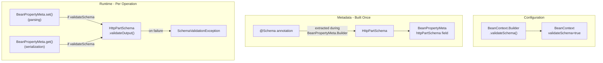

# Schema Validation Mode for Juneau Parsers and Serializers

## Architecture Overview

The `@Schema` annotation and `HttpPartSchema.validateOutput()` / `validateInput()` validation logic already exist. The goal is to wire this validation into the bean property get/set lifecycle, gated by a new `validateSchema` flag on `BeanContext`.



## Key Files to Modify

### 1. Add `validateSchema` flag to `BeanContext`

Follow the established pattern (e.g., `ignoreUnknownBeanProperties`) in [BeanContext.java](../juneau-core/juneau-marshall/src/main/java/org/apache/juneau/BeanContext.java):

- Add `PROP_validateSchema` constant (~line 191)
- Add `private boolean validateSchema` to `Builder` (~line 248)
- Initialize to `false` in `Builder()` constructor (~line 285)
- Copy in all `Builder` copy constructors
- Add `validateSchema()` and `validateSchema(boolean)` builder methods (following pattern of `ignoreUnknownBeanProperties()` ~line 2384)
- Add to `hashKey()` method for proper caching
- Add `private final boolean validateSchema` to `BeanContext` (~line 3647)
- Assign in `BeanContext` constructor (~line 3694)
- Add `isValidateSchema()` getter
- Add to `properties()` method

### 2. Expose flag in `BeanSession`

In [BeanSession.java](../juneau-core/juneau-marshall/src/main/java/org/apache/juneau/BeanSession.java):

- Add `isValidateSchema()` delegating to `ctx.isValidateSchema()`

### 3. Cache `HttpPartSchema` on `BeanPropertyMeta`

In [BeanPropertyMeta.java](../juneau-core/juneau-marshall/src/main/java/org/apache/juneau/BeanPropertyMeta.java):

- Add `private final HttpPartSchema httpPartSchema` field
- In the `BeanPropertyMeta.Builder` or constructor, build the `HttpPartSchema` from `@Schema` annotations on the property:

```java
HttpPartSchema.Builder sb = HttpPartSchema.create();
bpm.getAnnotations(Schema.class).forEach(x -> sb.apply(x.inner()));
this.httpPartSchema = sb.build();
```

This reuses the existing `HttpPartSchema.Builder.apply(Schema)` method (~line 2820 of `HttpPartSchema.java`) which already maps all `@Schema` attributes.

- Add `getHttpPartSchema()` getter

### 4. Add validation in `BeanPropertyMeta.set()` (parsing path)

In [BeanPropertyMeta.java](../juneau-core/juneau-marshall/src/main/java/org/apache/juneau/BeanPropertyMeta.java) `set()` method (~line 1007):

After the value is unswapped (line 1017) and before `setPropertyValue()` (line 1039), add:

```java
if (bc.isValidateSchema() && httpPartSchema != null)
    httpPartSchema.validateOutput(value1, bc);
```

This validates the parsed value against the schema before it is set on the bean.

### 5. Add validation in `BeanPropertyMeta.get()` (serialization path)

In [BeanPropertyMeta.java](../juneau-core/juneau-marshall/src/main/java/org/apache/juneau/BeanPropertyMeta.java) `get()` method (~line 804):

After the value is retrieved, validate it:

```java
public Object get(BeanMap<?> m, String pName) {
    Object value = m.meta.onReadProperty(m.bean, pName, getInner(m, pName));
    if (bc.isValidateSchema() && httpPartSchema != null)
        httpPartSchema.validateOutput(value, bc);
    return value;
}
```

### 6. Expose through `BeanContextable.Builder`

In [BeanContextable.java](../juneau-core/juneau-marshall/src/main/java/org/apache/juneau/BeanContextable.java) `Builder` class:

Add `validateSchema()` and `validateSchema(boolean)` methods delegating to `bcBuilder.validateSchema()`, following the pattern of other delegated methods. This makes the flag available on `Parser.Builder`, `Serializer.Builder`, and all subclasses.

### 7. Handle exceptions properly

`HttpPartSchema.validateOutput()` throws `SchemaValidationException` which extends `ParseException`. This already fits the parser path. For the serializer path (in `get()`), wrap it:

- In the `get()` method, catch `SchemaValidationException` and wrap in `BeanRuntimeException` (which is already the pattern used for errors in `BeanPropertyMeta`)

### 8. Bean-level `@Schema` validation (required properties, minProperties, maxProperties)

In [BeanMap.java](../juneau-core/juneau-marshall/src/main/java/org/apache/juneau/BeanMap.java) or `BeanMeta`:

- Build an `HttpPartSchema` for the bean class itself from class-level `@Schema` annotations
- On `BeanMap.getBean()` (post-parse completion), validate required properties are present
- On serialization entry, validate `minProperties`/`maxProperties` constraints

### 9. Add `@BeanConfig` annotation support

In [BeanConfig.java](../juneau-core/juneau-marshall/src/main/java/org/apache/juneau/annotation/BeanConfig.java):

- Add `validateSchema()` attribute (following pattern of `ignoreUnknownBeanProperties`)
- Update `BeanConfigAnnotation.Applier` to apply it

## Testing

### Test file: `juneau-utest/src/test/java/org/apache/juneau/BeanContext_ValidateSchema_Test.java`

Create a comprehensive test class covering:

- **a01**: String property with `minLength`/`maxLength` - valid values pass, violations throw
- **a02**: String property with `pattern` - valid values pass, violations throw
- **a03**: String property with `enum_` - valid values pass, violations throw
- **b01**: Integer/Number property with `minimum`/`maximum` - valid values pass, violations throw
- **b02**: Number property with `exclusiveMinimum`/`exclusiveMaximum`
- **b03**: Number property with `multipleOf`
- **c01**: Collection/Array property with `minItems`/`maxItems`
- **c02**: Collection property with `uniqueItems`
- **d01**: Required property (parsing null/missing value throws)
- **d02**: Bean-level `minProperties`/`maxProperties`
- **e01**: Validation disabled by default (no errors without `.validateSchema()`)
- **e02**: Validation on parsing path (parser with `.validateSchema()`)
- **e03**: Validation on serialization path (serializer with `.validateSchema()`)
- **f01**: Multiple formats (JSON, XML, UON, MsgPack) all trigger validation
- **f02**: Nested beans with `@Schema` on inner bean properties
- **f03**: `@Schema` with `const_` constraint
- **f04**: `@Schema` with Draft 2020-12 features (`exclusiveMinimumValue`, `exclusiveMaximumValue`)

### Test bean definitions:

```java
public static class MyBean {
    @Schema(minLength="2", maxLength="10")
    public String name;

    @Schema(minimum="0", maximum="150")
    public int age;

    @Schema(pattern="^[a-z]+$")
    public String code;

    @Schema(enum_="ACTIVE,INACTIVE")
    public String status;

    @Schema(minItems="1", maxItems="5")
    public List<String> tags;

    @Schema(required=true)
    public String id;
}
```

### Test pattern:

```java
@Test void a01_stringMinMaxLength() {
    var p = JsonParser.create().validateSchema().build();
    // Valid
    assertEquals("ab", p.parse("{\"name\":\"ab\"}", MyBean.class).name);
    // Too short
    assertThrows(ParseException.class,
        () -> p.parse("{\"name\":\"a\"}", MyBean.class));
    // Too long
    assertThrows(ParseException.class,
        () -> p.parse("{\"name\":\"abcdefghijk\"}", MyBean.class));
    // Default (no validation)
    assertEquals("a", JsonParser.DEFAULT.parse("{\"name\":\"a\"}", MyBean.class).name);
}
```

## Documentation

### Javadoc on `BeanContext.Builder.validateSchema()`

Add detailed Javadoc explaining:
- What the flag does
- Which `@Schema` attributes are checked
- When validation occurs (during parsing and serialization)
- What exceptions are thrown
- Example usage with both parser and serializer

### Javadoc on `@Schema` annotation

Add a note to the existing `@Schema` annotation Javadoc referencing the `validateSchema` mode and how it applies to bean properties.

### User guide topic

Add a topic at `docs/pages/topics/` covering:
- Enabling validation mode
- Supported schema constraints on bean properties
- Error handling
- Usage with REST endpoints (annotating DTOs)
- Example scenarios
