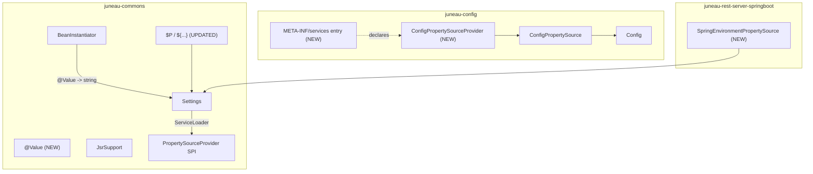

# TODO-79: Juneau `@Value` annotation + Spring Boot `application.yaml` bridge

Source: TODO.md headline bullet expanded 2026-05-25 after a brainstorming session that mapped the work against the existing `org.apache.juneau.commons.settings` + `org.apache.juneau.commons.inject` infrastructure.

## Goal

Add a Juneau `@Value` annotation that lets beans, fields, setters, and constructor parameters read configuration values declaratively (analog to Spring's `@Value`), plus a `${xxx}` shortcut in `VarResolver` and a Spring `Environment` bridge so that values defined in `application.yaml` / `application.properties` are reachable through the same `@Value`/`$P{...}`/`Settings` lookup pipeline as native Juneau `*.cfg` entries.

End-state developer experience:

```java
// Native Juneau:
@Rest(path="/orders")
public class OrdersResource extends RestServlet {

    @Value("${db.url}")                          // From juneau.cfg, system props, env, or Spring Environment
    private String dbUrl;

    @Value("${db.timeout.ms:5000}")              // Default of 5000 if unset, coerced to int
    private int timeoutMs;

    @Inject
    public OrdersResource(
        @Value("${app.name:orders}") String appName,
        @Value("${app.startInstant}") Instant startInstant   // Coerced via Settings.toType(...)
    ) { ... }
}

// Mixed Juneau + Spring `@Value` (FQN-detected, no compile-time Spring dep in juneau-commons):
@Rest(path="/billing")
public class BillingResource extends RestServlet {

    @org.springframework.beans.factory.annotation.Value("${stripe.api.key}")
    private String stripeKey;   // Honored identically to Juneau's @Value
}

// Free-text resolution via the new shortcut:
String banner = restRequest.getVarResolver().resolve("Welcome to ${app.name}!");
```

## Why now

- The `org.apache.juneau.commons.settings.PropertySource` SPI already exists and is already implemented by `org.apache.juneau.config.ConfigPropertySource`. The interface seam between `juneau-commons` and `juneau-config` that the brainstorming session worried about is already in the tree — TODO-79 is mostly **wiring**, not new infrastructure.
- `Settings.useServiceLoader()` already calls `ServiceLoader.load(PropertySourceProvider.class)` at build time (see [Settings.java](../juneau-core/juneau-commons/src/main/java/org/apache/juneau/commons/settings/Settings.java) lines 281-290), but `juneau-config` ships **no** `PropertySourceProvider` and **no** `META-INF/services/...PropertySourceProvider` entry, so the wire is unconnected.
- The `$P{key,default}` var in [PropertyVar.java](../juneau-core/juneau-commons/src/main/java/org/apache/juneau/commons/svl/vars/PropertyVar.java) already routes through `Settings.get()` — the unified lookup point. Making `${xxx}` a shortcut for `$P{xxx}` is a 3-line tokenizer tweak in `VarResolverSession`, not a new var.
- `BasicBeanStore` + `BeanInstantiator` already drive `@Bean` / `@Inject` / `@Named` / `@Autowired` / `@ConditionalOnProperty` field/parameter/setter resolution via FQN-based annotation matching in [JsrSupport.java](../juneau-core/juneau-commons/src/main/java/org/apache/juneau/commons/inject/JsrSupport.java). Adding `@Value` slots in next to `@Inject` in the same pipeline — and FQN-matching `org.springframework.beans.factory.annotation.Value` falls out for free with the same trick that already handles `SPRING_AUTOWIRED`.
- TODO-69 (AuthN guards) is done, TODO-20 (debug rethink) is next, TODO-78 + view siblings are queued. TODO-79 sits in Phase G (server-feature track) and has no hard dependencies on any of those — can land any time after Phase A.

## Research findings (verified 2026-05-25)

Significant facts from reading the current tree that shape the design:

1. **`PropertySource` SPI is in `juneau-commons`** ([PropertySource.java](../juneau-core/juneau-commons/src/main/java/org/apache/juneau/commons/settings/PropertySource.java)). Returns a `PropertyLookupResult` that distinguishes "missing" from "present-but-null". Already the neutral interface between `juneau-commons` and `juneau-config`.

2. **`ConfigPropertySource` exists in `juneau-config`** ([ConfigPropertySource.java](../juneau-core/juneau-config/src/main/java/org/apache/juneau/config/ConfigPropertySource.java)) and adapts `Config` to `PropertySource`. It's a 50-line file, no other adapters needed.

3. **`Settings` already aggregates sources** ([Settings.java](../juneau-core/juneau-commons/src/main/java/org/apache/juneau/commons/settings/Settings.java)). Lookup order is documented at lines 44-53: thread-local override → global override → sources in reverse insertion order → system props → env. Already supports type coercion via `StringSetting.asType(Class)` for `Integer`, `Long`, `Boolean`, `Double`, `Float`, `File`, `Path`, `URI`, `Charset`, plus reflection-based fallback to `valueOf(String)` / `(String)` constructors / `Enum.valueOf(...)`.

4. **`$P{...}` is already the Settings-backed var** ([PropertyVar.java](../juneau-core/juneau-commons/src/main/java/org/apache/juneau/commons/svl/vars/PropertyVar.java)). Subclass of `DefaultingVar` so `$P{key,default}` syntax is already supported.

5. **`JsrSupport` already does FQN-based annotation detection** ([JsrSupport.java](../juneau-core/juneau-commons/src/main/java/org/apache/juneau/commons/inject/JsrSupport.java)). Recognizes Juneau, Jakarta, JavaX, and Spring variants of `@Inject` / `@Autowired` / `@Named` / `@Qualifier` / `@Singleton` / `@PostConstruct` / `@PreDestroy` without compile-time dependencies on those APIs. Same trick applies trivially to `@Value`.

6. **`SpringBeanStore` is the natural Spring seam** ([SpringBeanStore.java](../juneau-rest/juneau-rest-server-springboot/src/main/java/org/apache/juneau/rest/springboot/SpringBeanStore.java)) — already captures `ApplicationContext` in its constructor (line 66). `ApplicationContext.getEnvironment()` gives the `Environment` that the Spring bridge needs to wrap.

7. **No `META-INF/services/org.apache.juneau.commons.settings.PropertySourceProvider` exists anywhere in the tree** (`rg` confirmed). `juneau-config`'s `ConfigPropertySource` is therefore never auto-registered today; consumers must wire it manually.

8. **JDK ships no usable EL** (verified separately). Nashorn was removed in JDK 15; `javax.script` is empty without a third-party engine; `StringTemplate` (JEP 430) was preview in JDK 21-23 and **withdrawn in JDK 24** pending redesign. Jakarta EL is a separate dep (`org.glassfish:jakarta.el`), SpEL is `spring-expression`. **For TODO-79 we deliberately ship Tier-1 placeholder semantics only** (key + default + nesting). `#{...}` expression support is deferred to a future `juneau-config-el` module.

9. **`VarResolverSession`'s tokenizer matches `$X{...}`** where `X` is a Var name (zero or more ASCII chars). The `${...}` shortcut is a single lookahead in the scanner: when `$` is followed immediately by `{`, emit `P` as the var name. Backward-compatible — no existing `$X{...}` form changes.

## Resolved decisions (from brainstorming 2026-05-25)

1. **`@Value` lives in `org.apache.juneau.commons.inject`** alongside `@Inject` / `@Named` / `@Bean`, not in `juneau-microservice`. Symmetric to `@Inject` (resolves *beans*); `@Value` resolves *strings/primitives*. Spring places `@Value` in `org.springframework.beans.factory.annotation` alongside `@Autowired`, not in `spring-boot` — same precedent.

2. **No new interface layer between `juneau-commons` and `juneau-config`.** `PropertySource` already is the layer. We just need a `ConfigPropertySourceProvider` + `META-INF/services` entry in `juneau-config` to flip on the auto-wiring that `Settings.useServiceLoader()` already calls.

3. **Shortcut syntax: `${xxx}` → `$P{xxx}`.** Routes through `Settings` so Config + env + system properties + Spring `Environment` all participate via the same lookup. Spring-idiom matches industry mental model; literal `@Value("${db.url}")` is the same string as Spring's, zero learning curve. Sidesteps the `MessageFormat`/`Mustache`/SLF4J `{0}` collision that a bare `{xxx}` shortcut would have.

4. **Expression scope: Tier 1 only** (property-placeholder semantics — key, default, nesting). No arithmetic, no method calls, no ternary. `${foo.${env}.url}` works for free because `VarResolver` already resolves inner vars before passing the key to the outer var. `#{...}` EL deferred to a separate follow-on TODO if/when demand surfaces.

5. **Spring `@Value` is honored identically to Juneau `@Value`** via FQN-matching in `JsrSupport`. No compile-time Spring dep in `juneau-commons`. Both annotations carry the same `${...}` payload, both resolve through the same `Settings`-backed pipeline.

6. **`@Value` and `@Inject` are mutually exclusive on the same injection site.** Throw `BeanCreationException` with a clear message if both are present. `@Value` for strings/primitives, `@Inject` for beans — no overloaded semantics.

7. **`ConfigPropertySourceProvider` is classpath-default-silent.** If `juneau.cfg` is not on the classpath, return `null` from `create()` (already filtered out by the SPI's `.filter(Objects::nonNull)` stream). No warning log. Many deployments will not want a classpath config and shouldn't see noise.

## Architecture



Lookup precedence inside `Settings` is already "sources in reverse insertion order, then sys-props, then env". Spring `Environment` is added last by the Spring auto-config, so it wins over `Config`, which wins over sys-props, which wins over env.

## Scope

**In scope (v1):**

- **`org.apache.juneau.commons.inject.Value`** annotation. `@Target({FIELD, METHOD, PARAMETER, CONSTRUCTOR})`, `@Retention(RUNTIME)`, single `String value()` attribute carrying a `${...}` expression or plain literal.
- **`JsrSupport` extensions**: `JUNEAU_VALUE`, `SPRING_VALUE` FQN constants + `isValueAnnotation(AnnotationInfo)` and `valueExpression(AnnotationInfo)` helpers.
- **`BeanInstantiator` parameter/field/setter resolution branch** that detects `@Value` (Juneau or Spring), resolves the expression through a session-scoped `VarResolver`, and coerces to the target type via `Settings.toType(String, Class)`.
- **`${xxx}` shortcut** in `VarResolverSession`'s tokenizer — single lookahead that lowers `${...}` to `$P{...}`.
- **`org.apache.juneau.config.ConfigPropertySourceProvider`** + `META-INF/services/org.apache.juneau.commons.settings.PropertySourceProvider` entry in `juneau-config`. Returns `new ConfigPropertySource(Config.create().name("juneau.cfg").build())` if a classpath `juneau.cfg` exists; `null` otherwise.
- **Microservice + RestContext integration**: when a microservice/RestContext resolves its own `Config`, push a `ConfigPropertySource` wrapping it onto `Settings.get().addSource(...)` so per-microservice config shadows the classpath default.
- **`org.apache.juneau.rest.springboot.SpringEnvironmentPropertySource`** wrapping `org.springframework.core.env.Environment`. Auto-registered from the existing Spring `@Configuration` (or `SpringBeanStore` constructor) so `application.yaml` / `application.properties` / profile-specific overrides / CLI args participate.
- **Tests** in `juneau-utest` covering: `String` / `int` / `Integer` / `boolean` / `URI` / `Instant` coercion; `${foo}`, `${foo:bar}`, `${foo.${env}.url}` resolution; `@Value` + Spring `@Value` interchangeability; per-microservice-config shadowing; Spring `Environment` shadowing of `Config`.
- **Docs**: release-notes entry under `juneau-docs/pages/release-notes/9.5.0.md` + new topic page documenting `@Value` + `${...}` + Spring Boot bridge.

**Explicitly out of scope (v1):**

- **`#{...}` SpEL / Jakarta-EL expressions.** Deferred to a future `juneau-config-el` module if demand surfaces. The architecture leaves room: `#{...}` would lower to `$EL{...}` the same way `${...}` lowers to `$P{...}`.
- **`@ConfigurationProperties`-style prefix binding** (binding `app.db.*` to a `DbConfig` bean). `@Value` is single-key. Prefix binding is a separate effort if requested.
- **Arithmetic / boolean / ternary inside `${...}`.** Pure placeholder semantics only.
- **Auto-registering a non-classpath `Config`.** `ConfigPropertySourceProvider` only looks for `juneau.cfg` on the classpath; programmatic `Config` instances are wired via the Microservice/RestContext integration path, not the SPI.
- **Hot-reload of `@Value`-injected fields when the backing `Config` changes.** Spring's `@Value` is also single-shot at injection time. `Config` already has a `ConfigEventListener` for hot-reload-aware code that wants it; `@Value` users who need that should observe `Config` directly.

## Implementation plan

### Phase 1 — `@Value` annotation + BeanInstantiator wiring (juneau-commons)

- Create `juneau-core/juneau-commons/src/main/java/org/apache/juneau/commons/inject/Value.java`.
- Extend [JsrSupport.java](../juneau-core/juneau-commons/src/main/java/org/apache/juneau/commons/inject/JsrSupport.java) with `JUNEAU_VALUE` and `SPRING_VALUE` FQN constants plus `isValueAnnotation(AnnotationInfo)` and `valueExpression(AnnotationInfo)` helpers. Mirrors the existing `isNamedAnnotation` / `qualifierValue` pattern.
- In [BeanInstantiator.java](../juneau-core/juneau-commons/src/main/java/org/apache/juneau/commons/inject/BeanInstantiator.java), in the parameter/field/setter resolution path that today checks `@Inject` / `@Autowired` / `@Named`:
    - If an injection site carries `@Value` (Juneau or Spring), reject it if `@Inject` is also present (throw `BeanCreationException`).
    - Otherwise resolve the expression through a session-scoped `VarResolver` (default vars + `PropertyVar` is enough — `${...}` will already be the shortcut from Phase 2), then coerce to the target type via `Settings.toType(String, Class)`.
    - Wrap coercion failures in a `BeanCreationException` with a clear "could not coerce '${expr}' resolving to '<value>' to <targetType>" message.
- Acceptance tests in `juneau-utest/src/test/java/org/apache/juneau/commons/inject/Value_Test.java`:
    - `@Value` on constructor parameter, setter, field — all three sites.
    - String / int / Integer / boolean / URI / Instant target types.
    - `${missing:default}` path — default used.
    - `${missing}` with no default — `null` for reference types, `BeanCreationException` for primitives.
    - Spring `@Value` (referenced via FQN reflection helper in the test, not a compile-time dep) honored identically.
    - `@Value` + `@Inject` on the same site rejected with `BeanCreationException`.

### Phase 2 — `${xxx}` shortcut in VarResolver (juneau-commons)

- In `juneau-core/juneau-commons/src/main/java/org/apache/juneau/commons/svl/VarResolverSession.java`, the tokenizer scanning for `$X{...}`: add a single special case — when the scanner sees `$` immediately followed by `{`, treat the segment as if it were `$P{...}`. No new `Var` class needed.
- Nested resolution (`${foo.${env}.url}`) falls out for free because `VarResolver` already recursively resolves inner vars before passing the key to the outer var.
- Acceptance tests in `juneau-utest/src/test/java/org/apache/juneau/commons/svl/DollarBraceShortcut_Test.java`:
    - `${foo}` resolves identically to `$P{foo}`.
    - `${foo:bar}` returns `"bar"` when `foo` is unset (uses `DefaultingVar` semantics).
    - `${foo.${env}.url}` resolves nested.
    - Literal `$P{...}`, `$C{...}`, `$E{...}`, `$IF{...}` still work — no regression. (Re-run the full SVL test suite.)
    - Escape semantics (`\${literal}`) still pass through unchanged.

### Phase 3 — Auto-register Config as a PropertySource (juneau-config + juneau-microservice)

- Add `juneau-core/juneau-config/src/main/java/org/apache/juneau/config/ConfigPropertySourceProvider.java`.
    - Strategy: returns `new ConfigPropertySource(Config.create().name("juneau.cfg").build())` if a discoverable `juneau.cfg` exists on the classpath; otherwise returns `null` (the SPI already filters nulls).
    - `order()` returns something sensibly low (e.g. `100`) so user-supplied providers can add themselves "after" by returning a higher number — `Settings`'s "sources walked in reverse insertion order" means higher-`order()` providers register last and therefore win.
- Add `juneau-core/juneau-config/src/main/resources/META-INF/services/org.apache.juneau.commons.settings.PropertySourceProvider` containing the FQN of `ConfigPropertySourceProvider`.
- In `juneau-microservice/juneau-microservice/src/main/java/org/apache/juneau/microservice/Microservice.java`'s build path (the spot where `Config` is resolved into the bean store): also call `Settings.get().addSource(new ConfigPropertySource(cfg))` so the per-microservice `Config` shadows the auto-registered classpath default.
- Same hook in `RestContext.Builder` so non-microservice REST resources that build their own `Config` get the same treatment.
- Acceptance tests:
    - Classpath-only path: drop a `juneau.cfg` with `[s]/k=v` into `juneau-utest`'s test resources, instantiate a `@Value("${s/k}") String v` bean **without** a microservice. Expect `"v"`.
    - Microservice-override path: build a `Microservice` with `Config.create().memStore().build()` having `[s]/k=micro`; same bean should resolve to `"micro"` rather than the classpath value.

### Phase 4 — Spring Environment bridge (juneau-rest-server-springboot)

- Add `juneau-rest/juneau-rest-server-springboot/src/main/java/org/apache/juneau/rest/springboot/SpringEnvironmentPropertySource.java`. Wraps `org.springframework.core.env.Environment`. `get(name)` returns `PropertyLookupResult.present(opt(env.getProperty(name)))` if `env.containsProperty(name)`, otherwise `PropertyLookupResult.missing()`.
- Auto-registration: in the existing Spring `@Configuration` in `juneau-rest-server-springboot` (or via `SpringBeanStore`'s constructor — the place where `ApplicationContext` is captured), call `Settings.get().addSource(new SpringEnvironmentPropertySource(appContext.getEnvironment()))`. Adding it from Spring guarantees `application.yaml` / `application.properties` / `--db.url=...` / profiles all participate via Spring's standard resolution rules.
- Acceptance test: a `@SpringBootTest` mirroring [SpringBeanStore_Test.java](../juneau-utest/src/test/java/org/apache/juneau/rest/springboot/SpringBeanStore_Test.java) puts `db.url=spring-value` in `application.yaml` (or `@TestPropertySource`), defines a Juneau `@Rest` resource whose constructor takes `@Value("${db.url}") String url`, asserts the field is `"spring-value"`. Also verify Spring `@Value("${db.url}")` (FQN-imported) resolves identically.

### Phase 5 — Docs + release notes

- Release-notes entry under `juneau-docs/pages/release-notes/9.5.0.md`:
    - **Top-level major change**: "New `@Value` annotation + `${...}` shortcut + Spring Boot `application.yaml` bridge".
    - Module-level entries under `juneau-marshall` (the `${...}` shortcut) and `juneau-rest-server` / `juneau-rest-server-springboot` (the `@Value` + Spring bridge).
- New topic page `juneau-docs/pages/topics/...ValueAnnotationBasics.md` covering:
    - `@Value` annotation syntax + supported target types.
    - `${...}` shortcut + nesting + default-value syntax.
    - Resolution order (thread-local → global → sources reverse-insertion → sys-props → env).
    - Spring Boot bridge — what works automatically, what doesn't.
- Cross-link from existing `SimpleVariableLanguageBasics` and `VariableBasics` topic pages.

### Phase 6 — Internal adoption audit + migration (added 2026-05-25)

Once `@Value` exists, sweep the Juneau codebase for places that today read
configuration declaratively (and awkwardly) and migrate them to `@Value` —
both as a dogfooding pass that proves the annotation in production-quality
code, and as a way to delete hand-rolled defaulting / property-lookup code.

**Discovery — ripgrep patterns to surface candidates:**

```bash
# System property + env-var reads (the obvious migration candidates)
rg -n --type java 'System\.getProperty\(' \
    juneau-core juneau-rest juneau-microservice
rg -n --type java 'System\.getenv\(' \
    juneau-core juneau-rest juneau-microservice

# Hand-rolled "property name constant + default" pairs
rg -n --type java 'static\s+final\s+String\s+\w+\s*=\s*"\w+(\.\w+)+"' \
    juneau-core juneau-rest juneau-microservice

# Direct Config builder usages that could be auto-wired instead
rg -n --type java 'Config\.create\(\)\.name\(' \
    juneau-core juneau-rest juneau-microservice

# Known-good config-shaped knobs from recent landings (FINISHED-66, FINISHED-69, FINISHED-77)
rg -n --type java 'jwksCacheTtl|rateLimitWindow|debugRequestHeader' \
    juneau-rest
```

**Classify each candidate into one of three buckets:**

- **Migrate (clear win):** single-key configurable value with a sensible
  default, read from a bean constructor / `@Bean` factory / `@Rest`-host
  initializer. Direct replacement with `@Value("${...:default}")`.
- **Defer (borderline):** value is read in a hot path or from a place
  without a `BeanInstantiator`-managed lifecycle (e.g. static initializer,
  inside a `Memoizer` lambda). Document as a follow-on TODO candidate and
  move on.
- **Skip:** not really configurable (constant, framework-internal,
  hard-coded by intent). No action.

**Migration scope guardrails:**

- Cap Phase 6 at **5–15 user-facing migrations** in this PR. The point is
  proof-of-concept dogfooding, not a wholesale config refactor.
- If discovery surfaces more than ~15 strong candidates, migrate the
  highest-impact 5–15 in this PR and file a follow-on TODO ("**TODO-91 —
  expand `@Value` internal adoption to remaining sites**") with the
  inventory.
- Internal-only / framework-defaults knobs (Open Question 1 below) gated
  on user OQA before any migration of those sites.

**Per-migration checklist:**

1. Replace the hand-rolled lookup with `@Value("${key.path:default}")` at
   the field, constructor parameter, or setter.
2. Delete the now-unused property-name constant and any `getProperty(...)
   != null ? ... : default` defaulting code.
3. Update any test that hard-coded the legacy property name to use either
   the same `${key.path}` form via `System.setProperty(...)` in a
   `@BeforeEach`, or — when the test is `BeanInstantiator`-aware — a
   `@Value`-injected constructor parameter so the migration is round-tripped
   in tests too.
4. If the legacy lookup had a custom-typed coercion (e.g. parsed a
   comma-delimited list), confirm `Settings.toType(...)` handles the same
   type, or add an `asType(...)` test in `Settings_Test`.

**Acceptance criteria:**

- Discovery report exists in the PR description (or as a stub TODO-91 plan
  file) listing every candidate found, its bucket (migrate / defer / skip),
  and a one-line rationale for the bucket.
- At least 5 migrations land in this PR (lower-bound for "this counts as
  dogfooding"); upper bound 15 per the guardrail above.
- All migrated sites carry a release-notes mention under the appropriate
  `### juneau-*` module section in `9.5.0.md` — users upgrading need to
  know which knobs are now Juneau-`@Value`-resolved (which means they pick
  up the new resolution order: thread-local → global → sources → sys-props
  → env → Spring `Environment`).
- Tests for every migrated site pass.

**Sequencing:**

- Phase 6 runs **after** Phases 1–4 land (it depends on the
  `BeanInstantiator`-managed `@Value` resolution being live).
- Phase 6 runs **before or alongside** Phase 5 (docs); the docs phase's
  release-notes entries pick up the migrated sites.

## Resolved decisions — Phase 6

1. **Internal-only framework knob migration — RESOLVED 2026-05-25 as Option 1
   (stay user-facing).** Phase 6's discovery scope is bounded to sites that
   are already on a `BeanInstantiator`-managed lifecycle — i.e. sites where
   a user would naturally place `@Value` themselves (e.g. user-defined
   `@Bean` factories, `@Rest`-host constructors, custom `RestServlet`
   subclasses with `@Inject` constructors). Framework-internal config
   readers that today hand-roll lookups in static initializers or
   un-injected constructors (notably `juneau-microservice/Microservice.java`
   bootstrap, `RestContext.Builder` defaults, `DebugConfig`'s
   system-property defaults from FINISHED-20, `JwtTokenValidator`'s JWKS
   TTL default from FINISHED-69) are out of Phase 6 scope. Each surfaces in
   the discovery report under the **Defer** bucket with a `TODO-92`
   reference.

   A follow-on **TODO-92 — `@Value` framework-internal adoption pass**
   will be filed alongside TODO-79's landing to track the larger
   refactor (route framework-internal config readers through a
   `BeanInstantiator`-resolved seam so they can carry `@Value`). It is
   deliberately a separate PR — keeps TODO-79 reviewable and lets the
   framework-internal pass be sequenced independently.

## Risk notes

- The `${...}` tokenizer change is the only place in the plan that touches a hot path (every `VarResolver.resolve(...)` call). Mitigation: keep the change in `VarResolverSession.parse(...)` to a single 3-line lookahead (`$` followed by `{` → emit `P` as the var name), and run the full existing VarResolver test suite before any other change in Phase 2.
- `ConfigPropertySourceProvider`'s classpath-default `juneau.cfg` lookup must be **silent** when the file is absent (return `null`, no warning log). Many deployments will not want a classpath config and shouldn't see noise.
- Spring `Environment.getProperty(...)` can be slow on cold lookups for unknown keys (it walks every nested `PropertySource`). `Settings` already memoizes through `StringSetting` so this only bites the first lookup per key per session.
- `Settings.get()` is a process-wide singleton. Tests that mutate it via `addSource(...)` must clean up in `@AfterEach` to avoid cross-test bleed. Pattern: capture the source returned from `addSource(...)`, hold it in a test field, remove it in teardown. (May need to add a `Settings.removeSource(PropertySource)` if one doesn't exist — verify during Phase 3.)
- Eager scanning of `@Value` fields on cold-start: `BeanInstantiator` already scans annotations once per class; adding `@Value` to its set of recognized annotations doesn't change the asymptotic cost.

## Out of scope / follow-on TODOs

- **`#{...}` SpEL / Jakarta-EL expression support.** Recommended path when it lands: separate `juneau-config-el` Maven module declaring `jakarta.el` in `provided` scope, registering a `$EL{...}` var that the `#{...}` shortcut lowers to. Track as its own TODO post-9.5 if demand surfaces.
- **`@ConfigurationProperties`-style prefix binding** (`@ConfigurationProperties(prefix="app.db") DbConfig dbConfig`). `@Value` is single-key; prefix binding is a separate effort.
- **Hot-reload-aware `@Value` fields** that automatically re-resolve when the backing `Config` fires a `ConfigEvent`. Spring's `@Value` is also single-shot at injection time; users who need hot reload should observe `Config` directly.
