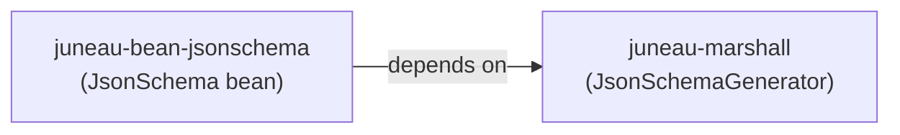

# JsonSchema Bean Generation from JsonSchemaGenerator

## Overview

Add the ability for `JsonSchemaGenerator` to produce typed `JsonSchema` beans instead of only `JsonMap` objects. This requires filling gaps in the `JsonSchema` bean, creating a bridge class in the `juneau-bean-jsonschema` module (which already depends on `juneau-marshall`), and comprehensive testing.

## Problem

`JsonSchemaGenerator` (in `juneau-marshall`) produces `JsonMap` objects. There is no way to obtain typed `JsonSchema` beans (in `juneau-bean-jsonschema`) from the generator. Users who want structured, type-safe schema objects must manually construct them or do ad-hoc conversion.

## Architecture Constraint



`juneau-bean-jsonschema` depends on `juneau-marshall`, not the other way around. Adding `juneau-bean-jsonschema` as a dependency of `juneau-marshall` would create a circular dependency. Therefore, the bridge code must live in `juneau-bean-jsonschema`.

## Prerequisite: Missing Properties in JsonSchema Bean

The `JsonSchema` bean is missing three standard JSON Schema properties that `JsonSchemaGenerator` produces:

- **`format`** (String) -- Used by the generator for values like `int32`, `int64`, `int16`, `float`, `double`, `uri`. This is also supported by the `@Schema` annotation (`format()` on line 1023 of `Schema.java`).
- **`$comment`** (String) -- Added in Draft 07. Standard annotation-level keyword.
- **`deprecated`** (Boolean) -- Added in Draft 2019-09. Standard annotation-level keyword.

Without `format`, the generated `JsonSchema` bean would lose information compared to the `JsonMap` output. These must be added first.

---

## Phase 1: Add Missing Properties to JsonSchema Bean

**File:** `master/juneau-bean/juneau-bean-jsonschema/src/main/java/org/apache/juneau/bean/jsonschema/JsonSchema.java`

Add three new fields with getters and setters following the existing pattern:

- `private String format;` -- with `getFormat()` / `setFormat(String)`
- `private String comment;` -- with `@Beanp("$comment")` on getter/setter, `getComment()` / `setComment(String)`
- `private Boolean deprecated;` -- with `getDeprecated()` / `setDeprecated(Boolean)`

**File:** `master/juneau-bean/juneau-bean-jsonschema/src/main/java/org/apache/juneau/bean/jsonschema/JsonSchemaProperty.java`

Add fluent-chaining overrides for the new setters (returning `JsonSchemaProperty` instead of `JsonSchema`), following the existing pattern used by all other setters in this class.

**File:** `master/juneau-bean/juneau-bean-jsonschema/src/main/java/org/apache/juneau/bean/jsonschema/JsonSchemaRef.java`

Add fluent-chaining overrides for the new setters (same pattern).

---

## Phase 2: Create JsonSchemaBeanGenerator

**New file:** `master/juneau-bean/juneau-bean-jsonschema/src/main/java/org/apache/juneau/bean/jsonschema/JsonSchemaBeanGenerator.java`

This class wraps `JsonSchemaGenerator` and converts `JsonMap` output to `JsonSchema` beans. It lives in `juneau-bean-jsonschema` where both types are accessible.

**Conversion strategy:** Serialize `JsonMap` to JSON via `JsonSerializer`, then parse into `JsonSchema` via `JsonParser`. This roundtrip approach is necessary because `JsonSchema` uses several `@Swap` annotations (`BooleanOrSchemaSwap`, `JsonTypeOrJsonTypeArraySwap`, `JsonSchemaOrSchemaArraySwap`, `BooleanOrSchemaArraySwap`) that handle polymorphic type conversions during parsing. A direct `convertToType()` call would not invoke these swaps.

**Public API:**

```java
public class JsonSchemaBeanGenerator {

    // Default instance with default settings
    public static final JsonSchemaBeanGenerator DEFAULT;

    // Builder for custom configuration
    public static Builder create();

    // Generate schema bean from a Java type
    public JsonSchema generate(Type type);
    public JsonSchema generate(Class<?> type);
    public JsonSchema generate(Object o);

    // Convert an existing JsonMap schema to a JsonSchema bean
    public static JsonSchema toBean(JsonMap schemaMap);

    public static class Builder {
        // Delegate to JsonSchemaGenerator.Builder for all config
        public Builder addDescriptionsTo(TypeCategory...values);
        public Builder addExamplesTo(TypeCategory...values);
        public Builder useBeanDefs();
        public Builder ignoreTypes(String...values);
        // ... other delegated config methods ...
        public JsonSchemaBeanGenerator build();
    }
}
```

**Bean definitions handling:** When `useBeanDefs()` is enabled, the generator session collects definitions in `Map<String, JsonMap>`. The `generate()` method must:

1. Call `session.getSchema(type)` to get the root `JsonMap`
2. Call `session.getBeanDefs()` to get the definitions map
3. If definitions exist, inject them into the root `JsonMap` under `$defs` before converting
4. Convert the combined `JsonMap` to `JsonSchema` via the JSON roundtrip

**Static convenience on JsonSchema (optional):**

```java
// In JsonSchema.java, add static factory methods:
public static JsonSchema of(Type type) {
    return JsonSchemaBeanGenerator.DEFAULT.generate(type);
}

public static JsonSchema of(Class<?> type) {
    return JsonSchemaBeanGenerator.DEFAULT.generate(type);
}
```

---

## Phase 3: Testing

**New file:** `master/juneau-utest/src/test/java/org/apache/juneau/bean/jsonschema/JsonSchemaBeanGenerator_Test.java`

Test categories (mirror the structure of `JsonSchemaGeneratorTest.java`):

- **Primitive types:** Verify `int` -> `{type:"integer", format:"int32"}`, `float` -> `{type:"number", format:"float"}`, `String` -> `{type:"string"}`, `boolean` -> `{type:"boolean"}`, `URI` -> `{type:"string", format:"uri"}`
- **Beans:** Object type with `properties` map containing nested schemas
- **Collections:** Array type with `items` schema; `Set` adds `uniqueItems:true`
- **Maps:** Object type with `additionalProperties` schema
- **Enums:** String type with `enum` list
- **Bean definitions:** `useBeanDefs()` produces `$ref` in properties and `$defs` at root
- **`@Schema` annotations:** Custom schema properties from annotations are preserved
- **Descriptions and examples:** `addDescriptionsTo()` and `addExamplesTo()` produce correct output
- **Nested structures:** Multi-level beans, arrays of beans, maps of beans
- **Round-trip fidelity:** Verify that `JsonSerializer.DEFAULT.serialize(generatedBean)` produces the same JSON as `JsonSerializer.DEFAULT.serialize(generatedJsonMap)` for all test cases
- **Static `toBean()` conversion:** Standalone `JsonMap` -> `JsonSchema` conversion

**Update existing test file:** `master/juneau-utest/src/test/java/org/apache/juneau/bean/jsonschema/JsonSchema_Test.java`

- Add tests for the new `format`, `$comment`, and `deprecated` properties
- Verify serialization/deserialization round-trip of these new fields

---

## Phase 4: Documentation

- **`JsonSchemaBeanGenerator.java`** -- Full Javadoc with usage examples showing common scenarios (simple bean, bean with defs, custom configuration)
- **`JsonSchema.java`** -- Update class-level Javadoc to mention `JsonSchemaBeanGenerator` as a way to auto-generate schemas from POJOs
- **`package-info.java`** in `org.apache.juneau.bean.jsonschema` -- Add section about automatic schema generation

### Update Release Notes
/Users/james.bognar/git/apache/juneau/docs/pages/release-notes

### Update Documentation

Find how existing languages are documented in the following location and update the documentation to match
the same level of detail.
/Users/james.bognar/git/apache/juneau/docs/pages/topics
---

## Key Files Reference

**Source (beans):**
- `master/juneau-bean/juneau-bean-jsonschema/src/main/java/org/apache/juneau/bean/jsonschema/JsonSchema.java`
- `master/juneau-bean/juneau-bean-jsonschema/src/main/java/org/apache/juneau/bean/jsonschema/JsonSchemaProperty.java`
- `master/juneau-bean/juneau-bean-jsonschema/src/main/java/org/apache/juneau/bean/jsonschema/JsonSchemaRef.java`

**Source (generator, in juneau-marshall):**
- `master/juneau-core/juneau-marshall/src/main/java/org/apache/juneau/jsonschema/JsonSchemaGenerator.java`
- `master/juneau-core/juneau-marshall/src/main/java/org/apache/juneau/jsonschema/JsonSchemaGeneratorSession.java`

**New file:**
- `master/juneau-bean/juneau-bean-jsonschema/src/main/java/org/apache/juneau/bean/jsonschema/JsonSchemaBeanGenerator.java`

**Tests:**
- `master/juneau-utest/src/test/java/org/apache/juneau/jsonschema/JsonSchemaGeneratorTest.java` (reference)
- `master/juneau-utest/src/test/java/org/apache/juneau/bean/jsonschema/JsonSchema_Test.java` (update)
- `master/juneau-utest/src/test/java/org/apache/juneau/bean/jsonschema/JsonSchemaBeanGenerator_Test.java` (new)
