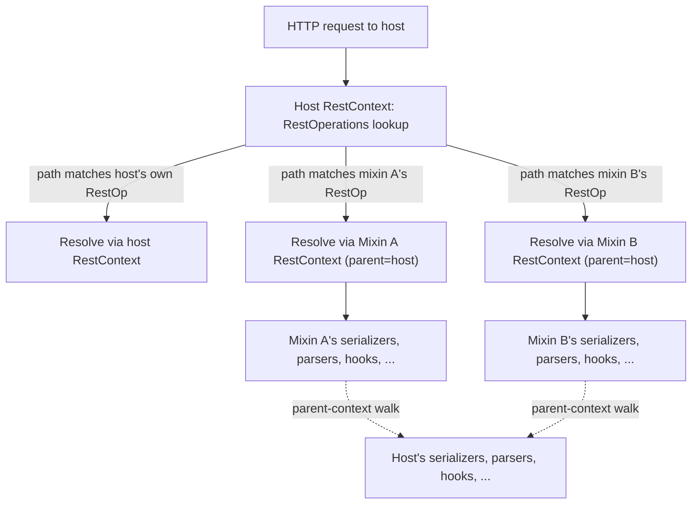

# TODO-81: Sub-`RestContext` per mixin — host-to-mixin inheritance for serializers, parsers, hooks, and everything else

Source: split out of TODO-74 review on 2026-05-24. Surfaced by the YAML-serializer-for-`/openapi.yaml` question (TODO-74 OQ1). Initially scoped to a narrow `@Rest(requiredSerializers/requiredParsers)` primitive, then redesigned 2026-05-24 (same session) into a full sub-`RestContext` model after recognizing the narrow design was the camel's nose for parallel `requiredXxx` members on every contribution list.

## Goal

Promote `@Rest(mixins=...)` mixin classes from "method libraries absorbed into the host's `RestContext`" to "embedded sub-resources, each with their own `RestContext` parent-linked to the host's." Reuse the existing `parentContext` machinery (already mature for `@Rest(children=...)`) so:

- Mixin endpoints inherit the host's serializers, parsers, encoders, converters, response processors, guards, hooks, debug enablement, call logger, messages, var resolver, and every other `@Rest(...)`-driven contribution list. Inheritance walks parent context → mixin's own `@Rest(...)` annotation chain.
- A mixin's `@Rest(serializers=...)` (and every other contribution list) **appends** to the inherited host set — visible to mixin endpoints only, NOT to host endpoints.
- A mixin's `@Rest(noInherit={"serializers"})` (or any property name) cuts off inheritance for that property, letting the mixin own its full set — semantics identical to `@RestOp(noInherit={...})` and to the existing class-chain `@Rest(noInherit)` behavior.
- `@RestStartCall` / `@RestEndCall` hooks fire BOTH on the host's context AND on the mixin's context for mixin endpoints (host first, mixin second), per parent-context delegation.

End-state developer experience:

```java
// Mixin: declare YAML for /openapi.yaml without forcing the host to register it globally.
@Rest(
    paths = {"/openapi", "/openapi.json", "/openapi.yaml"},
    serializers = {YamlSerializer.class}
)
public class BasicOpenApiResource { ... }

// Host: vanilla RestServlet, no YAML declared.
@Rest(mixins = BasicOpenApiResource.class)
public class ApiResource extends RestServlet {
    @RestGet("/items") public List<Item> items() { ... }
}

// Resolution:
//   ApiResource RestContext      → serializers = [host defaults (JSON, XML, HTML, ...)]
//   BasicOpenApiResource sub-CTX → serializers = [host defaults..., YamlSerializer]
//
// Request → /items                                          uses host's set (no YAML)
// Request → /openapi.yaml                                   uses mixin's set (YAML available)
// Request → /openapi  with Accept: application/yaml         uses mixin's set (YAML available)
// Request → /items    with Accept: application/yaml         406 Not Acceptable (host has no YAML)
```

```java
// Mixin opts out of inheriting host serializers/parsers entirely.
@Rest(
    paths = {"/raw"},
    noInherit = {"serializers", "parsers"},
    serializers = {OctetStreamSerializer.class},
    parsers = {OctetStreamParser.class}
)
public class BasicRawBlobResource { ... }
// Mixin endpoints use ONLY {OctetStream*}; host's JSON/XML/HTML are not inherited.
```

```java
// Mixin overrides debug enablement and call logger without affecting the host.
@Rest(
    paths = {"/admin/threads", "/admin/heap"},
    debugEnablement = AdminDebugEnablement.class,
    callLogger = StructuredJsonLogger.class
)
public class BasicAdminResource { ... }
// Host's CallLogger logs /items requests; mixin's StructuredJsonLogger logs /admin/* requests.
```

## Why now

- TODO-74's `BasicOpenApiResource` motivates this directly: `/openapi.yaml` needs a YAML serializer, and asking every importer to register one globally is wrong on two counts (defeats encapsulation; pollutes the host's content-negotiation surface for unrelated endpoints).
- The narrow `requiredSerializers` primitive considered first is the camel's nose: each contribution list (encoders, response processors, REST op args, converters, ...) would need its own parallel `requiredXxx` member, doubling the annotation surface for a problem that's already solved by parent-context inheritance for child resources.
- The mature precedent in [RestContext.java](juneau-rest/juneau-rest-server/src/main/java/org/apache/juneau/rest/RestContext.java) is `@Rest(children=...)`: each child is its own RestContext with `parentContext = host`. Many resolution chains already walk `parentContext()` (`bootstrapBeanStore`, `thrownStore`, `fullPath`, `messages`, var resolver tokens, ...). Mixins should benefit from the same infrastructure.
- Generalizes naturally — once the model is in place, mixins can override or augment ANY `@Rest(...)` member with predictable inheritance semantics.
- Solves several pending TODO-77 concerns: `BasicAdminResource` wanting its own guard chain, `BasicEchoResource` wanting its own debug enablement, etc. — all just fall out of the model.

## Scope

**In scope (v1):**

- **New class structure.** Mixin classes get their own `RestContext` (call it a "mixin sub-context") at host-construction time:
    - For each entry in `getRestMixinClasses()`, build a `RestContext` with `parentContext = hostRestContext`, `resource = bs.instantiate(mixinClass)`, and `resourceClass = mixinClass`.
    - Memoize the sub-contexts under `mixinContexts: Memoizer<Map<Class<?>, RestContext>>` on the host context.
    - Sub-contexts share the host's path prefix — they do NOT mount under their own URL namespace (that's what `@Rest(children=...)` does; mixins are *inline* by design).
- **Route registration change.** [RestContext.java:1397-1417](juneau-rest/juneau-rest-server/src/main/java/org/apache/juneau/rest/RestContext.java) (`restOperations` builder) — for mixin classes, construct each `RestOpContext` with the **mixin's** `RestContext` instead of the host's. The route is still registered in the host's `RestOperations` map (so path lookup still hits the host first), but invocation flows through the mixin context's serializer/parser/etc. resolution.
- **Inheritance for marshalling primitives** — extend `serializersBuilder`, `parsersBuilder`, `encodersBuilder`, `partSerializer`, `partParser` to walk `parentContext()` before applying the local annotation chain. `noInherit={"serializers"}` etc. blocks the walk.
- **Inheritance for routing primitives** — `converters`, `responseProcessors`, `restOpArgs`, `guards` walk `parentContext()` similarly. **Guard inheritance is on by default** (resolved decision #2): if the host has `BearerTokenGuard`, mixin endpoints are also protected unless the mixin declares `@Rest(noInherit={"guards"})`. Errs on "too strict" rather than "too loose" — accidentally protected is recoverable; accidentally exposed is not.
- **Inheritance for lifecycle primitives** — `callLogger`, `debugEnablement`, `debugDefault`, `messages`, `varResolver`. These mostly inherit today by walking `parentContext()` already; verify and extend where needed.
- **Hooks dual-firing.** `@RestStartCall` / `@RestEndCall` on the host's class fire for mixin endpoints (host first, via parent delegation); the mixin's own `@RestStartCall` / `@RestEndCall` then fire (mixin second). `@RestPreCall` / `@RestPostCall` follow the same dual-firing pattern. `@RestDestroy` fires on both the mixin and host at shutdown.
- **`noInherit` semantic equivalence with `@RestOp(noInherit)`.** The same property-name set (`"serializers"`, `"parsers"`, `"encoders"`, `"converters"`, `"guards"`, `"hooks"`, `"messages"`, `"callLogger"`, ...) works on `@Rest(noInherit={...})` for the mixin context, blocking the parent-context walk for that property. Document the canonical set in `RestServerConstants`.
- **Apply to TODO-74's `BasicOpenApiResource`.** Declare `@Rest(serializers={YamlSerializer.class})` on the mixin class. Mixin endpoints get YAML inherited-plus-appended; host endpoints unaffected. Resolves TODO-74 OQ1.
- **Tests in `juneau-utest`** — see "Test matrix" below.

**Explicitly out of scope (v1):**

- **Sub-context per `@Rest(children=...)` child gaining serializer-inheritance.** Today children build their own marshalling stack from scratch. Extending inheritance to children too is a behavior change for existing apps — defer to a follow-on TODO, not bundled here.
- **Cross-mixin inheritance.** If mixin A declares `mixins=B`, B is also a mixin of the host, but A → B does NOT form an inheritance chain (B inherits from host, NOT from A). Keeps the inheritance graph flat (two levels: host → mixins). Cross-mixin inheritance can be added later if a use case emerges.
- **Lazy sub-context construction.** All mixin sub-contexts are built eagerly at host initialization (like `@Rest(children)`). Lazy initialization is a separate concern.
- **Removing `BasicRestServlet` chain entirely.** Some helpers (e.g. the `getHtdoc()` method) still need a class to live in; this TODO doesn't dismantle that, only changes how mixin endpoints are wired.

## Design notes

### Why each mixin needs its own `RestContext`

Today the mixin walk ([RestContext.java:1419-1443](juneau-rest/juneau-rest-server/src/main/java/org/apache/juneau/rest/RestContext.java)) registers each mixin's `@RestOp` methods as `RestOpContext`s built with `this` (the host's `RestContext`) as the second arg. Every request to a mixin endpoint resolves serializers, parsers, guards, hooks, etc. from the host's context. There's no place for mixin-scoped configuration.

For the model the user proposed to work, each mixin endpoint must resolve through a **distinct** `RestContext` so that:
- The mixin's `@Rest(serializers=...)` appends to a chain that starts with the host's serializers (parent-context walk).
- The host's `/items` endpoint resolves through the host's RestContext (no YAML), unaffected by the mixin's contributions.

This is structurally identical to `@Rest(children=...)` — each child has its own RestContext — except:
- Children mount under their own URL namespace; mixins mount under the host's namespace (inline).
- Children's `@RestOp` methods are routed to the child context (request lands on child, child resolves); mixin's `@RestOp` methods are routed inline (request lands on host's router, but invokes through the mixin context).

### Routing model



The host's `RestOperations` map remains the single routing table — keyed by (method, path). Each entry stores the `RestOpContext` for that route, which carries its owning `RestContext`. Mixin endpoints carry the mixin's `RestContext`; host endpoints carry the host's. Resolution at request time flows from the matched `RestOpContext`.

### Inheritance: the property walk

The existing `getRestAnnotationsForProperty(name)` ([RestContext.java:2015](juneau-rest/juneau-rest-server/src/main/java/org/apache/juneau/rest/RestContext.java)) walks the resource's own class hierarchy in parent-to-child order. It respects `noInherit` to cut off the walk.

For mixin sub-contexts, this needs extending to also walk `parentContext()` before the local class hierarchy:

```java
Stream<AnnotationInfo<Rest>> getRestAnnotationsForProperty(String name) {
    var annotations = new ArrayList<AnnotationInfo<Rest>>();
    // NEW: parent context's annotations first (if not blocked by local noInherit).
    if (parentContext != null && !isNoInherited(name))
        annotations.addAll(parentContext.getRestAnnotations());
    annotations.addAll(getRestAnnotations());
    // Existing noInherit cutoff (walks the combined list).
    var cutoff = annotations.size();
    for (var i = 0; i < annotations.size(); i++) {
        if (resolveCdl(annotations.get(i).getStringArray(PROPERTY_noInherit)).anyMatch(name::equalsIgnoreCase)) {
            cutoff = i + 1;
            break;
        }
    }
    return rstream(annotations.subList(0, cutoff));
}
```

This single change is enough to make all the `*Builder` memoizers (`serializersBuilder`, `parsersBuilder`, `encodersBuilder`, ...) inherit from the parent context automatically — they all read through `getRestAnnotationsForProperty(...)`.

**Caveat:** this also extends inheritance for `@Rest(children=...)` resources, which is a behavior change. Two ways to scope:

1. **Apply uniformly** — children also inherit from parent. Behavior change, but arguably correct (and consistent).
2. **Mixin-context-only** — add a flag on `RestContext` (e.g. `isMixinContext`) and guard the parent walk on it. Children unchanged.

Tentative recommendation: **start with (2) for safety**, then propose a follow-on TODO to flip children too once the mixin path is stable.

### Hook dual-firing

For `@RestStartCall` / `@RestEndCall` / `@RestPreCall` / `@RestPostCall`, the resolution today reads the resource's own class annotated methods ([RestContext.java:1231](juneau-rest/juneau-rest-server/src/main/java/org/apache/juneau/rest/RestContext.java) for `startCallInvokerPair`). Under the sub-context model:

- The mixin's RestContext builds its own hook invoker list from the mixin class.
- At request time, the host's RestContext's hooks fire first (because they live on the parent context); then the mixin's RestContext's hooks fire.
- For ordering across multiple mixins: host first, then mixin-walk order.
- `@RestDestroy` fires on both at shutdown (host's hooks first, then each mixin's).

The dual-firing wiring lives in the request-dispatch path — when a request lands on a mixin endpoint, the dispatcher walks `mixinContext.parentContext().startCallInvokerPair()` first, then `mixinContext.startCallInvokerPair()`.

### Bean store layering

Mixin sub-context's `beanStore` is parent-linked to the host's `beanStore` (same model as `@Rest(children=...)` — see [RestContext.java:1527](juneau-rest/juneau-rest-server/src/main/java/org/apache/juneau/rest/RestContext.java)). Mixin-scoped `@Bean` factory methods registered on the mixin class are visible only to the mixin's resolution chain; host's `@Bean` factories are inherited.

This means: a mixin author can write `@Bean YamlSerializer customYaml() { ... }` on the mixin class to override the default `YamlSerializer` instantiation, and the override applies only to the mixin's context. The host's instantiation chain is unaffected.

### Compatibility with FINISHED-72

FINISHED-72's `@Rest(mixins=...)` and `@Rest(paths=...)` primitives still work — same user-facing API. The implementation change is internal:

- Before: mixin's `@RestOp` methods absorbed into host's `RestOperations` with the host's `RestContext`.
- After: same routes mounted in the host's `RestOperations`, but each carrying its own `RestContext`.

All existing tests should pass without modification (modulo the YAML test that proves the new isolation behavior).

### Transitive mixins (flat inheritance)

`@Rest(mixins=A.class)` where `A` itself declares `@Rest(mixins=B.class)` — today both A and B are discovered as mixins of the host. Under the new model:

- A's RestContext: `parentContext = host`.
- B's RestContext: `parentContext = host` (NOT A).

So B sees host's contributions but NOT A's. This is the "flat inheritance" decision — the inheritance graph is two levels, never deeper. Rationale:

1. Predictable: a mixin always inherits from "the host," period.
2. Order-independent: the discovery order of A and B doesn't matter for B's resolution.
3. Composable: a mixin can be added or removed without rearranging inheritance chains.
4. If a use case for cross-mixin inheritance emerges, it can be modeled explicitly (`A.class` declared as parent of `B` via a new member, separate from `mixins`).

### YAML serializer module location (resolves TODO-74 OQ1's secondary concern)

Verify in Phase 0 which Maven module ships `org.apache.juneau.yaml.YamlSerializer`. If it's in `juneau-marshall` (default `juneau-rest-server` transitive dep), `BasicOpenApiResource` can hard-depend on it. If it's in an optional module, either:
- Move `YamlSerializer` into `juneau-marshall`, OR
- Make `BasicOpenApiResource` not strictly require YAML — `/openapi.yaml` gracefully 406s when the serializer isn't registered.

## Phased steps

### Phase 0 — confirm seams (read-only)

1. List every `Memoizer<...>` field on `RestContext` that reads `getRestAnnotationsForProperty(...)`. Approximately: `callLogger`, `consumes`, `produces`, `debugEnablement`, `encoders`, `messages`, `parsersBuilder`, `partParser`, `partSerializer`, `responseProcessors`, `restOpArgs`, `serializersBuilder`, `swaggerProvider`, `openApiProvider`, plus the new `paths` member and `mixins`.
2. List every `Memoizer<...>` that reads `parentContext()` today (for reference — these already do the right thing). Approximately: `thrownStore`, `fullPath`, `messages`, bean-store layering.
3. Confirm hook firing path (`@RestStartCall` / `@RestEndCall`) — find the request-dispatch entry point that invokes hooks and identify the injection point for dual-firing.
4. Confirm `RestOpContext` construction signature — does the host context appear as the second arg, and can it be swapped to a mixin context cleanly?
5. Find all tests asserting "the mixin's `@Rest(serializers=...)` is ignored" or similar — these are now reversed expectations.
6. Verify YAML serializer module location.
7. **Host-only property allowlist.** `@Rest(path)` and `@Rest(paths)` are top-level mount declarations that only have meaning for the class registered with the servlet container — they must NOT inherit from the parent (host) context when walking annotations on a mixin sub-context. Build an explicit allowlist of host-only property names (`path`, `paths`, and any other "where am I mounted on the URL tree" property surfaced by the audit) and skip the parent-walk for those names in `getRestAnnotationsForProperty(...)`. The host's `RestContext` already correctly reads `path`/`paths` from its own annotation chain only (post-TODO-73, via `resolveMountPaths(...)` reading `getRestAnnotations()` rather than the mixin-aware `getRestAnnotationsForProperty(...)`); the allowlist preserves that invariant under the new parent-walk model. Without it, a mixin sub-context would inherit the host's mount paths and could try to act on them in places that read `getPaths()`. Audit also `apiFormat` and any other annotation member whose semantics are "this class as a top-level deployable" rather than "this class's resolution chain"; add to the allowlist as appropriate.

### Phase 1 — `MixinContext` construction infrastructure

1. New flag on `RestContext`: `isMixinContext()` (or a new subclass `MixinRestContext extends RestContext` if subclassing fits cleanly).
2. New memoizer on host `RestContext`: `mixinContexts: Memoizer<Map<Class<?>, RestContext>>`. Built from `getRestMixinClasses()`. Each entry: `parentContext = this`, `resource = bs.instantiate(mixinClass)`, `resourceClass = mixinClass`. Eagerly initialized.
3. Verify mixin sub-context construction completes without errors for the FINISHED-72 happy paths.
4. Tests:
    - `MixinContext_Construction_Test` — host with one mixin; assert `hostContext.getMixinContexts()` returns map with one entry; entry's `parentContext == hostContext`; entry's `resourceClass == MixinClass`.
    - `MixinContext_BeanStore_Test` — mixin's beanStore is parent-linked to host's; `@Bean` on host visible from mixin's beanStore; `@Bean` on mixin not visible from host's beanStore.
    - `MixinContext_Multiple_Test` — host with two mixins; assert two distinct mixin contexts.

### Phase 2 — extend `getRestAnnotationsForProperty` to walk parent context

1. Modify `getRestAnnotationsForProperty(name)` to prepend `parentContext.getRestAnnotations()` when `isMixinContext()` and the local `noInherit` does NOT include the property. Preserve the existing `noInherit` cutoff logic.
2. **Guarded by `isMixinContext()`** — `@Rest(children=...)` resources retain today's behavior (no parent-context walk). Followon TODO to consider flipping children too.
3. Add `isNoInherited(propertyName)` helper that checks the local `@Rest(noInherit={...})` for the property name.
4. Tests:
    - `MixinInheritance_Serializers_Test` — host declares `serializers=JsonSerializer.class`; mixin declares no serializers; assert mixin endpoint uses host's `JsonSerializer`.
    - `MixinInheritance_SerializersAppend_Test` — host declares `JsonSerializer`; mixin declares `serializers=YamlSerializer.class`; assert mixin endpoint sees BOTH (host's appended-by-mixin); host endpoint sees only `JsonSerializer`.
    - `MixinInheritance_NoInherit_Test` — host declares `JsonSerializer`; mixin declares `noInherit={"serializers"}, serializers=YamlSerializer.class`; assert mixin endpoint sees ONLY `YamlSerializer`; host endpoint unchanged.

### Phase 3 — route registration through mixin context

1. Modify `addRestOperationsForClass(...)` ([RestContext.java:1419](juneau-rest/juneau-rest-server/src/main/java/org/apache/juneau/rest/RestContext.java)) to accept a `RestContext` arg (mixin or host) and construct each `RestOpContext` with that context.
2. Wire the mixin-class loop in `restOperations` builder ([RestContext.java:1404](juneau-rest/juneau-rest-server/src/main/java/org/apache/juneau/rest/RestContext.java)) to pass the mixin's RestContext instead of `this`.
3. Verify routing — request to mixin endpoint hits the host's RestOperations lookup, picks up the right RestOpContext, and that RestOpContext invokes through the mixin context for serializer/parser/etc. resolution.
4. Tests:
    - `MixinRouting_Basic_Test` — mixin endpoint at `/openapi/json` returns JSON via mixin context's serializer chain; verify via end-to-end HTTP call.
    - `MixinRouting_HostUnaffected_Test` — mixin declares `serializers=YamlSerializer.class`; host's `/items` endpoint returns 406 for `Accept: application/yaml` (host doesn't have YAML).

### Phase 4 — hooks, debug, callLogger, messages, varResolver

1. **Hooks dual-firing.** Identify the dispatch point that invokes `@RestStartCall` etc. Wrap to walk parent context's hooks first (when mixin context), then local. Same for `@RestEndCall`, `@RestPreCall`, `@RestPostCall`, `@RestDestroy`.
2. **Debug enablement / debugDefault.** Already memoized via `getRestAnnotationsForProperty(PROPERTY_debugEnablement)` etc. — should inherit automatically after Phase 2's walk change.
3. **CallLogger.** Same — inherits automatically.
4. **Messages.** Already walks parentContext via `messages()` ([RestContext.java:1004](juneau-rest/juneau-rest-server/src/main/java/org/apache/juneau/rest/RestContext.java) area). Verify mixin context inherits the host's message bundle and can override.
5. **Var resolver tokens.** [RestContext.java:1759, 1776](juneau-rest/juneau-rest-server/src/main/java/org/apache/juneau/rest/RestContext.java) already walks parentContext. Verify mixin context.
6. Tests:
    - `MixinHooks_DualFire_Test` — host has `@RestStartCall`; mixin has `@RestStartCall`; request to mixin endpoint invokes host's hook first, then mixin's.
    - `MixinHooks_DestroyOrder_Test` — shutdown invokes both classes' `@RestDestroy`.
    - `MixinCallLogger_Test` — mixin declares its own callLogger; mixin-endpoint requests log via mixin's logger; host-endpoint requests log via host's logger.
    - `MixinDebugEnablement_Test` — mixin declares its own debugEnablement; mixin endpoints respect it; host endpoints unaffected.

### Phase 5 — apply to TODO-74 + update TODO-74 plan

1. `BasicOpenApiResource` (introduced by TODO-74): declare `@Rest(serializers={YamlSerializer.class})` on the mixin class.
2. Remove the `requiredSerializers` references from TODO-74 OQ1 — closed by this TODO via a different mechanism.
3. Verify `/openapi.yaml` works on a vanilla `RestServlet` host that does NOT declare YAML; verify host's `/items` endpoint does NOT accept `Accept: application/yaml`.

### Phase 6 — docs + release notes

1. Release-notes entry under `### juneau-rest-server`:
    - `@Rest(...)` members on mixin classes (`serializers`, `parsers`, `encoders`, `converters`, `guards`, `hooks`, `callLogger`, `debugEnablement`, `messages`, ...) now apply to mixin endpoints with host-to-mixin inheritance.
    - `@Rest(noInherit={...})` on a mixin class blocks inheritance for the named properties, matching `@RestOp(noInherit={...})` semantics.
    - Behavior change: pre-9.5.0 mixin classes whose `@Rest(serializers=...)` etc. were silently ignored will now contribute to mixin endpoint resolution. Authors who relied on the old behavior should `noInherit` the property or remove the contribution.
2. New topic page `docs/pages/topics/MixinSubContexts.md` covering:
    - The host-to-mixin inheritance model with a worked example using `BasicOpenApiResource` + YAML.
    - The `noInherit` opt-out per property.
    - The flat-inheritance rule for transitive mixins.
    - Hook dual-firing semantics.
    - How to override host settings per mixin (custom callLogger, debug, etc.).
3. Update `docs/pages/topics/10.07a.RestServerComposition.md` to cross-reference the new topic and update the "Parent-chain mixin aggregation" section with the inheritance semantics for the per-mixin RestContext.

## Test matrix

The full test matrix lives under `juneau-utest/.../rest/mixin/` (new package). Cases:

| Inheritance scenario | Behavior |
|---|---|
| Host declares X; mixin declares nothing | Mixin endpoint sees host's X (inherited). |
| Host declares X; mixin declares Y | Mixin endpoint sees [X, Y] (host inherited, mixin appended). Host endpoint sees only X. |
| Host declares X; mixin declares `noInherit={"<prop>"}, Y` | Mixin endpoint sees only Y. Host endpoint sees only X. |
| Host declares X; mixin A declares Y; mixin B declares Z | Mixin A endpoint sees [X, Y]. Mixin B endpoint sees [X, Z]. Host endpoint sees only X. (Flat inheritance — A and B don't see each other.) |
| Host declares X; mixin A declares `mixins=B`; B declares Y | A's RestContext: parent=host. B's RestContext: parent=host (flat). Both A and B endpoints see [X, ...]. |
| Host has `@RestStartCall hostHook()`; mixin has `@RestStartCall mixinHook()` | Mixin-endpoint request invokes `hostHook()` then `mixinHook()`. Host-endpoint request invokes only `hostHook()`. |
| Host has `debug="never"`; mixin has `debug="always"` | Mixin endpoints debug-traced; host endpoints not. |
| Host has callLogger `HostLogger`; mixin has callLogger `MixinLogger` | Mixin endpoint requests logged via `MixinLogger`; host endpoint requests via `HostLogger`. |
| Mixin declares `@Bean YamlSerializer customYaml()` | Mixin's `YamlSerializer` is the custom instance; host's bean store does NOT see the override. |

The matrix runs for the following contribution properties (each gets its own test class to keep them isolated):

`serializers`, `parsers`, `encoders`, `partSerializer`, `partParser`, `converters`, `responseProcessors`, `restOpArgs`, `guards`, `callLogger`, `debugEnablement`, `debugDefault`, `messages`.

## Acceptance criteria

- [ ] Each mixin class registered via `@Rest(mixins=...)` gets its own `RestContext` with `parentContext` set to the host's `RestContext`.
- [ ] `getRestAnnotationsForProperty(name)` on a mixin context walks the parent context's annotations first (unless blocked by local `noInherit`), then the mixin's own class hierarchy.
- [ ] Mixin's `@Rest(serializers=...)` appends to the inherited host set; mixin endpoint resolution sees the union (host first, mixin appended); host endpoint resolution sees host only.
- [ ] `@Rest(noInherit={"serializers"})` (or any property name in `RestServerConstants.PROPERTY_*`) on a mixin class blocks parent-context inheritance for that property.
- [ ] `@RestStartCall` / `@RestEndCall` / `@RestPreCall` / `@RestPostCall` / `@RestDestroy` dual-fire (host first, then mixin) for mixin endpoints. Host endpoints invoke only host's hooks.
- [ ] Guard inheritance is on by default — host's `@Rest(guards=...)` protects mixin endpoints; mixin's own guards append; `@Rest(noInherit={"guards"})` on the mixin removes host's guards from the mixin context. Tested both directions (inherited-and-protected; opted-out-and-unguarded).
- [ ] Mixin's `beanStore` is parent-linked to host's; mixin-scoped `@Bean` factories override the inheritance chain for mixin's resolution only.
- [ ] Transitive mixins (mixin A declares `mixins=B`) result in flat parent-inheritance: both A and B's contexts have `parentContext = host` (not A → B chain).
- [ ] `@Rest(children=...)` resources retain pre-TODO-81 behavior (no parent-context walk for serializer/parser/etc.) — the mixin-vs-child divergence is intentional, not deferred.
- [ ] `BasicOpenApiResource` (TODO-74) declares `@Rest(serializers={YamlSerializer.class})`; `/openapi.yaml` works on a vanilla `RestServlet` host; host's `/items` endpoint does NOT accept `Accept: application/yaml`.
- [ ] Full test matrix (see above) green.
- [ ] No regression in existing `@Rest(children=...)` tests, `@Rest(mixins=...)` tests, or any of the FINISHED-72 test suite.
- [ ] Coverage ≥ 95% on the new sub-context construction and inheritance walk. Full `./scripts/test.py` green.
- [ ] Release notes flag the behavior change for `@Rest(serializers=...)` on mixin classes (previously silently ignored; now contributing).

## Resolved decisions

All previously open questions resolved 2026-05-24.

1. **Children too? — NO, mixins only.** `@Rest(children=...)` resources retain today's no-parent-walk behavior. Rationale: child resources tend to be completely independent from parents — they're externally-mounted at their own URL namespace, often have their own deployment lifecycle (factored into separate jars, etc.), and conflating their resolution with the host's would surprise authors who treat children as standalone REST endpoints that happen to be discovered through a parent. Mixins are different: they're explicitly *inline*, share the host's URL namespace, and exist to compose with the host. Inheritance is the right model for mixins; isolation is the right model for children. No follow-on TODO tracks flipping children — the divergence is intentional. Document loudly in the topic page.

2. **Guard inheritance — YES, inherit by default.** Host's guard chain applies to mixin endpoints; mixin's `@Rest(guards=...)` appends; `@Rest(noInherit={"guards"})` removes host guards from the mixin context (mixin endpoints become unguarded). Rationale: surprises around security defaults should err on "too strict" (mixin endpoint accidentally protected) not "too loose" (mixin endpoint accidentally exposed). A `BearerTokenGuard` on the host automatically protects mixin endpoints unless the mixin explicitly opts out. Document the opt-out pattern loudly — mixin authors who deliberately want their endpoint to be unguarded (e.g. a `/health` mixin) need `noInherit={"guards"}` on the mixin class.

3. **`@Bean` override scoping — `@Bean SerializerSet customSerializers()` REPLACES.** Consistent with today's host behavior — a `@Bean SerializerSet` factory method on the resource class replaces the assembled builder result. On a mixin class, the same factory replaces the mixin's inherited-plus-appended chain (not the host's). Host's `@Bean SerializerSet` is unaffected by mixin overrides. Same semantics apply to `@Bean ParserSet`, `@Bean EncoderSet`, etc.

4. **Eager construction performance — mitigate via shared defaults; benchmark before merge.** Each mixin spawns a full `RestContext` at host startup. For a host with the entire mixin pack (TODO-74 four + TODO-76 four + TODO-77 three = ~11 contexts), measure startup time before and after. Sub-contexts share most defaults via parent inheritance (less work per context — they don't rebuild what the parent already has), so the cost should scale sub-linearly. Acceptance gate: startup time increase < 50ms for a typical mixin stack on a development laptop. If we blow past that, evaluate lazy construction in a follow-on optimization TODO.

5. **Migration callout for `@Rest(serializers=...)` on mixin classes — release-notes + `noInherit` escape hatch.** Some users may have copy-pasted `@Rest(serializers=...)` onto mixin classes expecting it to be a no-op (or assuming it would magically work). After this TODO, those serializers will now contribute to the mixin's endpoints. Release-notes call-out + suggest `noInherit={"serializers"}` for users who want the old silent-ignore behavior. Same callout applies to every other `@Rest(...)` member that was silently ignored on mixin classes pre-TODO-81.

## Risks

- **Wide blast radius.** Touches `RestContext` construction, route registration, every `*Builder` memoizer's resolution chain, the hook-firing dispatcher, and the guard chain. Mitigation: phased rollout (Phase 1-2 establish the infrastructure; Phase 3-4 use it); existing FINISHED-72 tests act as the regression net.
- **Behavior change for mixin authors.** `@Rest(serializers=...)` on a mixin class is silently ignored today; now contributes. Users with such declarations get changed behavior on upgrade. Mitigation: release-notes call-out + `noInherit` escape hatch.
- **Children-vs-mixins divergence (intentional, doc-only risk).** `@Rest(mixins=...)` and `@Rest(children=...)` end up with different inheritance semantics: mixins inherit from host, children are isolated. This is the deliberate design (resolved decision #1), but the two concepts look syntactically similar (`@Rest(mixins=Foo.class)` vs `@Rest(children=Bar.class)`) so authors may not realize the semantic difference. Mitigation: topic page covers the distinction prominently; javadoc on both `@Rest.mixins()` and `@Rest.children()` cross-references the semantic split.
- **Hook dual-firing surprise.** Authors of host `@RestStartCall` may not expect their hook to fire for mixin-endpoint requests too. Today, since mixins share host context, host hooks ALWAYS fire for everything, so this is actually consistent with today's behavior — no behavior change, just newly visible to mixin authors.
- **Guard inheritance accidental-protection.** With guards inheriting by default (resolved decision #2), a host that adds a `BearerTokenGuard` automatically protects mixin endpoints that may have been intended as public (a `/health` mixin, for example). This is the deliberate "fail strict" choice — accidentally protected is recoverable, accidentally exposed is not — but mixin authors who deliberately want their endpoints unguarded need `@Rest(noInherit={"guards"})` on the mixin class. Mitigation: doc loudly in the topic page and in javadoc on `@Rest.guards()`; the `BasicHealthResource` and similar always-public mixins ship with `noInherit={"guards"}` as the canonical example.
- **Bean-store layering edge cases.** Mixin's parent-linked bean store + Spring Boot's `SpringBeanStore` adapter could interact in non-obvious ways for `@Primary` / `@Qualifier`. Mitigation: explicit Spring Boot test in the matrix (`BasicMixinSubContext_Springboot_Test`).

## Related work

- `todo/FINISHED-72-rest-mixins-and-paths.md` — the mixin primitive this redesigns the internals of (user-facing API unchanged).
- `todo/TODO-74-mixin-api-docs.md` — concrete motivating use case (`BasicOpenApiResource` + YAML); OQ1 there is resolved by this TODO.
- `todo/TODO-75-mixin-static-files.md`, `todo/TODO-76-mixin-convention-endpoints.md`, `todo/TODO-77-mixin-ops-introspection.md` — sibling mixin TODOs. All benefit from the new model (per-mixin debug / call logger / guards become natural).
- `juneau-rest/juneau-rest-server/src/main/java/org/apache/juneau/rest/RestContext.java` — primary implementation surface. `restOperations` builder, `getRestMixinClasses()`, `getRestAnnotationsForProperty(...)` are the main edit points.
- `juneau-rest/juneau-rest-server/src/main/java/org/apache/juneau/rest/annotation/Rest.java` — no annotation changes; existing members gain new semantics on mixin classes.
- `juneau-rest/juneau-rest-server-springboot/src/main/java/org/apache/juneau/rest/springboot/SpringBeanStore.java` — confirm Spring Boot bean-store layering interacts correctly with per-mixin parent-linked bean stores.

## Follow-on TODOs to track after this lands

- **Sibling-inheritance for mixins:** if a real use case emerges for mixin A's contributions being visible to mixin B (sibling inheritance), model it as an explicit mechanism (perhaps `@Rest(mixinParent=A.class)`). Currently scoped out of v1. The flat-inheritance rule (all mixins parent-linked directly to host) is the v1 model.

*(Note: "children-inherit-too" was considered as a follow-on but rejected per resolved decision #1 — `@Rest(children=...)` resources are intentionally independent from parents; the divergence between mixin inheritance and child isolation is a feature.)*
