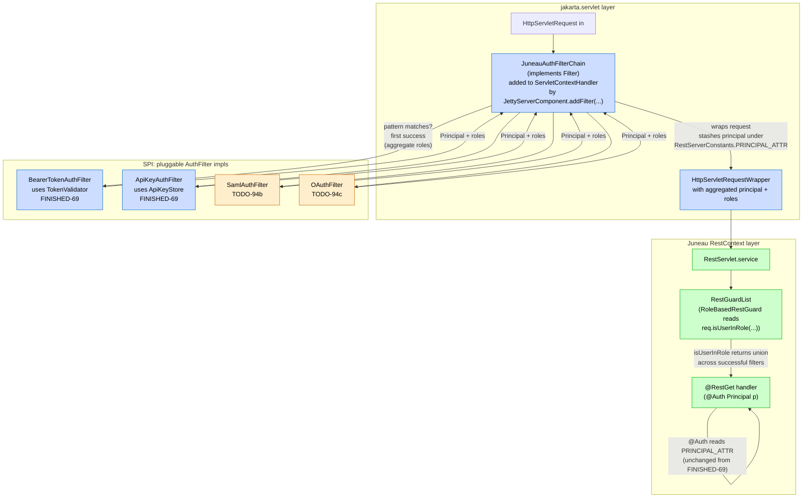
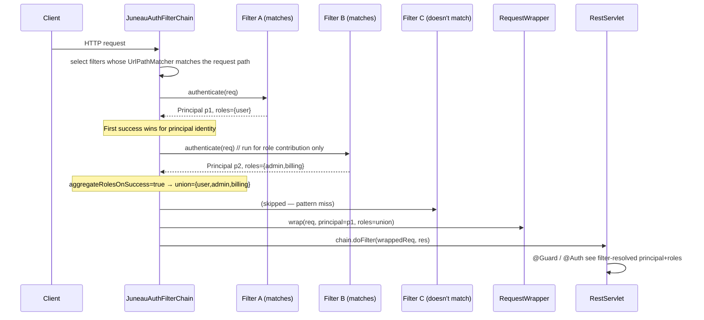
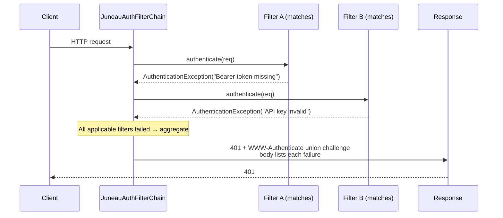

# TODO-94a: Auth filter framework — pluggable servlet-filter chain in `JettyMicroservice`

Source: promoted from `TODO.md` on 2026-05-25 during `/todo expand 94` (multi-file split per AGENTS.md letter-suffix precedent — see FINISHED-16a/b/c).

## Goal

Add a Juneau-idiomatic pluggable AuthN servlet-filter framework that runs at the **servlet** layer (before Juneau's request routing) so a single URL can support multiple, overlapping authentication options (e.g. *Bearer JWT* OR *API key* OR *SAML assertion*), short-circuit on the first success, aggregate roles when more than one succeeds, and surface the resolved `Principal` + roles to downstream `@Guard`-annotated REST ops via the standard `HttpServletRequest.getUserPrincipal()` / `isUserInRole(...)` surface that `RoleBasedRestGuard` already consumes today.

Lives in `juneau-rest-server` (core) so SAML / OAuth (TODO-94b / TODO-94c) sibling modules can simply ship `AuthFilter` impls without reinventing the chain mechanics. Adds the missing filter-registration surface to `juneau-microservice-jetty` since it has none today (see Research findings #1).

End-state developer experience:

```java
// Microservice path:
public class MyMicroservice extends JettyMicroservice {
    @Bean
    public AuthFilterChain authFilters(BeanStore bs) {
        return AuthFilterChain.create(bs)
            // /api/** accepts Bearer JWT OR API key — first to succeed wins; roles aggregate when both do.
            .append(BearerTokenAuthFilter.create()
                .pattern("/api/*")
                .validator(jwtValidator)
                .build())
            .append(ApiKeyAuthFilter.create()
                .pattern("/api/*")
                .store(myApiKeyStore)
                .build())
            // /sso/** accepts only a SAML assertion (provided by juneau-rest-server-saml — TODO-94b).
            .append(SamlAuthFilter.create()
                .pattern("/sso/*")
                .validator(samlValidator)
                .build())
            .build();
    }
}

// @Guard sees the filter-resolved Principal via the standard servlet surface, no extra wiring:
@Rest(path="/api")
public class ApiResource {
    @RestGet("/me")
    @Guard(roles="user|admin")           // RoleBasedRestGuard reads req.isUserInRole(...) which the filter populated
    public Profile me(@Auth Principal p) {  // @Auth (FINISHED-69) returns the same Principal the filter stashed
        return profileService.lookup(p.getName());
    }
}
```

## Why now

- **Direct extension of FINISHED-69.** FINISHED-69 shipped op-level AuthN via `BearerTokenGuard` / `ApiKeyGuard` + `TokenValidator` / `ApiKeyStore` SPIs, but those run **inside** `RestContext.handleCall(...)` — too late to authenticate a request before, say, a static-file mount or a non-`RestServlet` endpoint co-located on the same Jetty context. A servlet-layer filter chain is the missing peer.
- **No filter-registration surface in `juneau-microservice-jetty` today.** `JettyServerComponent.addServlet(...)` exists; there is no `addFilter(...)`. Users wiring auth into a Juneau microservice today must subclass `JettyServerComponent` and call `ServletContextHandler.addFilter(...)` directly — workable but undocumented and not symmetric with the `@Bean RestGuardList` style FINISHED-69 established. TODO-94a fixes both problems with a single SPI.
- **TODO-94b / TODO-94c sibling modules need a stable filter SPI to ship against.** Without this layer, both SAML and OAuth would have to reinvent the chain mechanics independently and the resulting designs would diverge.
- **`UrlPathMatcher` already exists** (`juneau-rest/juneau-rest-server/src/main/java/org/apache/juneau/rest/util/UrlPathMatcher.java`) — supports `/foo/{var}` named-var paths, trailing `/*` remainder syntax, and `*.ext` filename matching. The framework reuses it verbatim; no new pattern language.
- **`RoleBasedRestGuard` already reads `req.isUserInRole(...)`** so role aggregation Just Works if the filter wraps the request with an `HttpServletRequestWrapper` that returns aggregated roles. No new SPI on the guard side.

## Research findings (verified 2026-05-25)

Significant facts from reading the current tree that shape the design:

1. **`juneau-microservice-jetty` has NO filter-registration surface today.** `rg 'FilterHolder|jakarta\.servlet\.Filter' juneau-microservice/juneau-microservice-jetty` returns zero hits. `JettyServerComponent` (the lifecycle component, `JettyServerComponent.java`) exposes `addServlet(Servlet, String)` / `addServlet(Servlet, String...)` and a public `getServletContextHandler()` accessor; users wanting a filter today must call `ServletContextHandler.addFilter(...)` themselves via that escape hatch. TODO-94a MUST add a first-class `addFilter(...)` method to `JettyServerComponent` (and a `@Bean AuthFilterChain` auto-mount path) — this is the framework's structural prereq, not a nice-to-have.

2. **`UrlPathMatcher` syntax already covers the framework's needs.** Located at `juneau-rest/juneau-rest-server/src/main/java/org/apache/juneau/rest/util/UrlPathMatcher.java`. Supported forms (per the `compareTo` doc):
    - Filename: `foo.bar`, `*.bar`
    - Path: `/foo`, `/foo/bar`, `/foo/bar/*`
    - Path with vars: `/foo/{id}/bar`, `/foo/{id}/*`
    - Trailing remainder: `/foo/*` (matches `/foo/anything/deep/here`)
    Static factory `UrlPathMatcher.of(String)`. No new pattern syntax needs to be invented.

3. **`RestGuard` AuthZ-time integration is trivial.** `RoleBasedRestGuard.isRequestAllowed(req)` (`juneau-rest/juneau-rest-server/src/main/java/org/apache/juneau/rest/guard/RoleBasedRestGuard.java` line 74-77) does `req.isUserInRole(role)`. `RestRequest` inherits `isUserInRole(String)` from `HttpServletRequest`. A filter that wraps the request via `HttpServletRequestWrapper` and overrides `getUserPrincipal()` + `isUserInRole(String)` populates both surfaces in one step — `RoleBasedRestGuard` then sees the filter-resolved roles with zero changes to the guard.

4. **FINISHED-69's AuthN types are filter-ready.** `TokenValidator` (single-method functional interface returning `Principal`), `ApiKeyStore` (`Optional<Principal> lookup(String)`), `AuthenticationException` (with `wwwAuthenticate(String)` fluent setter), and `ClaimsPrincipal` (extends `Principal`, exposes typed claims) all live in `org.apache.juneau.rest.auth`. The filter framework wraps these — no new validator SPIs needed for the JWT / API-key cases. The framework adds ONLY the chain plumbing + path matching + role aggregation, not new validation surface.

5. **`RestServerConstants.PRINCIPAL_ATTR = "juneau.principal"`** is the FINISHED-69 attribute key the filter chain reuses verbatim. The `@Auth` arg-resolver (FINISHED-69) reads from this attribute, so a filter that stashes its resolved principal under the same key gives downstream `@Auth Principal p` parameters the right answer with no extra wiring. Same for `RestServerConstants.API_KEY_HEADER` (default `"X-API-Key"`) — reused by the API-key filter.

6. **`juneau-rest-server-springboot` uses Spring's own filter chain.** `BasicSpringRestServlet` is mounted via Spring's `ServletRegistrationBean`; auth filters under Spring Boot are typically registered via Spring's `FilterRegistrationBean`. TODO-94a must decide whether the framework also runs under Spring Boot (via a parallel auto-registration in the `springboot` module) or is Jetty-microservice-only with documented Spring Security as the recommended Spring path. See Open question 1.

## Resolved decisions

1. **Filter SPI lives in core `juneau-rest-server`, not a separate module.** Same containment stance as FINISHED-69's core `BearerTokenGuard` / `ApiKeyGuard` (which ship in core; only the JWT validator implementation is module-isolated). The framework adds zero new transitive deps to `juneau-rest-server` — uses only `jakarta.servlet.*` which `juneau-rest-server` already declares — so containment is preserved.

2. **Reuse `UrlPathMatcher` (per Research finding #2).** Do NOT introduce a parallel pattern syntax. The framework accepts one or more `String` patterns per filter; each is fed to `UrlPathMatcher.of(...)` once at filter-build time. Pattern semantics inherit whatever `UrlPathMatcher` provides today and benefit from future enhancements automatically.

3. **Short-circuit on first success; aggregate failures.** When multiple filters apply to the same request (per pattern matching), iterate in registered order. The **first** filter that returns a non-null `Principal` wins for principal resolution. Subsequent applicable filters are then run **only for role contribution** (controlled by a `boolean aggregateRolesOnSuccess` per-filter setting, default `true`) so role aggregation happens but principal identity stays deterministic. If ALL applicable filters fail, throw a single `AuthenticationException` whose body lists each filter's failure cause (suppressed exceptions chain via `Throwable.addSuppressed(...)`).

4. **Role aggregation via `HttpServletRequestWrapper`.** The chain installs a single wrapper instance per request; each successful filter contributes roles into a shared `Set<String>` carried by the wrapper. `getUserPrincipal()` returns the principal of the **first** successful filter (deterministic); `isUserInRole(String)` checks the union set. This makes `RoleBasedRestGuard` work unchanged and keeps the "one principal, many roles" invariant that downstream code expects.

5. **`AuthFilter` extends `jakarta.servlet.Filter` directly — do NOT invent a parallel SPI.** The framework adds Juneau-shaped helpers (`pattern(String)`, `aggregateRolesOnSuccess(boolean)`, etc.) on top of the standard `Filter` contract, but `AuthFilter implements Filter` so the underlying objects can also be registered directly with raw Jetty / Spring Boot `FilterRegistrationBean` for users who want to bypass the chain wrapper. Keeps the framework non-imposing.

6. **Filter chain runs BEFORE Juneau's request routing** (because it's a servlet `Filter`, by definition). This means filters see every request — including static-file mounts and non-`RestServlet` endpoints on the same context. Pattern matching is the gate; filters whose patterns don't match are skipped per-request.

7. **No auto-registration on `JettyMicroservice`.** Mirrors FINISHED-69's Resolved Decision #5 ("No auto-registered default `RestGuardList`") — explicit `@Bean AuthFilterChain` registration only. Silently enabling auth on resources that didn't ask for it is a security footgun.

8. **Apache RAT / OSGi packaging** matches `juneau-rest-server` (no new module — code ships in the existing core jar). No POM changes; no new transitive deps.

## Architecture



Chain decision flow per request:



All-failures flow (single aggregated rejection):



## Scope

**In scope (v1):**

- **`org.apache.juneau.rest.auth.filter.AuthFilter`** abstract base class.
    - `extends Object` and `implements jakarta.servlet.Filter`.
    - Abstract `Optional<AuthResult> authenticate(HttpServletRequest req) throws AuthenticationException` (or returns empty if the filter doesn't match the request even within its pattern — e.g. Bearer filter on a request with no `Authorization` header). The framework distinguishes "filter doesn't apply right now" (returns empty) from "filter applies but failed" (throws).
    - `final void doFilter(ServletRequest, ServletResponse, FilterChain)` is implemented on the abstract base — calls `authenticate(...)`, handles short-circuit / aggregation, defers to the framework's `AuthFilterChain` orchestration.
    - Builder-time settings: `pattern(String...)` (one or more `UrlPathMatcher` patterns; at least one required), `aggregateRolesOnSuccess(boolean)` (default `true`), `realm(String)` (carried into the `WWW-Authenticate` challenge on rejection).
- **`org.apache.juneau.rest.auth.filter.AuthResult`** value type.
    - `Principal principal()` (non-null).
    - `Set<String> roles()` (immutable, possibly empty).
    - Static factory `AuthResult.of(Principal, Set<String>)` and `AuthResult.of(Principal)` (no roles).
- **`org.apache.juneau.rest.auth.filter.AuthFilterChain`** orchestration.
    - `implements jakarta.servlet.Filter`.
    - Holds an ordered `List<AuthFilter>`.
    - On each request: build the list of applicable filters (via `UrlPathMatcher.match(...)`); short-circuit + aggregate per Resolved Decision #3; wrap the request via `AuthenticatedRequestWrapper`; delegate to `chain.doFilter(wrapped, res)`. If all applicable filters fail, throw the aggregated `AuthenticationException`.
    - Builder via `AuthFilterChain.create(BeanStore)` mirroring `RestGuardList.create(BeanStore)` so the chain participates in `BeanStore` resolution exactly like FINISHED-69's guard list.
- **`org.apache.juneau.rest.auth.filter.AuthenticatedRequestWrapper`** (package-private or public — see Open question 3).
    - `extends HttpServletRequestWrapper`.
    - Constructor takes `(HttpServletRequest delegate, Principal principal, Set<String> aggregatedRoles)`.
    - Overrides `getUserPrincipal()` to return the principal.
    - Overrides `isUserInRole(String)` to return `roles.contains(role)`.
    - Stashes the principal on the wrapped request under `RestServerConstants.PRINCIPAL_ATTR` for `@Auth`-arg-resolver pickup.
- **`org.apache.juneau.rest.auth.filter.BearerTokenAuthFilter`** — concrete `AuthFilter` wrapping FINISHED-69's `TokenValidator`. Pulls `Authorization: Bearer <token>` from the request, delegates to the configured `TokenValidator`, builds an `AuthResult` from the returned `Principal` plus the roles `ClaimsPrincipal` exposes (when the validator returns one).
- **`org.apache.juneau.rest.auth.filter.ApiKeyAuthFilter`** — concrete `AuthFilter` wrapping FINISHED-69's `ApiKeyStore`. Reads key from a configurable source (header default `X-API-Key` / query param / cookie), delegates to the configured `ApiKeyStore`.
- **`JettyServerComponent.addFilter(Filter, String pathSpec)` + `addFilter(Filter, String...pathSpecs)`** — adds the missing filter-registration surface to `juneau-microservice-jetty`. Mirrors the existing `addServlet(...)` shape so the two surfaces feel symmetric.
- **Auto-mount path:** in `JettyServerComponent.onStart(Microservice)`, scan the `BeanStore` for a single `AuthFilterChain` bean and auto-register it with `/*` path-spec if found — so user code is just `@Bean AuthFilterChain ...`, no manual `addFilter(...)` call.
- **`org.apache.juneau.rest.auth.filter.AuthFiltersConfig`** — optional `[AuthFilters]` config-file section that lets operators declare filters from `juneau.cfg` rather than `@Bean` code, mirroring the existing `[Jetty]` section's pattern. See Open question 5.
- **Tests** in `juneau-utest/src/test/java/org/apache/juneau/rest/auth/filter/`:
    - `AuthFilterChain_Test` — chain pattern matching; first-success; role aggregation; all-failure aggregation; non-matching filters skipped.
    - `AuthenticatedRequestWrapper_Test` — `getUserPrincipal()` + `isUserInRole(...)` overrides; `RestServerConstants.PRINCIPAL_ATTR` stash; integration with `RoleBasedRestGuard` (build a `RestServlet` with a `RoleBasedRestGuard("admin")` op, hit it through the filter chain, confirm `req.isUserInRole("admin")` returns `true` only when an applicable filter contributed `admin`).
    - `BearerTokenAuthFilter_Test` — happy path; missing header; validator throws; multiple matching filters with the same realm.
    - `ApiKeyAuthFilter_Test` — header / query / cookie sources; unknown key.
    - `JettyServerComponent_AddFilter_Test` — `addFilter(...)` mounts a filter at the requested path; auto-mount of `@Bean AuthFilterChain` works without manual `addFilter(...)`.
    - `AuthFilterChain_GuardIntegration_Test` — end-to-end: filter chain + `RoleBasedRestGuard` + `@Auth Principal` op together.
- **Docs**: new topic page `juneau-docs/pages/topics/AuthFilterFramework.md` covering: filter chain semantics, pattern matching, role aggregation, how filter-time AuthN composes with op-time guards (the "filter does AuthN, guard does AuthZ" mental model), config-file `[AuthFilters]` section (if shipped per Open question 5). Release-notes entries under `### juneau-rest-server` and `### juneau-microservice-jetty`.

**Explicitly out of scope (v1):**

- **SAML and OAuth filter implementations.** Those are TODO-94b (`juneau-rest-server-saml`) and TODO-94c (`juneau-rest-server-oauth`). TODO-94a ships ONLY the `AuthFilter` SPI + chain + `BearerTokenAuthFilter` + `ApiKeyAuthFilter` (the latter two so the framework has at least two reference impls that exercise it end-to-end in tests).
- **Spring Security parity / bridge.** Users on Spring Boot already have Spring Security's `SecurityFilterChain` / `FilterChainProxy`. TODO-94a is the Juneau-microservice-native peer; the Spring Boot integration question is gated on Open question 1.
- **GSSAPI / Kerberos / SPNEGO.** Container-supplied; not in the AuthFilter SPI charter.
- **Pre-emptive challenge issuance** (issuing a `401 + WWW-Authenticate: Bearer` to a never-authenticated request just to advertise schemes). Out of scope; the filter chain only authenticates *credential-bearing* requests and surfaces challenges on rejection.
- **Session management** (cookie-based sessions, server-side session stores). The filter framework is stateless — `Principal` is resolved per request, never cached server-side. Session AuthN is its own thing.
- **CORS / CSRF.** Separate concerns; filed under future TODOs if requested.
- **Auto-registration as a non-`AuthFilterChain` raw `jakarta.servlet.Filter` bean** in the `BeanStore`. Only `@Bean AuthFilterChain` is auto-mounted by `JettyServerComponent`. Raw filters require explicit `addFilter(...)` calls.

## Implementation plan

### Phase 0 — confirm seams (read-only)

1. Confirm `RestRequest.isUserInRole(String)` delegates to the wrapped `HttpServletRequest.isUserInRole(String)` (it does — inherits from the servlet contract). This is the key seam that makes role aggregation work without changes to `RoleBasedRestGuard`.
2. Confirm `RestRequest.getUserPrincipal()` delegates to the wrapped request as well (it does — same contract).
3. Confirm `RestServerConstants.PRINCIPAL_ATTR` and `RestServerConstants.API_KEY_HEADER` are public visible from a new `org.apache.juneau.rest.auth.filter` package (they are — same module).
4. Confirm `ServletContextHandler.addFilter(FilterHolder, String, EnumSet<DispatcherType>)` works from inside `JettyServerComponent.onStart(...)` — Jetty 12 EE11 servlet API.
5. Confirm `UrlPathMatcher.of(...)` accepts the patterns TODO-94a needs (`/*`, `/api/*`, `/foo/{id}/*`). Add a quick unit-test pass over the matrix if `UrlPathMatcher_Test` doesn't already cover all three.

### Phase 1 — `AuthFilter` SPI + chain orchestration + request wrapper (core `juneau-rest-server`)

1. New package `org.apache.juneau.rest.auth.filter` with `package-info.java` documenting the framework.
2. `AuthFilter` abstract base + `AuthResult` value type + `AuthFilterChain` orchestration + `AuthenticatedRequestWrapper`.
3. Tests:
    - `AuthFilterChain_Test` (10+ cases — pattern matching, success short-circuit, role aggregation, all-failure aggregation, non-matching filters skipped, mixed matching/non-matching, single-filter chain).
    - `AuthenticatedRequestWrapper_Test` (5+ cases — principal pass-through, role union, attribute stash, delegate methods unchanged).
    - `AuthResult_Test` (factory methods, defensive-copy of role set).

### Phase 2 — concrete `BearerTokenAuthFilter` + `ApiKeyAuthFilter` reference impls (core `juneau-rest-server`)

1. `BearerTokenAuthFilter` mirroring FINISHED-69's `BearerTokenGuard` extraction logic. Reuses `TokenValidator`. When the validator returns a `ClaimsPrincipal`, extract role claims via a configurable claim-name (default `roles`) to populate `AuthResult.roles()`.
2. `ApiKeyAuthFilter` mirroring FINISHED-69's `ApiKeyGuard` extraction logic. Reuses `ApiKeyStore`. Same role-extraction pattern when the store returns a `ClaimsPrincipal`.
3. Tests:
    - `BearerTokenAuthFilter_Test` (happy path, missing header, malformed header, validator throws, `ClaimsPrincipal` roles flow through to `AuthResult`).
    - `ApiKeyAuthFilter_Test` (header / query / cookie sources, unknown key, `ClaimsPrincipal` roles flow through).

### Phase 3 — `JettyServerComponent.addFilter(...)` + auto-mount (`juneau-microservice-jetty`)

1. Add public `addFilter(Filter, String)` and `addFilter(Filter, String...)` mirroring `addServlet(...)`. Internally wraps in `FilterHolder` + delegates to `ServletContextHandler.addFilter(...)`.
2. In `onStart(...)`, scan the `BeanStore` for a single `AuthFilterChain` bean (via `store.getBean(AuthFilterChain.class)`); if present, call `addFilter(chain, "/*")` BEFORE servlet registration so filters precede routing.
3. Tests in `juneau-utest`:
    - `JettyServerComponent_AddFilter_Test` — manual `addFilter(...)` call mounts a filter.
    - `JettyServerComponent_AuthFilterChainAutoMount_Test` — `@Bean AuthFilterChain` is auto-mounted at `/*`.

### Phase 4 — end-to-end `@Guard` integration test (`juneau-utest`)

1. `AuthFilterChain_GuardIntegration_Test` — builds a full `JettyMicroservice`-style `RestServlet` with:
    - An `AuthFilterChain` carrying `BearerTokenAuthFilter` + `ApiKeyAuthFilter` (different patterns, overlapping for one path).
    - A `RoleBasedRestGuard("admin|user")` on one op.
    - A `@Auth Principal p` parameter on the same op.
    Asserts:
    - Request with a valid bearer-token granting `user` role → `200`, `p.getName()` matches token subject.
    - Request with a valid API key granting `admin` role → `200`, role check passes.
    - Request with both → first-registered filter's principal wins, roles UNION; role check sees both roles.
    - Request with no credentials → `401` with aggregated `WWW-Authenticate` listing both schemes.
    - Request with a valid token but role-guard requires a role the token doesn't grant → `403` (correct AuthZ behavior — AuthN succeeded, AuthZ rejected).

### Phase 5 — optional `[AuthFilters]` config-file section (deferred unless Open question 5 RESOLVED in-scope)

1. New `AuthFiltersConfig` reading `[AuthFilters]` from `juneau.cfg`. Schema TBD — likely `name=<filter-class>;pattern=<...>;…`. Wires resolved filters into the `BeanStore` so the auto-mount path picks them up.
2. Tests: `AuthFiltersConfig_Test`.

### Phase 6 — docs + release notes

1. Release-notes entries:
    - `### juneau-rest-server` — new `#### AuthN Filter Framework (TODO-94a)` section listing `AuthFilter`, `AuthFilterChain`, `AuthResult`, `BearerTokenAuthFilter`, `ApiKeyAuthFilter`.
    - `### juneau-microservice-jetty` — new `addFilter(...)` API + auto-mount of `AuthFilterChain`.
2. New topic page `juneau-docs/pages/topics/AuthFilterFramework.md` covering:
    - Mental model: filter-time AuthN + op-time AuthZ.
    - Pattern matching (refers to `UrlPathMatcher` page).
    - Role aggregation semantics + the `aggregateRolesOnSuccess` knob.
    - `BeanStore` registration pattern.
    - Comparison to Spring Security's `SecurityFilterChain` for readers coming from that mental model.
    - Worked examples: Bearer + API-key overlap; pattern-disjoint filters; failure-aggregation example showing the response shape.
3. Cross-link from FINISHED-69's `AuthGuards` topic page.

## Acceptance criteria

- [ ] `AuthFilter` SPI exists in `org.apache.juneau.rest.auth.filter`; abstract base with `authenticate(req) -> Optional<AuthResult>` contract; concrete `BearerTokenAuthFilter` + `ApiKeyAuthFilter` reference impls.
- [ ] `AuthFilterChain` orchestrates multiple `AuthFilter`s with first-success / role-aggregation / all-failure semantics per Resolved Decision #3.
- [ ] `AuthenticatedRequestWrapper` populates `getUserPrincipal()` + `isUserInRole(...)` + stashes principal on `RestServerConstants.PRINCIPAL_ATTR` so FINISHED-69's `@Auth` arg-resolver and `RoleBasedRestGuard` both work unchanged.
- [ ] `JettyServerComponent.addFilter(...)` exists as the public filter-registration surface for `juneau-microservice-jetty`.
- [ ] `@Bean AuthFilterChain` is auto-mounted at `/*` by `JettyServerComponent` without explicit `addFilter(...)` calls.
- [ ] Pattern matching uses `UrlPathMatcher` verbatim — no new pattern syntax.
- [ ] End-to-end test confirms filter chain + `RoleBasedRestGuard` + `@Auth Principal` op composition works as documented.
- [ ] Coverage ≥ 90% on `org.apache.juneau.rest.auth.filter`. Full `./scripts/test.py` green.
- [ ] **Hard prereq**: TODO-94b and TODO-94c land ON TOP of TODO-94a — neither can start until this lands.

## Open questions

1. **Spring Boot reach of the filter framework — auto-register under Spring as well, document Spring Security as the recommended Spring path, or both?** Spring Boot users today reach for Spring Security; auto-registering an `AuthFilterChain` bean as a `FilterRegistrationBean` in `juneau-rest-server-springboot` would give Spring users the Juneau-native option. Trade-offs:
    - **In-scope auto-register under Spring** — gives a single mental model across deployment modes; users who don't want it can simply not declare an `AuthFilterChain` bean.
    - **Document Spring Security only** — keeps the `juneau-rest-server-springboot` module narrow; users coming from Spring already know `SecurityFilterChain` and don't need a new mental model.
    - **Both** — auto-register *and* document Spring Security as an alternative for users who want full Spring Security feature surface (OAuth, OIDC, method-security annotations, etc.).
    The plan above writes the v1 scope as "Jetty-microservice-first; Spring Boot integration deferred unless OQA picks in-scope". OQA needed before Phase 1 starts so Phase 3 / Phase 5 can be sized correctly.

2. **Filters run before or after Juneau's own request routing?** Both are technically possible (Juneau's `RestServlet` is itself a servlet, so a filter is always before it from the container's POV — but Juneau's `@RestHook(PRE_CALL)` hooks run AFTER the servlet entry and could carry equivalent logic). Current design assumes "filter runs first, principal flows through to op handlers via the wrapped request" — which matches the standard servlet-API mental model. Alternative: a `RestHookPreCall`-based shape that lives entirely inside `RestServlet`. **Recommend: filter-first** per the standard mental model, but flag for confirmation since the `RestHookPreCall` alternative is non-trivially smaller.

3. **`AuthenticatedRequestWrapper` — public or package-private?** Public lets users in custom filter impls construct their own wrapper directly (e.g. to add extra wrapping for an attribute beyond principal+roles). Package-private hides the type — users go through `AuthResult` + the framework wraps. **Recommend: public** for extension; revisit if it becomes an attack surface.

4. **Role-aggregation interaction with Spring Security's role chain when running under Spring Boot.** If TODO-94a's `AuthFilterChain` runs alongside Spring Security's `SecurityFilterChain` (Spring Security mounted at one filter index, Juneau's chain at another), whose `Principal` and `isUserInRole(...)` answer wins for downstream code? Order-sensitive. Likely answer: document "do not run both"; pick one. **Gated on Open question 1** — only relevant if the Spring path is in-scope.

5. **Config-file `[AuthFilters]` section — in-scope v1 or deferred?** Phase 5 in the implementation plan. Trade-off: declarative config is the Juneau idiom (matches the `[Jetty]` / `[Logging]` precedent) but the filter-construction surface is non-trivial (filter type, validator/store wiring, pattern list, realm, role-aggregation flag) and a config-file shape that covers all of it is its own design exercise. **Recommend: v1 = `@Bean`-only; config-file section deferred to a follow-on TODO unless OQA picks in-scope.**

6. **`AuthFilter.authenticate(...)` return type — `Optional<AuthResult>` (empty = "filter doesn't apply this request") vs throw vs `null`?** Current design picks `Optional` so the framework distinguishes three states: (a) filter matched the pattern but the request carries no credentials this filter recognizes (return empty — try the next applicable filter), (b) filter matched and the request carries credentials this filter recognizes but they're invalid (throw `AuthenticationException` — counts as a failure for aggregation), (c) success (return `Optional.of(AuthResult)`). Alternative: `Principal` return + sentinel `null` for state (a). **Recommend: `Optional<AuthResult>`** for clarity; `null` is ambiguous with "no roles".

7. **Filter ordering vs declaration order.** Current design preserves declaration order (first to register, first to authenticate). Alternative: add an `int order()` method on `AuthFilter` (or a `@Order(int)` annotation) so users can change ordering without re-registering. **Recommend: declaration order for v1**; add ordering knob if real-world usage demands it.

## Risk notes

- **Adding a filter surface to `JettyServerComponent` is a public-API addition.** Once shipped, it's contractually frozen — `addFilter(Filter, String)` / `addFilter(Filter, String...)` signatures must stay stable. Mitigation: the signatures mirror `addServlet(...)` so the maintenance burden is symmetric; signature design baked into Phase 0 review.
- **Filter ordering relative to Jetty's built-in filters.** Jetty 12 EE11 ships a few built-in filters (e.g. for static content). TODO-94a's auto-mount must register BEFORE those so credentials are resolved before any built-in filter sees the request. Mitigation: confirm Jetty's filter precedence model during Phase 0; if Jetty's built-ins register at servlet-context startup, TODO-94a registers in `JettyServerComponent.onStart(...)` which already runs after Jetty's static init; verify.
- **Per-request `UrlPathMatcher.match(...)` cost.** For every request, the chain walks every registered filter's matcher. If a user registers 50 filters with overlapping patterns, this becomes meaningful overhead. Mitigation: documented `O(n)` cost; for very-high-filter-count cases, future optimization is a path-trie (defer until measured).
- **All-failure aggregation builds an `AuthenticationException` chain via `addSuppressed`.** Suppressed exceptions can hold large stack traces; if 5 filters all fail with deep stacks, the response body grows. Mitigation: render only `getMessage()` for each suppressed cause in the response body; full stacks go to the request log only.
- **Role-set sizing for aggregation.** The `Set<String>` carried by `AuthenticatedRequestWrapper` is per-request; for a small N (typical: 2-10 roles) `HashSet` is fine. For pathological N (thousands of roles) memory matters; not expected in real deployments. Mitigation: documented; switch to a more compact representation if real-world usage proves otherwise.
- **Filter wraps the request before Juneau's parsing.** `AuthenticatedRequestWrapper` defers `getInputStream()` / `getReader()` / `getParameter(...)` to the delegate — no body read. This avoids the classic "filter consumed the body before the servlet" trap. Mitigation: documented + tested in `AuthenticatedRequestWrapper_Test`.
- **Public-static-method on the `AuthFilter` SPI accidentally locks in a transitive nimbus / opensaml dep.** The SPI base in core MUST NOT import anything from TODO-94b's SAML lib or TODO-94c's OAuth lib. Mitigation: code review gate; sibling modules depend on core, not the reverse.

## Out of scope (recap)

- SAML filter implementation (TODO-94b).
- OAuth / OIDC filter implementation (TODO-94c).
- Spring Security bridge / parity.
- Session-based AuthN (cookies + server-side session stores).
- CORS / CSRF filters.
- GSSAPI / Kerberos / SPNEGO.
- Pre-emptive `WWW-Authenticate` challenge issuance on unauthenticated requests.

## Related work

- `todo/FINISHED-69-authn-guards-jwt-apikey.md` — the AuthN landing this TODO extends. TODO-94a reuses every type FINISHED-69 introduced (`TokenValidator`, `ApiKeyStore`, `AuthenticationException`, `ClaimsPrincipal`, `@Auth` arg-resolver, `RestServerConstants.PRINCIPAL_ATTR` / `.API_KEY_HEADER`). The new types are only the filter-layer plumbing (`AuthFilter`, `AuthFilterChain`, `AuthResult`, `AuthenticatedRequestWrapper`) plus the two reference impls (`BearerTokenAuthFilter`, `ApiKeyAuthFilter`).
- `todo/TODO-94b-saml-module.md` — sibling. HARD dep on this plan landing first. SAML-specific filter + validator.
- `todo/TODO-94c-oauth-module.md` — sibling. HARD dep on this plan landing first; soft dep on FINISHED-69 (reuses `JwtTokenValidator` for JWT access tokens). OAuth-specific filter + flow helpers.
- `juneau-rest/juneau-rest-server/src/main/java/org/apache/juneau/rest/guard/RoleBasedRestGuard.java` — the AuthZ-time consumer of filter-resolved roles via `req.isUserInRole(...)`. Unchanged by this TODO.
- `juneau-rest/juneau-rest-server/src/main/java/org/apache/juneau/rest/util/UrlPathMatcher.java` — the path-matching primitive reused verbatim. Unchanged.
- `juneau-microservice/juneau-microservice-jetty/src/main/java/org/apache/juneau/microservice/jetty/JettyServerComponent.java` — gains `addFilter(...)` + the auto-mount path.
- `juneau-rest/juneau-rest-server-springboot/` — gated on Open question 1.
