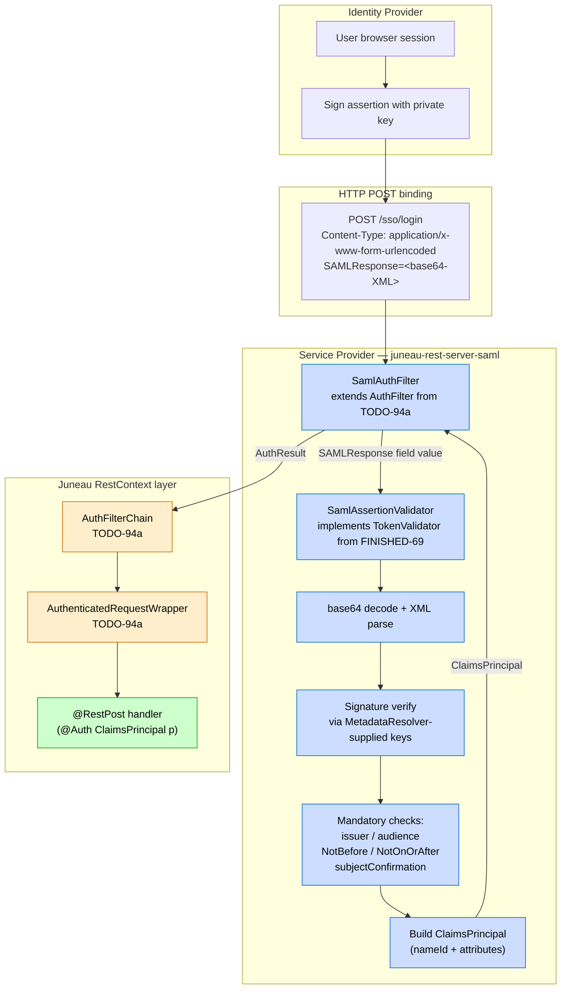

# TODO-94b: `juneau-rest-server-saml` — SAML 2.0 assertion validation module

Source: promoted from `TODO.md` on 2026-05-25 during `/todo expand 94` (multi-file split per AGENTS.md letter-suffix precedent — see FINISHED-16a/b/c).

**Hard dependency: TODO-94a (auth filter framework) must land first.** TODO-94a provides the `AuthFilter` SPI, `AuthFilterChain`, `AuthResult`, and `AuthenticatedRequestWrapper` that this module's `SamlAuthFilter` plugs into. Without TODO-94a, this module has nothing to plug into.

## Goal

Ship a new opt-in Maven module `juneau-rest-server-saml` that ships a `SamlAssertionValidator` (`implements TokenValidator` — FINISHED-69's existing SPI) and a `SamlAuthFilter` (`extends AuthFilter` — TODO-94a's SPI) for **consumer-side** SAML 2.0 assertion validation. Juneau is a Service Provider (SP) in SAML parlance — we receive a signed SAML assertion from an Identity Provider (IdP), verify it, extract the subject + attributes into a `ClaimsPrincipal`, and let downstream Juneau code consume it the same way it consumes a JWT-resolved `ClaimsPrincipal`.

Mirrors FINISHED-69's `juneau-rest-server-jwt` module isolation pattern: the SAML library dependency (`opensaml`) is declared `provided` so it never bleeds into the core `juneau-rest-server` POM. Consumers add `juneau-rest-server-saml` + the OpenSAML version they want.

End-state developer experience:

```java
@Rest(path="/sso")
public class SsoResource extends RestServlet {

    @Bean
    public AuthFilterChain authFilters(BeanStore bs) {
        var validator = SamlAssertionValidator.create()
            .metadataResolver(MyIdpMetadataResolver.create("https://idp.example.com/metadata"))
            .audience("https://api.example.com")
            .build();

        return AuthFilterChain.create(bs)
            .append(SamlAuthFilter.create()
                .pattern("/sso/*")
                .validator(validator)
                .build())
            .build();
    }

    @RestPost("/login")
    public Profile login(@Auth ClaimsPrincipal p) {
        // p is the assertion's subject; p.getClaim("eduPersonAffiliation", String.class) etc.
        return profileService.lookup(p.getName());
    }
}
```

## Why now

- **Direct sibling of TODO-94c (OAuth).** Both land on the TODO-94a filter framework; both fulfill the FINISHED-69 promise of "JWT is the v1 AuthN format, more formats land on top of the same `TokenValidator` SPI". SAML is the dominant enterprise SSO format that doesn't reduce to a JWT.
- **Module-isolation precedent is proven.** FINISHED-69's `juneau-rest-server-jwt` shipped with `nimbus-jose-jwt` declared `provided`; `mvn dependency:tree` on the upstream `juneau-rest-server` shows zero nimbus references. Repeating that pattern for `opensaml` is a known-good design.
- **Enterprise migration path.** Apps moving onto Juneau from Spring-Security-with-SAML configurations need a first-class story; this module is that story.

## Research findings (verified 2026-05-25)

Significant facts shaping the design:

1. **OpenSAML is the canonical Apache 2.0 Java SAML library.** Maintained by Shibboleth Consortium. Coordinates as of 2026:
    - `org.opensaml:opensaml-core-api`
    - `org.opensaml:opensaml-core-impl`
    - `org.opensaml:opensaml-saml-api`
    - `org.opensaml:opensaml-saml-impl`
    - `org.opensaml:opensaml-xmlsec-api` + `opensaml-xmlsec-impl` (signature/encryption)
    - `org.opensaml:opensaml-security-api` + `opensaml-security-impl` (key/cred management)
    - `org.opensaml:opensaml-messaging-api` + `opensaml-messaging-impl` (binding handlers)
    - `org.opensaml:opensaml-soap-api` + `opensaml-soap-impl` (only needed for back-channel artifact resolution)
    **License: Apache 2.0** — compatible with the Apache Juneau project's licensing without any additional NOTICE file work beyond standard Apache transitive-dep handling. Version to recommend is the latest 5.x line stable at land time (5.x is the Jakarta-EE-aligned generation; 4.x is the javax-aligned legacy). The exact version pin is filed under Open question 4.
    Transitive deps: `org.slf4j:slf4j-api`, `joda-time:joda-time` (still used in older code paths — verify whether 5.x has migrated to `java.time` since this affects the implementer's mental model), `net.shibboleth.utilities:java-support`, `org.cryptacular:cryptacular`, plus the standard XML-stack (`xerces`, `xalan`, `xml-apis`). These are NOT trivial.

2. **Alternatives considered and rejected for the bridge module's reference impl:**
    - **`org.apache.santuario:xmlsec` (signature-only path)** — Apache 2.0, smaller dep surface than OpenSAML (no full SAML object model), but the implementer would have to write the SAML XSD parsing, attribute extraction, condition validation, subject-confirmation walking, etc., from scratch. The amount of code we'd save by avoiding OpenSAML is more than swallowed by the amount we'd have to write. Documented as a "if you only need signature verification and already have your own SAML parser" escape hatch in the module README.
    - **`org.picketlink:picketlink-federation`** — JBoss-stewarded SAML library; Apache 2.0; less actively maintained than OpenSAML; not the canonical choice in 2026.
    - **Deprecated `javax.security.auth` / built-in Java SAML APIs** — there is no JDK-native SAML API; the `javax.security.sasl` Kerberos/GSSAPI bits are orthogonal. Skipped.
    - **`spring-security-saml2-service-provider`** — embeds OpenSAML, adds Spring Security plumbing on top. Out of charter because we deliberately don't depend on Spring Security; users who want it are already in Spring Security territory and don't need this module.
    The chosen approach is to wrap OpenSAML directly behind the `TokenValidator` SPI — same wrap-an-industry-canonical-lib stance FINISHED-69 took with nimbus.

3. **SAML assertion shape.** A SAML 2.0 `<Assertion>` is XML with these mandatory components for SP validation:
    - `<Signature>` — XML-DSig signature over the assertion (or over the enclosing `<Response>`). Must verify against an IdP-published key (from metadata).
    - `<Issuer>` — IdP's entity ID; must match the configured trusted IdP.
    - `<Subject>` — the authenticated user. `<NameID>` carries the username. `<SubjectConfirmation>` carries audience-restriction-like proof rules.
    - `<Conditions>` — `NotBefore` / `NotOnOrAfter` validity window + `<AudienceRestriction>` listing acceptable SP entity IDs. SP MUST match its own entity ID against the audience list.
    - `<AuthnStatement>` — when/how the user authenticated at the IdP.
    - `<AttributeStatement>` — attributes (email, groups, eduPersonAffiliation, etc.) that the IdP asserts about the user. The validator extracts these into `ClaimsPrincipal` claims.

4. **SAML bindings.** SAML assertions reach an SP via one of several bindings:
    - **HTTP POST** — the IdP redirects the user-agent to the SP with a base64-encoded `<Response>` in a form field (`SAMLResponse`). Most common for SSO.
    - **HTTP Redirect** — assertion (or `<AuthnRequest>`) in a query-string parameter. Used mostly for `<AuthnRequest>`, not assertions (assertions are too big).
    - **HTTP Artifact** — IdP sends an opaque artifact, SP fetches the assertion over back-channel SOAP. Niche.
    - **SOAP** — back-channel.
    v1 scope: **HTTP POST binding only** (the dominant case). Other bindings filed under Open question 3.

5. **Trust model.** The SP trusts the IdP because the IdP publishes a SAML metadata document (`<EntityDescriptor>`) listing its signing keys + endpoints. The SP loads this metadata at startup (and periodically refreshes), uses the keys to verify signatures, uses the endpoints to redirect for SSO. OpenSAML's `MetadataResolver` interface abstracts this.

6. **FINISHED-69's SPIs are filter-ready.** `TokenValidator` is `Principal validate(String token)`. For SAML, the "token" parameter is the base64-encoded `<Response>` extracted from the `SAMLResponse` form field. The validator decodes, parses, verifies, and returns a `ClaimsPrincipal` whose claims are the SAML attributes. Zero changes required to FINISHED-69's `TokenValidator` interface.

## Resolved decisions

1. **SAML library — OpenSAML, isolated in the new `juneau-rest-server-saml` sub-module, `provided` scope** (mirrors FINISHED-69's nimbus stance verbatim). The full OpenSAML dep tree is heavy (XML stack + cryptacular + joda + slf4j), so containment matters: a `dependency:tree` on `juneau-rest-server` MUST never surface any `org.opensaml:*` artifact. Consumers of `juneau-rest-server-saml` add the OpenSAML version they want; the module's POM declares the API/Impl pair as `provided`. Phase 1 includes a `mvn -pl juneau-rest/juneau-rest-server dependency:tree | grep -i opensaml` containment check, identical to FINISHED-69's nimbus containment check.

2. **Module structure mirrors `juneau-rest-server-jwt` end-to-end.** Same POM layout (parent `juneau-rest`, `bundle` packaging, source-jar + felix bundle-plugin + jacoco), same `juneau-rest-server` hard dep, same `provided`-scope third-party dep. Same `META-INF/services` discoverability through the `BeanStore` for the validator. Same release-notes section pattern (`### juneau-rest-server-saml (new module)`).

3. **`SamlAssertionValidator implements TokenValidator`.** Reuses FINISHED-69's SPI verbatim. No new validator interface. The "token" string parameter carries the base64-encoded `SAMLResponse` form value; the validator handles base64-decode + XML parse + signature verify + condition check + audience check internally. Returns a `ClaimsPrincipal` (FINISHED-69's existing type) whose claim names map 1:1 to SAML `<Attribute>` names; built-in claims for `nameId`, `nameIdFormat`, `sessionIndex`, `authnInstant`.

4. **`SamlAuthFilter` is the v1 filter shape.** Pulls the `SAMLResponse` form field from the request (HTTP POST binding only); rejects on other content types. Delegates the base64 payload to the configured `SamlAssertionValidator`. Wraps successful results in TODO-94a's `AuthResult` with the validator's `ClaimsPrincipal` + roles extracted from a configurable SAML attribute (default `roles`; users override via `SamlAuthFilter.rolesAttribute("groups")` etc.).

5. **Metadata loading is the consumer's job in v1.** The validator builder requires a `MetadataResolver` (OpenSAML's interface) — TODO-94b does NOT bundle a default `MetadataResolver` impl in v1. Documented "Choosing a MetadataResolver" matrix in the module README (filesystem-XML / URL-fetched / Shibboleth Consortium dynamic resolver / etc.). See Open question 2 for whether we change this in v1.5.

6. **Mandatory validation set.** The validator enforces ALL of the following at every `validate(...)` call; no opt-out for v1:
    - **Signature verification** against an IdP key resolved from the metadata.
    - **Issuer match** against the configured trusted IdP entity ID.
    - **Audience restriction** — the configured SP entity ID MUST appear in the `<Conditions><AudienceRestriction>` list.
    - **Time window** — current time must be within `NotBefore` (inclusive) and `NotOnOrAfter` (exclusive), with a configurable clock-skew window (default 60s, max 300s — mirrors FINISHED-69's `JwtTokenValidator` clock-skew design).
    - **Subject confirmation** — at least one `<SubjectConfirmation>` element must have a method that the SP recognizes (`urn:oasis:names:tc:SAML:2.0:cm:bearer` for the POST binding); if the `<SubjectConfirmationData>` carries `NotOnOrAfter` / `Recipient` / `InResponseTo`, those are also checked.
    Each failure throws `AuthenticationException` with a specific message + a `WWW-Authenticate: SAML realm="<realm>"` challenge.

7. **Algorithm allowlist for signature verification.** Default: `[http://www.w3.org/2001/04/xmldsig-more#rsa-sha256, http://www.w3.org/2001/04/xmldsig-more#ecdsa-sha256]`. SHA-1 variants permanently rejected (NIST deprecation). Algorithms configurable via `SamlAssertionValidator.Builder.signatureAlgorithms(String...)`. Mirrors FINISHED-69's `JwtTokenValidator` algorithm-allowlist pattern.

## Architecture



## Scope

**In scope (v1):**

- New Maven module `juneau-rest/juneau-rest-server-saml/` with POM mirroring `juneau-rest-server-jwt` end-to-end (parent `juneau-rest`, `bundle` packaging, OSGi manifest, jacoco wiring, source-jar attach).
- POM deps:
    - Hard dep: `juneau-rest-server` (transitively pulls TODO-94a's filter framework types from core).
    - **`provided` scope**: OpenSAML 5.x API + Impl pair plus the minimum companion deps needed to make API+Impl resolve (`opensaml-core-api`, `opensaml-core-impl`, `opensaml-saml-api`, `opensaml-saml-impl`, `opensaml-xmlsec-api`, `opensaml-xmlsec-impl`, `opensaml-security-api`, `opensaml-security-impl`, `opensaml-messaging-api`, `opensaml-messaging-impl`). Exact version pin per Open question 4.
- **`org.apache.juneau.rest.auth.saml.SamlAssertionValidator implements TokenValidator`**:
    - Builder accepts `metadataResolver(MetadataResolver)`, `audience(String)` (SP entity ID), `issuer(String)` (trusted IdP entity ID), `clockSkew(Duration)` (default 60s, max 300s), `signatureAlgorithms(String...)` (default `[rsa-sha256, ecdsa-sha256]`), `clock(Clock)` (default `Clock.systemUTC()`), `rolesAttribute(String)` (default `"roles"`), `requireSubjectConfirmation(boolean)` (default `true`).
    - `validate(String base64SamlResponse) throws AuthenticationException` — decodes, parses, verifies, checks, returns a `ClaimsPrincipal`. Claim names: `nameId`, `nameIdFormat`, `sessionIndex`, `authnInstant`, `issuer`, plus one entry per `<Attribute>` in the `<AttributeStatement>` (multi-valued attributes carried as `List<String>`).
- **`org.apache.juneau.rest.auth.saml.SamlAuthFilter extends AuthFilter`** (TODO-94a's SPI):
    - Builder accepts standard `AuthFilter` shape (`pattern(String...)`, `realm(String)`, `aggregateRolesOnSuccess(boolean)`) plus `validator(SamlAssertionValidator)`, `samlResponseFormField(String)` (default `"SAMLResponse"`), `rolesAttribute(String)` (default `"roles"`; if set, overrides the validator's setting at the filter level).
    - `authenticate(req)`:
        - Match HTTP POST + form-urlencoded content type; otherwise return empty (filter doesn't apply this request).
        - Read the `SAMLResponse` form field; if missing, return empty.
        - Delegate to `validator.validate(...)`; throw on `AuthenticationException`.
        - On success, build an `AuthResult` carrying the `ClaimsPrincipal` + roles extracted from the configured roles attribute.
- **`org.apache.juneau.rest.auth.saml.SamlMetadataResolvers`** (utility class) — convenience factory methods for the two most common `MetadataResolver` setups:
    - `SamlMetadataResolvers.url(URI metadataUrl, Duration refreshInterval)` — HTTP-fetched metadata with periodic refresh.
    - `SamlMetadataResolvers.file(Path metadataXml)` — file-system XML.
    These wrap OpenSAML's `FilesystemMetadataResolver` / `HTTPMetadataResolver` with sane defaults; users who need more (chained resolvers, custom auth, etc.) build their own.
- **`META-INF/services` registration** — none required (the validator + filter are user-constructed at `@Bean`-factory time, not ServiceLoader-discovered).
- **Tests** in `juneau-utest/src/test/java/org/apache/juneau/rest/auth/saml/`:
    - `SamlAssertionValidator_HappyPath_Test` — signed assertion with matching audience + issuer + time window → success; `ClaimsPrincipal` carries `nameId` + attributes.
    - `SamlAssertionValidator_Security_Test` — signature mismatch / no signature / wrong issuer / audience mismatch / before NotBefore / after NotOnOrAfter / no SubjectConfirmation / SHA-1 algorithm rejected.
    - `SamlAssertionValidator_Builder_Test` — required-field rejection, clock-skew bounds, signature-algorithm validation.
    - `SamlAssertionValidator_ClaimsPrincipal_Test` — attribute extraction (single + multi-valued), roles claim, claim-type coercion.
    - `SamlAuthFilter_Test` — happy path, missing form field, non-POST request returns empty (filter skipped), wrong content type returns empty, validator throws → `AuthenticationException` propagates with `WWW-Authenticate: SAML realm="..."`.
    - `SamlMetadataResolvers_Test` — file resolver + URL resolver round-trip (URL via local Jetty fixture).
    - **Containment check (CI-gated)** — a Maven plugin or shell step that runs `mvn -pl juneau-rest/juneau-rest-server dependency:tree` and greps for `org.opensaml`; non-zero matches fail the build. Mirrors FINISHED-69's nimbus containment gate.
- Module-level test deps in `juneau-utest/pom.xml` (test scope only):
    - `juneau-rest-server-saml`
    - OpenSAML API + Impl pair (the bridge module declares them `provided`, so test classpaths need explicit declarations).
    - Test fixtures: a stub IdP that signs assertions on demand for the happy-path tests.
- **Docs**: new topic page `juneau-docs/pages/topics/SamlAuthSupport.md`. Release-notes entry `### juneau-rest-server-saml (new module)` in `9.5.0.md` (or whichever release file the SAML module lands in).

**Explicitly out of scope (v1):**

- **IdP implementation** — Juneau is an SP, not an IdP. No `<AuthnRequest>` generation, no `<Response>` issuance, no metadata publishing. If a user needs to BE the IdP, that's an entirely different module.
- **WS-Federation** — separate protocol family; not SAML 2.0; out of charter.
- **SAML 1.x** — long deprecated; not supported.
- **Encrypted assertions** (`<EncryptedAssertion>`) — IdPs CAN encrypt assertions to the SP's public key; v1 supports signed-cleartext only. Filed under Open question 5.
- **Bindings other than HTTP POST** — HTTP Redirect (rarely used for assertions), HTTP Artifact (back-channel SOAP), SOAP. v1 = POST only.
- **Single Logout (SLO)** — orthogonal to assertion validation; would be its own module if requested.
- **Default `MetadataResolver` impl beyond the convenience factories** — see Open question 2.
- **Attribute mapping DSL** — v1 maps `<Attribute>` names 1:1 to `ClaimsPrincipal` claim names. Users who need transformation (rename, split, merge) do it after the validator returns.

## Implementation plan

### Phase 0 — confirm seams (read-only)

1. Confirm TODO-94a has landed and `AuthFilter` / `AuthFilterChain` / `AuthResult` / `AuthenticatedRequestWrapper` are stable public types in `org.apache.juneau.rest.auth.filter`.
2. Confirm FINISHED-69's `TokenValidator` / `ClaimsPrincipal` / `AuthenticationException` are stable.
3. Confirm OpenSAML 5.x dep coordinates resolve cleanly through Maven Central (no JBoss / Shibboleth repos required).
4. **Decide OpenSAML version pin** (Open question 4) and document the rationale.
5. **Decide MetadataResolver default packaging** (Open question 2).

### Phase 1 — module skeleton + POM + containment check

1. New module `juneau-rest/juneau-rest-server-saml/` with `pom.xml` mirroring `juneau-rest-server-jwt`.
2. POM `<properties>` carries `opensaml.version` (per Open question 4).
3. All OpenSAML deps declared `provided`.
4. Module registered in `juneau-rest/pom.xml` `<modules>` + three `<artifactItem>` entries (sources, bin/lib, bin/osgi) added to `juneau-distrib/pom.xml` (mirroring how FINISHED-69 wired `juneau-rest-server-jwt`).
5. Containment check verified: `mvn -pl juneau-rest/juneau-rest-server dependency:tree | grep -i opensaml` returns nothing.

### Phase 2 — `SamlAssertionValidator` (no filter yet)

1. Validator + builder + claim-extraction code.
2. `XMLObjectProviderRegistrySupport.initSAML()` hook called once (lazy-init in the validator constructor; OpenSAML requires bootstrap before any unmarshalling). Document the bootstrap behavior; protect against re-entrant init.
3. Tests:
    - `SamlAssertionValidator_HappyPath_Test`
    - `SamlAssertionValidator_Security_Test`
    - `SamlAssertionValidator_Builder_Test`
    - `SamlAssertionValidator_ClaimsPrincipal_Test`

### Phase 3 — `SamlAuthFilter`

1. Filter + builder.
2. Tests: `SamlAuthFilter_Test` exercising the HTTP POST happy path + skip-conditions + failure propagation.

### Phase 4 — `SamlMetadataResolvers` convenience factories

1. `SamlMetadataResolvers.url(...)` / `.file(...)`.
2. Tests: `SamlMetadataResolvers_Test` with a local Jetty fixture serving stub IdP metadata XML for the URL path.

### Phase 5 — end-to-end integration test

1. `SamlAuthFilter_EndToEnd_Test` — full stack: stub IdP issues a signed assertion → SP exposes a `RestServlet` protected by an `AuthFilterChain` containing the `SamlAuthFilter` → POST the assertion → confirm op handler sees the right `@Auth ClaimsPrincipal` and `req.isUserInRole(...)` matches the roles attribute.

### Phase 6 — docs + release notes

1. Release-notes entry under `### juneau-rest-server-saml (new module)` in the appropriate release notes file. Include explicit Maven coordinates, the `provided`-scope callout, and the OpenSAML version recommendation.
2. New topic page `juneau-docs/pages/topics/SamlAuthSupport.md` covering: SP-side mental model, the validator + filter wiring, `MetadataResolver` choice matrix, signature-algorithm allowlist, troubleshooting (clock skew, audience mismatch, attribute extraction).
3. Cross-link from TODO-94a's `AuthFilterFramework.md` topic page and FINISHED-69's `AuthGuards.md`.

## Acceptance criteria

- [ ] New module `juneau-rest/juneau-rest-server-saml` builds and tests pass.
- [ ] OpenSAML 5.x dep declared `provided`; containment check confirms zero `org.opensaml:*` references in `juneau-rest-server` `dependency:tree`.
- [ ] `SamlAssertionValidator implements TokenValidator` reuses FINISHED-69's SPI without modification.
- [ ] `SamlAuthFilter extends AuthFilter` plugs into TODO-94a's chain without bridging code.
- [ ] All six mandatory validation checks (signature, issuer, audience, time window, subject confirmation, algorithm allowlist) enforced and tested.
- [ ] SHA-1 signature algorithms permanently rejected.
- [ ] `ClaimsPrincipal` claims populated from `<AttributeStatement>` 1:1; built-in `nameId` / `nameIdFormat` / `sessionIndex` / `authnInstant` / `issuer` claims present.
- [ ] `SamlMetadataResolvers.url(...)` / `.file(...)` convenience factories work end-to-end.
- [ ] End-to-end test confirms `SamlAuthFilter` → `AuthFilterChain` → `@Guard` + `@Auth ClaimsPrincipal` composition.
- [ ] Coverage ≥ 85% on the SAML module (the heavy `OpenSAML`-mediated XML paths are exercised through stub-IdP fixtures; some defensive branches in XML parsing are deliberately unreachable from tests).
- [ ] Full `./scripts/test.py` green.

## Open questions

1. **Should `SamlAssertionValidator` integrate with FINISHED-69's `@Auth ClaimsPrincipal` arg-resolver via a different "principal type" than the JWT path?** Both JWT and SAML produce a `ClaimsPrincipal`; differentiating them downstream (e.g. "did this principal come from a SAML assertion or a JWT?") requires either a marker subclass (`SamlClaimsPrincipal extends ClaimsPrincipal`) or a `principal.getClaim("issuerType", String.class).equals("SAML")` convention. **Recommend: marker claim** (no new subclass — keeps the `@Auth Principal` API uniform); flag for confirmation.

2. **Bundle a default `MetadataResolver` impl in the module, or only the `SamlMetadataResolvers` convenience factories?** The convenience factories wrap OpenSAML's stock resolvers with sane defaults. A "bundled default" would mean picking one (likely the URL-based resolver with a 60-min refresh) and using it when the user doesn't specify a resolver. **Trade-off**: bundling a default makes the happy path one line shorter (`SamlAssertionValidator.create().metadataUrl(...).build()` vs `.metadataResolver(SamlMetadataResolvers.url(...)).build()`); not bundling keeps the validator's surface narrow and forces users to think about refresh semantics. **Recommend: convenience factories only** (no bundled default); document the factory functions prominently in the topic page.

3. **HTTP Redirect / Artifact / SOAP bindings — defer or in-scope v1?** v1 plan above ships POST binding only. HTTP Redirect is rarely used for full assertions (size limits); Artifact requires back-channel SOAP plumbing (an additional OpenSAML dep surface — `opensaml-soap-*`); SOAP binding is similarly heavy. **Recommend: POST-only v1**; file Redirect / Artifact / SOAP as follow-on TODOs only if user demand surfaces. Confirm.

4. **OpenSAML version pin.** Need to confirm the current stable 5.x line at land time. As of the 2026-05-25 planning date, the public OpenSAML release cadence has shipped 5.x for a couple of years; verify which 5.x release line is recommended for new integrations (Shibboleth Consortium typically marks one minor line as "current stable"). Avoid 5.0.0 (rough edges typical of x.0.0); ideally 5.1.x or 5.2.x. **Action: implementer confirms at land time and pins via the `opensaml.version` POM property.**

5. **Encrypted assertions (`<EncryptedAssertion>`) — in v1 or defer?** Some enterprise IdPs require encrypted assertions for sensitive attribute classes (e.g. anything tagged "restricted" in eduPerson). v1 plan ships signed-cleartext only. **Trade-off**: in-scope adds `opensaml-xmlsec-impl` Decrypter plumbing + a `decryptionCredential(Credential)` builder setting + tests; defers cleanly to v1.5 if not in scope. **Recommend: defer to v1.5**; flag for confirmation since some target users will need it day-1.

6. **Default signature algorithm allowlist.** Plan picks `[rsa-sha256, ecdsa-sha256]` (mirroring FINISHED-69's `JwtTokenValidator` defaults). Some legacy IdPs still sign with `rsa-sha1`; current NIST guidance deprecates SHA-1 for signatures. **Recommend: ship the strict default**; users who must accept SHA-1 opt in explicitly via `.signatureAlgorithms(...)` with a documented warning. Confirm.

7. **Clock-skew default + max.** Plan picks 60s default, 300s max (mirrors FINISHED-69's JWT path). SAML deployments historically tolerate more skew than JWT (some IdPs have notoriously poor NTP discipline). **Should the SAML default be larger (e.g. 120s)?** Recommend: keep at 60s for parity with the JWT path; users can raise to 300s explicitly. Confirm.

## Risk notes

- **OpenSAML's XML parsing surface is large and CVE-prone.** XML libraries (xerces, xalan) have a long CVE history (XXE, billion-laughs, etc.). Mitigation: defer XML-parser hardening to OpenSAML's library code (which knows the SAML-specific risks better than we do); pin a current OpenSAML 5.x release with active CVE patching; document the OpenSAML version recommendation in the release notes so users know which line to track.
- **`opensaml-xmlsec-impl` pulls `joda-time` and `xerces`/`xalan` transitively.** These are NOT trivial deps for downstream apps; the `provided`-scope containment makes them the consumer's problem, but downstream apps on `juneau-rest-server-saml` will see these transitively. Mitigation: documented in the module README + topic page; advise consumers to BOM-pin their XML stack.
- **OpenSAML `InitializationService.initialize()` is a global, one-shot operation.** Calling it twice or from multiple threads concurrently can race. Mitigation: lazy double-checked-locking init in the validator constructor; document the bootstrap behavior.
- **Signature verification is computationally expensive** (asymmetric crypto on potentially-large XML blobs). For high-traffic SP endpoints, this can dominate request latency. Mitigation: documented; recommend pairing with an SP-side session cookie that short-circuits re-validation once the assertion is consumed (future v1.5 work, not in v1).
- **Audience-mismatch error messages might leak the configured SP entity ID.** Today's `AuthenticationException` body would include the audience-mismatch message verbatim. Mitigation: messages name "audience" generically without echoing the configured value; specific mismatch detail goes to the request log only.
- **JWT/SAML algorithm-confusion attacks** — unlikely in the SAML world (SAML uses URN-style algorithm identifiers, not the JWT `alg` header), but the validator MUST still treat the algorithm as advisory and verify against the keys OpenSAML has registered for the assertion's signing credential rather than letting the algorithm hint pick the verification path. Mitigation: rely on OpenSAML's stock signature-verification pipeline; algorithm allowlist is enforced via OpenSAML's `SignatureValidationParameters`.
- **Stub-IdP test fixtures.** Tests need a way to produce signed SAML responses without spinning up a real IdP. Mitigation: use OpenSAML's stock `SignatureSupport` to sign in-memory `<Assertion>` objects with a generated keypair; the test classpath gets the same OpenSAML version as production via the `juneau-utest` test-scope dep. Pattern matches FINISHED-69's `JwtTestSupport` in `juneau-utest/src/test/java/org/apache/juneau/rest/auth/jwt/JwtTestSupport.java`.

## Out of scope (recap)

- IdP implementation (Juneau is SP, not IdP).
- WS-Federation, SAML 1.x.
- Encrypted assertions (v1.5).
- HTTP Redirect / Artifact / SOAP bindings (POST only in v1).
- Single Logout (SLO).
- Attribute mapping DSL.

## Related work

- `todo/TODO-94a-auth-filter-framework.md` — **HARD prereq.** This module's `SamlAuthFilter extends AuthFilter` from TODO-94a; nothing to plug into without it. TODO-94a provides the chain orchestration, role aggregation, and request wrapping. This module ships only the SAML-specific validation + filter glue.
- `todo/TODO-94c-oauth-module.md` — sibling. No hard dep between TODO-94b and TODO-94c (both depend on TODO-94a; neither depends on the other). Can land in parallel.
- `todo/FINISHED-69-authn-guards-jwt-apikey.md` — **soft dep / pattern source.** Reuses FINISHED-69's `TokenValidator` SPI, `AuthenticationException` (with `wwwAuthenticate(...)`), and `ClaimsPrincipal` types verbatim. Mirrors FINISHED-69's `juneau-rest-server-jwt` module-isolation pattern (`provided`-scope third-party dep, containment check, parent-POM + distrib wiring).
- `juneau-rest/juneau-rest-server-jwt/pom.xml` — the structural template this module's POM mirrors end-to-end.
- `juneau-rest/juneau-rest-server-jwt/src/main/java/org/apache/juneau/rest/auth/jwt/JwtTokenValidator.java` — the design template for `SamlAssertionValidator` (builder shape, mandatory-check enforcement, algorithm allowlist, clock-skew cap).
