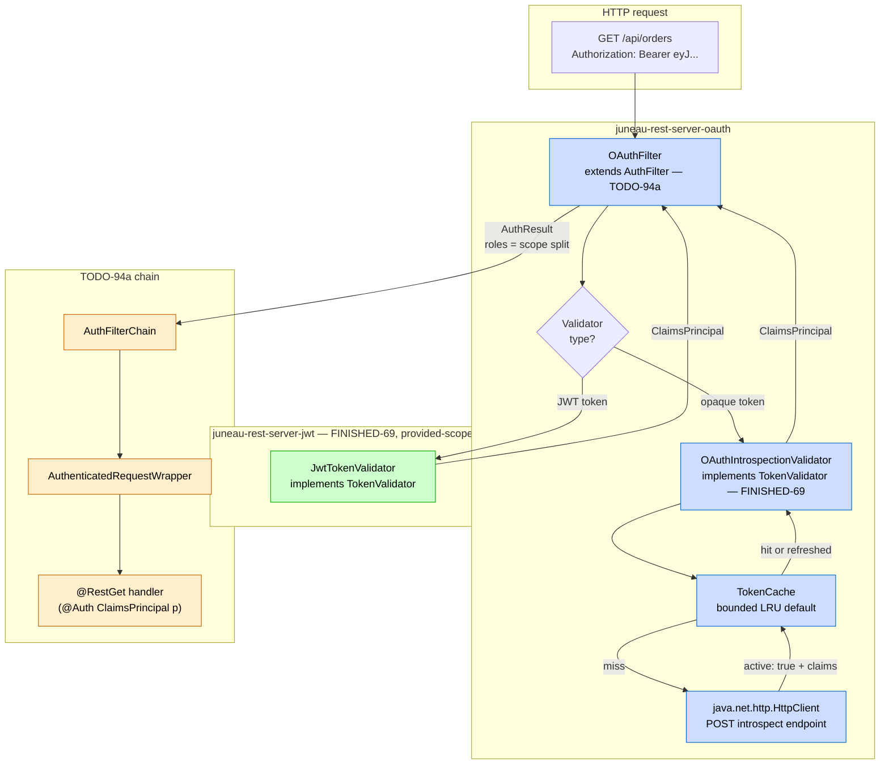
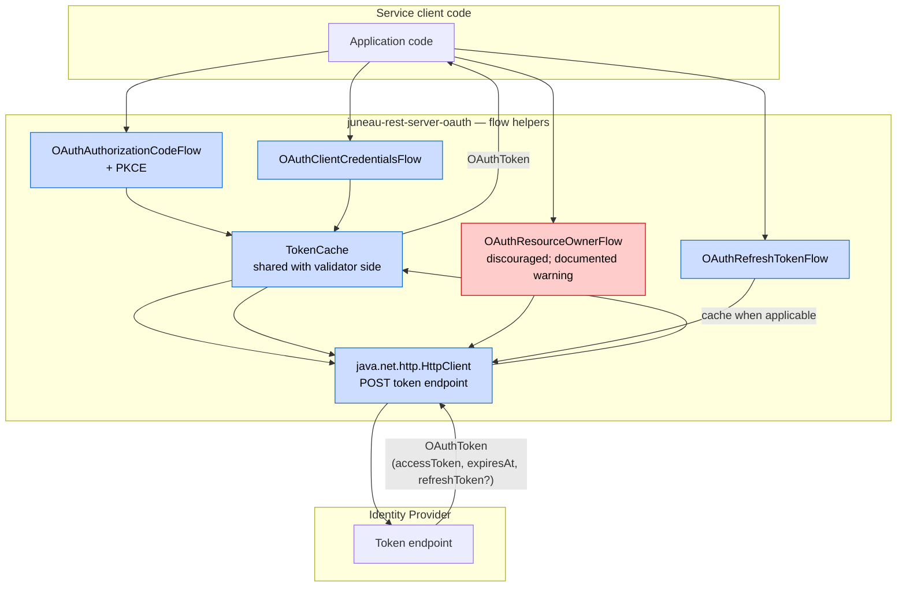
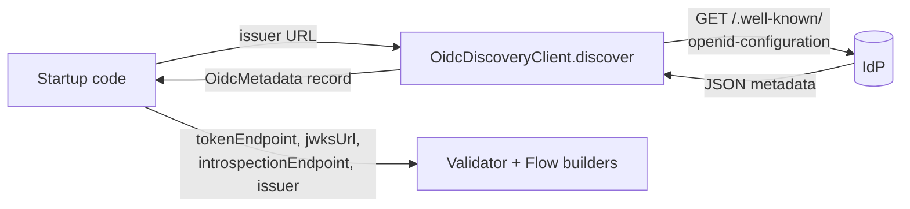

# TODO-94c: `juneau-rest-server-oauth` — OAuth 2.0 / OIDC integration module

Source: promoted from `TODO.md` on 2026-05-25 during `/todo expand 94` (multi-file split per AGENTS.md letter-suffix precedent — see FINISHED-16a/b/c).

**Hard dependency: TODO-94a (auth filter framework) must land first.** TODO-94a provides the `AuthFilter` SPI, `AuthFilterChain`, `AuthResult`, and `AuthenticatedRequestWrapper` that this module's `OAuthFilter` plugs into.

**Soft dependency: FINISHED-69 — reused, not reimplemented.** For OAuth access tokens that happen to be JWTs (the dominant case under OIDC), this module delegates verification to FINISHED-69's `JwtTokenValidator` in `juneau-rest-server-jwt`. We do NOT reimplement JWT verification here.

## Goal

Ship a new opt-in Maven module `juneau-rest-server-oauth` covering the **resource-server-side** of the OAuth 2.0 / OIDC ecosystem — the side that *accepts* OAuth-issued access tokens on protected endpoints, validates them (either via opaque-token introspection per RFC 7662 or JWT verification), and exposes the authenticated subject + scopes to Juneau code. Plus a curated set of **flow helpers** for service-to-service clients that need to *acquire* tokens (authorization-code with PKCE, client-credentials, resource-owner password-credentials, refresh-token), and OIDC discovery (`.well-known/openid-configuration`) to wire endpoints declaratively.

Mirrors FINISHED-69's `juneau-rest-server-jwt` module isolation pattern: built on the JDK `java.net.http.HttpClient` for all back-channel calls; no Nimbus / Spring Security at the module boundary. The only OAuth-flavored third-party surface is `juneau-rest-server-jwt`'s nimbus path, accessed via TODO-94c's optional dep on the JWT module (`provided` scope — consumers opt in if they want JWT access tokens; opaque-token-only consumers skip it).

End-state developer experience:

```java
// Resource-server side: protect /api/* with bearer-token validation.
@Rest(path="/api")
public class ApiResource extends RestServlet {

    @Bean
    public AuthFilterChain authFilters(BeanStore bs) {
        // Discover endpoints from the IdP's OIDC metadata.
        var oidc = OidcDiscoveryClient.create()
            .issuer(URI.create("https://login.example.com/realms/api"))
            .build()
            .discover();

        // For JWT access tokens (the OIDC default): delegate to FINISHED-69's JwtTokenValidator.
        var jwtValidator = JwtTokenValidator.create()
            .jwksUrl(oidc.jwksUrl())
            .issuer(oidc.issuer().toString())
            .audience("api.example.com")
            .build();

        // For opaque tokens (RFC 7662 introspection):
        var opaqueValidator = OAuthIntrospectionValidator.create()
            .introspectionEndpoint(oidc.introspectionEndpoint())
            .clientId("api-server")
            .clientSecret(envSecret("OAUTH_CLIENT_SECRET"))
            .build();

        return AuthFilterChain.create(bs)
            .append(OAuthFilter.create()
                .pattern("/api/*")
                .validator(jwtValidator)           // OR opaqueValidator; or both via two filters
                .build())
            .build();
    }
}

// Client side: acquire a token via client-credentials.
var token = OAuthClientCredentialsFlow.create()
    .tokenEndpoint(URI.create("https://login.example.com/realms/api/protocol/openid-connect/token"))
    .clientId("worker-service")
    .clientSecret(envSecret("OAUTH_CLIENT_SECRET"))
    .scope("read:orders write:orders")
    .build()
    .acquire();
restClient.bearerToken(token.accessToken()).get("/api/orders").run();
```

## Why now

- **Direct sibling of TODO-94b (SAML).** Both land on TODO-94a's filter framework; both extend FINISHED-69's `TokenValidator` SPI; both follow the `juneau-rest-server-jwt` module-isolation precedent. Together they cover the three dominant enterprise AuthN formats (JWT — FINISHED-69; SAML — TODO-94b; OAuth/OIDC — TODO-94c).
- **OAuth 2.0 / OIDC is the dominant token-issuance protocol for modern services.** Every major IdP — Okta, Auth0, Keycloak, Azure AD, Cognito, Google — speaks it. Today a Juneau user accepting OAuth tokens either uses FINISHED-69's `JwtTokenValidator` directly (works for JWT access tokens but skips the OAuth client-flow story) or reaches for Spring Security's OAuth client. A first-class Juneau module closes both gaps.
- **JDK `java.net.http.HttpClient` covers the entire back-channel surface.** Token endpoint, introspection endpoint, JWKS fetch, OIDC discovery — all are simple HTTPS GET/POST with JSON responses. No HTTP-client dep needed for the OAuth flow paths; the JWKS path is already covered by FINISHED-69's nimbus integration when JWT validation is in play.

## Research findings (verified 2026-05-25)

Significant facts shaping the design:

1. **OAuth 2.0 standard surface area we care about:**
    - **RFC 6749** — OAuth 2.0 framework: authorization-code, client-credentials, resource-owner password-credentials, refresh-token, implicit (deprecated). v1 ships all *except* implicit.
    - **RFC 7636** — PKCE (Proof Key for Code Exchange). Mandatory for authorization-code in modern OAuth profiles.
    - **RFC 7662** — Token introspection. The opaque-token validation path.
    - **RFC 6750** — Bearer token usage (`Authorization: Bearer <token>`). Already covered by FINISHED-69's `BearerTokenGuard` extraction logic.
    - **RFC 8414** — OAuth 2.0 Authorization Server Metadata (`/.well-known/oauth-authorization-server`). Companion to OIDC's `/.well-known/openid-configuration`.
    - **RFC 8628** — Device authorization grant. Listed in scope-options as "defer to follow-on TODO unless trivially small"; current take: device-code requires browser-redirect coordination that doesn't fit the v1 "this is a resource-server + back-channel-client" charter cleanly. Defer.

2. **OIDC standard surface area:**
    - **OIDC Core 1.0** — ID tokens (a JWT shape), `userinfo` endpoint, scopes (`openid`, `profile`, `email`), `nonce` claim for replay protection.
    - **OIDC Discovery 1.0** — `/.well-known/openid-configuration` endpoint returns JSON listing every IdP endpoint + capability flag. Drastically reduces config burden.
    - **OIDC RP (Relying Party) Login Flow** — the user-facing "log in with Google/Okta" interactive flow. **Significantly larger than v1's resource-server charter** — covers session management, OIDC nonce verification, ID-token + access-token correlation, userinfo fetch, optional dynamic client registration. v1 ships the *building blocks* (discovery, JWT validation, authorization-code flow) but does NOT ship the end-to-end RP. See Open question 3.

3. **JWT vs. opaque tokens.** OAuth 2.0 access tokens are spec-opaque (the resource server treats them as bearer strings). In practice:
    - **JWT access tokens** — most modern IdPs (Okta, Auth0, Keycloak, Azure AD, Cognito) issue JWTs by default. Verification is local + cacheable JWKS fetch; zero per-request IdP round-trip. **TODO-94c delegates to FINISHED-69's `JwtTokenValidator` via the optional `juneau-rest-server-jwt` provided-scope dep.**
    - **Opaque access tokens** — Google's Workspace tokens are the most famous example; some on-prem IdPs configure for opaque to keep token contents private. Verification requires an introspection round-trip per request (RFC 7662 POST to the IdP's introspection endpoint with `Authorization: Basic <client_id:client_secret>`). **TODO-94c ships `OAuthIntrospectionValidator` directly on the JDK `HttpClient`.**

4. **JDK `java.net.http.HttpClient` is sufficient for every back-channel call.** Token endpoint POST (form-urlencoded body, JSON response), introspection POST (form body, JSON response), discovery GET (JSON response), JWKS GET (JSON response). No third-party HTTP client needed; the JDK's `HttpClient` (since JDK 11) covers timeouts, async, HTTP/2, basic auth, and TLS out of the box.

5. **JSON parsing for OAuth/OIDC responses.** Token endpoint responses are tiny JSON objects (`access_token`, `token_type`, `expires_in`, `refresh_token`, `scope`). Introspection responses are similar (`active`, `sub`, `exp`, `scope`, etc.). Discovery responses are larger but still pure JSON. **Reuse `juneau-marshall`'s JSON parser** for everything — it's already a hard dep of `juneau-rest-server`. No new JSON-parser dep.

6. **FINISHED-69's `JwtTokenValidator` is reusable as-is.** Its builder takes `jwksUrl(URI)`, `issuer(String)`, `audience(String)`, `algorithms(...)`, `clockSkew(Duration)`, `clock(Clock)`. The validator returns a `ClaimsPrincipal`. TODO-94c's `OAuthFilter` simply accepts a `TokenValidator` (FINISHED-69's SPI); users plug in either the JWT validator from the JWT module or this module's `OAuthIntrospectionValidator`.

7. **Token cache design.** Both introspection and client-credentials flows benefit from per-token caching:
    - **Introspection cache** — same opaque token validated within the cache window short-circuits the IdP round-trip. Default TTL bounded by `min(token's exp, configured-ttl)`; LRU bounded by `maxEntries`.
    - **Client-credentials token cache** — a service acquiring tokens for back-channel calls should reuse them until `exp - skew`, not re-acquire on every call. Same shape.
    Both cache SPIs are pluggable so consumers can swap an in-memory default for Redis / Caffeine / etc.

8. **No HTTP-client surface conflict with `juneau-rest-client`.** `juneau-rest-client` exists for *user* HTTP calls; using it for the framework's OAuth back-channel would couple the OAuth module to the REST client's lifecycle + transitive deps. The JDK `HttpClient` keeps the boundary clean.

## Resolved decisions

1. **Build on `java.net.http.HttpClient` for ALL back-channel.** No `juneau-rest-client` dep; no Apache HttpClient; no OkHttp. Per-flow / per-validator builders accept an optional `httpClient(HttpClient)` so users who need custom HTTP behavior (proxies, custom SSL, timeouts) wire their own.

2. **Reuse FINISHED-69's `juneau-rest-server-jwt` for JWT access-token validation; do NOT reimplement.** TODO-94c declares `juneau-rest-server-jwt` as a `provided`-scope dep so consumers who want JWT access tokens add both modules (and the nimbus dep) at runtime. Opaque-token-only consumers skip the JWT module entirely — TODO-94c's `OAuthFilter` accepts ANY `TokenValidator`. Containment: `mvn dependency:tree` on `juneau-rest-server-oauth` MUST NOT pull nimbus transitively; nimbus only surfaces when the consumer explicitly adds both `juneau-rest-server-oauth` + `juneau-rest-server-jwt` + nimbus on their own classpath.

3. **No Spring Security / Spring OAuth deps.** Same isolation discipline as FINISHED-69 and TODO-94b. Spring users who want Spring Security's OAuth client keep using it; this module is the Juneau-native peer.

4. **JSON parsing via `juneau-marshall` (existing hard dep of `juneau-rest-server`).** No new JSON-parser dep.

5. **Token cache SPI is pluggable; ship a bounded-LRU in-memory default.** `TokenCache` interface with `get(String key) -> Optional<CachedToken>` / `put(String key, CachedToken, Duration ttl)`. Default impl: `LinkedHashMap`-backed with `accessOrder=true` (LRU) + a max-entries cap (default 1000; configurable) + per-entry TTL eviction on `get`. Pluggable so a Redis / Caffeine impl drops in for distributed deployments.

6. **`OAuthIntrospectionValidator implements TokenValidator`** (FINISHED-69's SPI). On `validate(String token)`: cache lookup first; on miss, POST to introspection endpoint with `Authorization: Basic <client_id:client_secret>` + form body `token=<token>&token_type_hint=access_token`; parse the JSON response; if `"active": false`, throw `AuthenticationException`; on `"active": true`, build a `ClaimsPrincipal` from the response fields (`sub` → `Principal.getName()`; `scope`, `client_id`, `username`, `aud`, `iss`, `exp`, plus any IdP-specific extra fields → claims); cache the success for `min(exp - now, configured-ttl)`.

7. **`OAuthFilter extends AuthFilter`** (TODO-94a's SPI). Pulls `Authorization: Bearer <token>` from the request (reuses FINISHED-69's extraction logic verbatim — same parser); delegates to the configured `TokenValidator`; wraps the result in an `AuthResult` with roles extracted from a configurable claim (default `scope` split on whitespace per RFC 6749 §3.3, mapped 1:1 into the role set).

8. **OIDC discovery is a separate utility, not auto-fetched.** `OidcDiscoveryClient` is its own type; users call `.discover()` explicitly to get an `OidcMetadata` record. The metadata record's getters (`tokenEndpoint()`, `jwksUrl()`, `introspectionEndpoint()`, etc.) feed the validator and flow-helper builders. **Rationale:** discovery is a one-time startup call; baking it into the validator's lazy-init path would mean every test setup also pays the discovery cost + needs network. Explicit is better.

9. **Flow helpers are stateless value types.** Each flow type (`OAuthClientCredentialsFlow`, `OAuthAuthorizationCodeFlow`, `OAuthResourceOwnerFlow`, `OAuthRefreshTokenFlow`) is a builder-built object with an `acquire()` (or `exchange()`) method returning an `OAuthToken` record (`accessToken`, `tokenType`, `expiresAt`, `refreshToken Optional<...>`, `scope Optional<...>`). No mutable state on the flow objects themselves.

## Architecture

### Resource-server side (validation)



### Client side (token acquisition flows)



### OIDC discovery



## Scope

**In scope (v1):**

- New Maven module `juneau-rest/juneau-rest-server-oauth/` with POM mirroring `juneau-rest-server-jwt` (parent `juneau-rest`, `bundle` packaging, OSGi manifest, jacoco wiring, source-jar attach).
- POM deps:
    - Hard dep: `juneau-rest-server` (transitively pulls TODO-94a's filter framework types + FINISHED-69's `TokenValidator` / `ClaimsPrincipal` / `AuthenticationException`).
    - **`provided` scope**: `juneau-rest-server-jwt` (consumers who want JWT access tokens add it + the nimbus dep at runtime; opaque-token-only consumers don't pay this cost).
    - No HTTP-client dep — JDK `java.net.http.HttpClient` only.
    - No JSON-parser dep — `juneau-marshall` already transitively present.
- **`org.apache.juneau.rest.auth.oauth.OAuthIntrospectionValidator implements TokenValidator`** (FINISHED-69 SPI):
    - Builder accepts `introspectionEndpoint(URI)`, `clientId(String)`, `clientSecret(String)` (or `clientSecretSupplier(Supplier<String>)` for rotation), `httpClient(HttpClient)` (optional), `tokenCache(TokenCache)` (optional; defaults to bounded LRU), `cacheTtl(Duration)` (default 5 min, max 1h; capped by token's `exp` if shorter), `clock(Clock)` (default `Clock.systemUTC()`), `requiredScopes(String...)` (optional — extra check that the token's `scope` claim covers these).
    - `validate(String token)`:
        1. Cache lookup; if hit + not expired, return cached `ClaimsPrincipal`.
        2. POST to introspection endpoint with `Authorization: Basic <base64(clientId:clientSecret)>` + form body `token=<token>&token_type_hint=access_token`.
        3. Parse JSON response.
        4. If `"active": false`, throw `AuthenticationException("Token inactive")` with `WWW-Authenticate: Bearer realm="<realm>", error="invalid_token"`.
        5. If `requiredScopes` set and `scope` claim doesn't cover them, throw `AuthenticationException("Required scope missing")` with `WWW-Authenticate: Bearer realm="...", error="insufficient_scope"`.
        6. Build `ClaimsPrincipal` from response fields; cache; return.
- **`org.apache.juneau.rest.auth.oauth.OAuthFilter extends AuthFilter`** (TODO-94a SPI):
    - Builder accepts standard `AuthFilter` shape + `validator(TokenValidator)` + `rolesClaim(String)` (default `"scope"`; values whitespace-split per RFC 6749 §3.3) + `realm(String)` (default `"api"`).
    - `authenticate(req)`:
        1. Extract `Authorization: Bearer <token>` (reuse FINISHED-69's extraction logic; same parser).
        2. If absent / malformed, return empty (filter doesn't apply).
        3. Delegate to `validator.validate(token)`; throw on `AuthenticationException`.
        4. Build `AuthResult` from the returned `Principal` + roles extracted from the configured `rolesClaim`.
- **Flow helpers** in `org.apache.juneau.rest.auth.oauth.flow`:
    - **`OAuthClientCredentialsFlow`** — `tokenEndpoint(URI)`, `clientId(String)`, `clientSecret(String)` (or supplier), `scope(String...)` (joined with spaces per spec), `httpClient(HttpClient)` (optional). `acquire()` returns `OAuthToken`. Cached per `(clientId, scope)` key when `tokenCache(TokenCache)` is supplied.
    - **`OAuthAuthorizationCodeFlow`** — `tokenEndpoint(URI)`, `authorizationEndpoint(URI)` (for the URL generator), `clientId(String)`, `clientSecret(Optional<String>)` (public clients omit), `redirectUri(URI)`, `scope(String...)`, `httpClient(HttpClient)` (optional). Provides `buildAuthorizationUrl(state, pkceChallenge)` (PKCE S256 mandatory) and `exchange(code, pkceVerifier)` returning `OAuthToken`. The flow itself does NOT manage state/PKCE storage — that's the caller's responsibility per OIDC RP charter.
    - **`OAuthResourceOwnerFlow`** — `tokenEndpoint(URI)`, `clientId(String)`, `clientSecret(String)`, `username(String)`, `password(String)`, `scope(String...)`, `httpClient(HttpClient)` (optional). `acquire()` returns `OAuthToken`. **Discouragement notice**: javadoc + topic-page warning that this grant type was removed from OAuth 2.1; legitimate use limited to first-party trusted clients that already have the user's credentials. Filed under `@Deprecated(since = "9.5.0")` from day-1 to surface the warning at IDE compile time.
    - **`OAuthRefreshTokenFlow`** — `tokenEndpoint(URI)`, `clientId(String)`, `clientSecret(Optional<String>)`, `refreshToken(String)`, `scope(String...)` (optional narrowing), `httpClient(HttpClient)` (optional). `acquire()` returns `OAuthToken` with a potentially-rotated refresh token.
- **`org.apache.juneau.rest.auth.oauth.OAuthToken`** record: `accessToken (String)`, `tokenType (String)`, `expiresAt (Instant)`, `refreshToken (Optional<String>)`, `scope (Optional<Set<String>>)`, `idToken (Optional<String>)`. Immutable.
- **OIDC discovery** in `org.apache.juneau.rest.auth.oauth.oidc`:
    - `OidcDiscoveryClient` — `.issuer(URI)`, `.httpClient(HttpClient)`, `.build().discover() -> OidcMetadata`. Fetches `<issuer>/.well-known/openid-configuration`. Cached per-instance (one-shot — re-create for refresh).
    - `OidcMetadata` record — getters for the standard OIDC + OAuth metadata fields the validators/flows need (`issuer`, `tokenEndpoint`, `authorizationEndpoint`, `introspectionEndpoint`, `jwksUrl`, `userinfoEndpoint`, `endSessionEndpoint`, `supportedScopes`, etc.). Unknown fields preserved as `Map<String, Object> extras()` for IdP-specific extensions.
- **`org.apache.juneau.rest.auth.oauth.TokenCache`** SPI + default bounded-LRU impl `BoundedLruTokenCache` (default 1000 entries, configurable). Pluggable so Redis/Caffeine impls drop in.
- **Tests** in `juneau-utest/src/test/java/org/apache/juneau/rest/auth/oauth/`:
    - `OAuthIntrospectionValidator_HappyPath_Test`
    - `OAuthIntrospectionValidator_Inactive_Test`
    - `OAuthIntrospectionValidator_InsufficientScope_Test`
    - `OAuthIntrospectionValidator_Cache_Test` (cache hit / miss / TTL eviction / per-entry exp cap)
    - `OAuthIntrospectionValidator_Builder_Test`
    - `OAuthFilter_Test`
    - `OAuthFilter_JwtValidator_IntegrationTest` (delegates to `juneau-rest-server-jwt`)
    - `OAuthClientCredentialsFlow_Test` (with `OAuthClientCredentialsFlow_Cache_Test`)
    - `OAuthAuthorizationCodeFlow_Test` (PKCE generation + auth-URL building + code-exchange happy path)
    - `OAuthResourceOwnerFlow_Test` (happy path + the `@Deprecated` warning round-trip)
    - `OAuthRefreshTokenFlow_Test` (refresh + refresh-token rotation)
    - `OidcDiscoveryClient_Test` (fetch + parse + unknown-field preservation in `extras()`)
    - `BoundedLruTokenCache_Test`
    - **Containment check** — `mvn -pl juneau-rest/juneau-rest-server dependency:tree | grep -i nimbus` returns empty (TODO-94c does NOT add nimbus to the upstream tree; nimbus only surfaces if the consumer pulls the JWT module too).
- Module-level test deps in `juneau-utest/pom.xml` (test scope only): `juneau-rest-server-oauth` + `juneau-rest-server-jwt` (for the JWT-delegating filter test) + `nimbus-jose-jwt` (test scope — required by `juneau-rest-server-jwt`'s tests). Fixtures: a stub IdP fronting `WireMock`-style HTTP stubs or a thin `HttpClient`-mock layer.
- **Docs**: new topic page `juneau-docs/pages/topics/OAuthAuthSupport.md`. Release-notes entry `### juneau-rest-server-oauth (new module)`.

**Explicitly out of scope (v1):**

- **Device-code flow (RFC 8628).** Browser-redirect coordination doesn't fit the resource-server + back-channel-client v1 charter cleanly. Defer to follow-on TODO.
- **OAuth 1.x.** Deprecated; no demand.
- **Implicit flow.** Deprecated in OAuth 2.1; security flaws around access-token-in-URL fragment.
- **Custom grant types** beyond the four standard flows (e.g. JWT-bearer-grant RFC 7523, SAML2-bearer-grant RFC 7522). File as follow-ons if requested.
- **End-to-end OIDC Relying-Party (RP) login flow.** Discovery, JWT validation, and authorization-code flow are in scope; the *session-management + nonce-correlation + userinfo-fetch + ID-token-claims-into-session* glue that turns those into a "Log in with Google" button is its own non-trivial design. See Open question 3 for whether this changes.
- **Dynamic client registration (RFC 7591).** Niche; manual client provisioning is the dominant practice. Defer.
- **PAR (Pushed Authorization Requests, RFC 9126).** Modern but not yet ubiquitous. Defer to a v1.5 if real-world demand surfaces.
- **mTLS-bound tokens (RFC 8705) / DPoP (RFC 9449).** Sender-constrained token shapes; orthogonal to the bearer-token v1 surface.
- **OIDC dynamic-key-rotation listening** (refresh JWKS on `kid` miss). FINISHED-69's `JwksCache` already handles TTL-driven refresh + graceful-degradation; on-`kid`-miss eager refresh is a v1.5 enhancement.

## Implementation plan

### Phase 0 — confirm seams (read-only)

1. Confirm TODO-94a has landed and `AuthFilter` / `AuthFilterChain` / `AuthResult` / `AuthenticatedRequestWrapper` are stable.
2. Confirm FINISHED-69's `TokenValidator` / `ClaimsPrincipal` / `AuthenticationException` are stable and that `JwtTokenValidator` in `juneau-rest-server-jwt` is consumable as a normal `TokenValidator` (it should be — the JWT module's whole point was being a drop-in `TokenValidator`).
3. Confirm `juneau-marshall`'s JSON parser handles the introspection / discovery / token-endpoint JSON shapes cleanly (single-level objects with mixed string / number / boolean / array values; no surprises).
4. Confirm JDK `java.net.http.HttpClient` is available in the target JDK version (yes — JDK 17 is the project floor; `HttpClient` since JDK 11).
5. Confirm containment: nothing in `juneau-rest-server-oauth`'s own POM transitively pulls nimbus.

### Phase 1 — module skeleton + POM + containment check

1. New module `juneau-rest/juneau-rest-server-oauth/` with `pom.xml` mirroring `juneau-rest-server-jwt`.
2. `provided`-scope dep on `juneau-rest-server-jwt`. No nimbus dep at the OAuth module's own POM.
3. Module registered in `juneau-rest/pom.xml` `<modules>` + `juneau-distrib/pom.xml` `<artifactItem>` entries.
4. Containment check passes.

### Phase 2 — `OAuthIntrospectionValidator` + `TokenCache` SPI + bounded-LRU default

1. Validator + builder + cache SPI + default impl.
2. Tests:
    - `OAuthIntrospectionValidator_HappyPath_Test`
    - `OAuthIntrospectionValidator_Inactive_Test`
    - `OAuthIntrospectionValidator_InsufficientScope_Test`
    - `OAuthIntrospectionValidator_Cache_Test`
    - `OAuthIntrospectionValidator_Builder_Test`
    - `BoundedLruTokenCache_Test`

### Phase 3 — `OAuthFilter` + JWT delegation integration

1. `OAuthFilter` extending TODO-94a's `AuthFilter`.
2. Tests:
    - `OAuthFilter_Test` (happy path with introspection validator)
    - `OAuthFilter_JwtValidator_IntegrationTest` (filter wired to FINISHED-69's `JwtTokenValidator`; confirms the cross-module composition works)

### Phase 4 — flow helpers (client side)

1. `OAuthToken` record.
2. `OAuthClientCredentialsFlow` + `OAuthAuthorizationCodeFlow` + `OAuthResourceOwnerFlow` (`@Deprecated`) + `OAuthRefreshTokenFlow`.
3. Tests for each flow.

### Phase 5 — OIDC discovery

1. `OidcDiscoveryClient` + `OidcMetadata` record.
2. Tests: `OidcDiscoveryClient_Test` (happy path + unknown-field preservation + endpoint extraction).

### Phase 6 — docs + release notes

1. Release-notes entry under `### juneau-rest-server-oauth (new module)`. Include Maven coordinates, the `provided`-scope JWT-module note, and the JDK `HttpClient` minimal-deps callout.
2. New topic page `juneau-docs/pages/topics/OAuthAuthSupport.md` covering: resource-server-side filter + validator wiring, JWT-vs-opaque token decision matrix, the four flow helpers (with the `OAuthResourceOwnerFlow` discouragement warning prominent), OIDC discovery walkthrough, token-cache configuration.
3. Cross-link from TODO-94a's `AuthFilterFramework.md` and FINISHED-69's `AuthGuards.md` + `JwtTokenValidator` javadoc.

## Acceptance criteria

- [ ] New module `juneau-rest/juneau-rest-server-oauth` builds and tests pass.
- [ ] No nimbus / Spring deps at the OAuth module's POM boundary; containment check confirms.
- [ ] `OAuthIntrospectionValidator implements TokenValidator` (FINISHED-69 SPI) verified by reflection in a test.
- [ ] `OAuthFilter extends AuthFilter` (TODO-94a SPI) verified.
- [ ] Filter + JWT-validator delegation works end-to-end (proves the soft-dep on FINISHED-69's JWT module).
- [ ] All four flow helpers compile-time-verified: `OAuthClientCredentialsFlow`, `OAuthAuthorizationCodeFlow` (PKCE S256 mandatory), `OAuthResourceOwnerFlow` (with `@Deprecated`), `OAuthRefreshTokenFlow`.
- [ ] OIDC discovery returns a populated `OidcMetadata` against a stub IdP fixture.
- [ ] Bounded-LRU token cache enforces both max-entries cap AND per-entry TTL, with eviction tests covering both.
- [ ] Coverage ≥ 85% on the OAuth module (network-bound paths exercised through HttpClient mocks / stub-IdP fixtures).
- [ ] Full `./scripts/test.py` green.

## Open questions

1. **Token-cache TTL default + LRU bound.** Plan picks 5 min default TTL (capped by token's `exp` when shorter), max TTL 1h, default LRU 1000 entries. **Are these defaults right?** 5 min TTL means a revoked token still works for up to 5 min — acceptable for most setups, dangerous for high-security ones. **Alternative**: shorter default (60s) + clearer documentation that operators should tune up if their introspection endpoint can't handle the QPS. Confirm before Phase 2.

2. **Bundle a default introspection-endpoint client or require consumer wiring?** Plan picks "bundled by default" — the `OAuthIntrospectionValidator.Builder` accepts `introspectionEndpoint(URI)` + `clientId(String)` + `clientSecret(String)` and constructs an internal `HttpClient`-backed call. Alternative: require the user to supply an `IntrospectionClient` they built themselves. **Recommend: bundled default** with the optional `httpClient(HttpClient)` escape hatch for custom HTTP behavior. Confirm.

3. **OIDC RP (Relying-Party) login flow — in v1 or deferred?** v1 plan ships the building blocks (discovery, JWT validation, authorization-code flow with PKCE) but does NOT ship the end-to-end "Log in with Google" RP. The RP layer would add: session-cookie management, nonce generation+storage+verification, ID-token claims → session, userinfo fetch, state CSRF protection, OIDC-specific error handling. **Trade-off:** in-scope = ~500 LOC + non-trivial session-storage SPI; defer = users compose the building blocks themselves (workable but a real learning curve). **Recommend: defer to v1.5** as `juneau-rest-server-oidc-rp` (separate module) unless the OQA round picks in-scope. The user-facing comment in the original TODO-94 bullet flagged this as "unless the worker judges it's a small lift" — current judgment: **not** a small lift; defer.

4. **`OAuthResourceOwnerFlow` ship-or-skip.** OAuth 2.1 has removed this grant type. We're shipping it anyway because (a) some IdPs still require it for legacy client migrations, and (b) it's tiny (one POST). **Confirm**: ship-with-`@Deprecated`-since-9.5.0 (current plan) vs. don't-ship-at-all (force users who need it to construct the HttpClient call manually). Recommend: ship-with-warning so the migration story is "use Juneau's helper but heed the IDE warning" rather than "go write your own HttpClient call".

5. **Device-code flow (RFC 8628) — confirm defer.** Current plan defers. The original TODO bullet said "defer to a follow-on TODO unless trivially small". Device-code is ~100 LOC of polling logic + the user-experience of "show this code to the user and wait for them to enter it on another device"; the latter doesn't really belong in a framework module. **Confirm defer.**

6. **`requiredScopes` enforcement on the validator vs. the filter.** Plan puts the check on `OAuthIntrospectionValidator.Builder.requiredScopes(...)`. Could also live on `OAuthFilter.Builder.requiredScopes(...)` (since scope semantics are an AuthZ concern, and AuthZ traditionally sits closer to the filter/op layer than the validator). **Recommend: keep on the validator** so the JWT path (FINISHED-69's `JwtTokenValidator` — which doesn't have a `requiredScopes` setting today) and the introspection path expose the same surface; users who want pure-AuthZ scope-checking can stack a `RestGuard` on top. Confirm.

7. **JWKS-on-kid-miss eager refresh — coordinate with FINISHED-69 or defer entirely?** FINISHED-69's `JwksCache` refreshes on TTL only; if an IdP rotates keys outside the TTL window and the cached key set doesn't contain the new `kid`, validation fails until the next TTL expiry. The OAuth module hits this same path when validating JWTs. **Should TODO-94c land an enhancement to FINISHED-69 to add `kid`-miss eager refresh, or defer that to a future TODO touching FINISHED-69 specifically?** Recommend: defer; file as a separate TODO targeting FINISHED-69's JWKS code.

## Risk notes

- **OAuth implementations vary wildly between IdPs.** Spec compliance is unevenly enforced; some IdPs return `expires_in` as a string, some lowercase scope values, some omit `token_type` (assumed `Bearer`). Mitigation: defensive parsing of IdP responses; explicit IdP-compatibility test matrix in the docs (call out tested-against Keycloak, Okta, Auth0, Azure AD); document the workarounds the validator/flow helpers ship with.
- **Token-cache memory bound is the implementer's responsibility.** A naïve `Map<String, CachedToken>` with no size cap would leak memory under a steady stream of unique tokens (e.g. a misbehaving client cycling tokens). Mitigation: bounded LRU is mandatory in the default impl; document the trade-off (LRU bound vs. miss rate) clearly.
- **Introspection endpoint outage stalls every request.** If the IdP's introspection endpoint goes down, every uncached token fails validation. Mitigation: bounded cache + graceful-degradation option (configurable: serve stale on introspection failure vs. fail-closed). Defaults fail-closed (security-safe default); operators opt in to stale-tolerance.
- **PKCE implementation correctness.** The S256 challenge construction (`base64url(sha256(verifier))`) is easy to get wrong in subtle ways (e.g. forgetting URL-safe base64; padding handling). Mitigation: code-review gate; comprehensive `OAuthAuthorizationCodeFlow_Test` against known-good vector from RFC 7636 §4.
- **Client-secret handling.** Validators / flows take `clientSecret(String)` — secrets in plain `String` linger in the heap and may be picked up by heap dumps. Mitigation: `clientSecretSupplier(Supplier<String>)` overload so users can pull secrets from a secret manager on demand without holding them; document the trade-off; do NOT bundle a default secret-manager integration in v1.
- **Authorization-code state/PKCE storage.** TODO-94c's `OAuthAuthorizationCodeFlow` does NOT manage state or PKCE storage — that's the caller's job. **Risk**: callers will get this wrong (storing PKCE in a query string, not validating state correctly). Mitigation: javadoc + topic-page guidance; the topic page ships a worked example showing the storage pattern correctly.
- **Logging of tokens.** Never log access / refresh tokens. Mitigation: code-review gate; tests assert no token substring appears in any logged-message capture; `OAuthIntrospectionValidator`'s diagnostic exceptions echo only the response shape, never the token.

## Out of scope (recap)

- Device-code flow (RFC 8628).
- Implicit flow, OAuth 1.x, custom grant types.
- End-to-end OIDC RP login flow (only the building blocks ship).
- Dynamic client registration, PAR, mTLS-bound / DPoP tokens.
- JWKS-on-kid-miss eager refresh (defer to a separate TODO touching FINISHED-69's JWKS code).

## Related work

- `todo/TODO-94a-auth-filter-framework.md` — **HARD prereq.** This module's `OAuthFilter extends AuthFilter` from TODO-94a; chain orchestration, role aggregation, request wrapping all live there.
- `todo/TODO-94b-saml-module.md` — sibling. No hard dep between TODO-94b and TODO-94c (both depend on TODO-94a only); can land in parallel.
- `todo/FINISHED-69-authn-guards-jwt-apikey.md` — **soft dep.** Reuses FINISHED-69's `TokenValidator` / `AuthenticationException` / `ClaimsPrincipal` SPIs verbatim. For JWT access tokens, delegates to FINISHED-69's `JwtTokenValidator` via a `provided`-scope dep on `juneau-rest-server-jwt`. Mirrors FINISHED-69's `juneau-rest-server-jwt` module-isolation pattern.
- `juneau-rest/juneau-rest-server-jwt/` — `provided`-scope optional dep; consumers opt in for JWT access-token support; opaque-token-only consumers skip it. The OAuth module's POM declares this dep at `provided` scope; containment check confirms `juneau-rest-server-oauth` does NOT transitively pull nimbus.
- `juneau-rest/juneau-rest-server-jwt/src/main/java/org/apache/juneau/rest/auth/jwt/JwtTokenValidator.java` — the design template for `OAuthIntrospectionValidator` (builder shape, `TokenValidator` impl, claim mapping).
- `juneau-rest/juneau-rest-server-jwt/src/main/java/org/apache/juneau/rest/auth/jwt/JwksCache.java` — the cache-design template for `BoundedLruTokenCache` (bounded, TTL-driven, graceful-degradation-aware).
