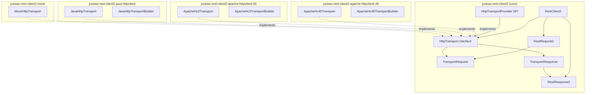

# RestClient2 Transport Abstraction Plan

## Problem Statement

The current `RestClient` in [`juneau-rest-client`](../juneau-rest/juneau-rest-client/pom.xml) is tightly coupled to Apache HttpClient 4.5.14:
- `RestClient` directly extends `BeanContextable` and **implements `org.apache.http.client.HttpClient`**
- `RestRequest` implements `HttpUriRequest` and wraps `HttpRequestBase` / `HttpEntityEnclosingRequestBase`
- `RestResponse` implements `org.apache.http.HttpResponse`
- `ResponseContent` implements `org.apache.http.HttpEntity`
- The `RestClient.Builder` exposes 40+ Apache HC-specific configuration methods (`httpClientBuilder()`, `connectionManager()`, `defaultRequestConfig()`, etc.)
- The `RestCallHandler` interface uses Apache types: `HttpResponse run(HttpHost, HttpRequest, HttpContext)`

The `juneau-rest-common` module also depends on `httpcore` 4.4.16, using `org.apache.http.Header`, `NameValuePair`, `HttpEntity`, `StatusLine`, etc. as foundational types across ~185 classes.

## Architecture Overview



## Module Structure

All new modules under `juneau-rest/`:

### 1. `juneau-rest-client2` (Core)

- **Dependencies**: `juneau-marshall` (serialization/parsing), `juneau-assertions`. **No** `httpcore` or `httpclient` dependency.
- **Package**: `org.apache.juneau.rest.client2`
- **Contains**: Transport abstractions, RestClient2, RestRequest2, RestResponse2, interceptors, remote proxy support, header/body types

### 2. `juneau-rest-client2-apache-httpclient-45`

- **Dependencies**: `juneau-rest-client2`, `org.apache.httpcomponents:httpclient:4.5.14`
- **Package**: `org.apache.juneau.rest.client2.apache.hc45`
- **Contains**: `ApacheHc45Transport`, `ApacheHc45TransportBuilder`

### 3. `juneau-rest-client2-apache-httpclient-50`

- **Dependencies**: `juneau-rest-client2`, `org.apache.hc.client5:httpclient5:5.4.x`
- **Package**: `org.apache.juneau.rest.client2.apache.hc5`
- **Contains**: `ApacheHc5Transport`, `ApacheHc5TransportBuilder`

### 4. `juneau-rest-client2-java-httpclient`

- **Dependencies**: `juneau-rest-client2` (requires Java 11+)
- **Package**: `org.apache.juneau.rest.client2.java`
- **Contains**: `JavaHttpTransport`, `JavaHttpTransportBuilder`

### 5. `juneau-rest-client2-mock`

- **Dependencies**: `juneau-rest-client2`, `juneau-rest-server`
- **Package**: `org.apache.juneau.rest.client2.mock`
- **Contains**: `MockHttpTransport`, `MockRestClient2`

---

## Transport Abstraction Layer Design

### Core Interfaces (in `juneau-rest-client2`)

#### `HttpTransport`

The single point of abstraction replacing `org.apache.http.client.HttpClient`:

```java
public interface HttpTransport extends Closeable {
    TransportResponse send(TransportRequest request) throws TransportException;
}
```

#### `TransportRequest`

Immutable request object built by `RestRequest2`, consumed by transport implementations. Uses only JDK types:

```java
public class TransportRequest {
    private final String method;          // GET, POST, etc.
    private final URI uri;                // Full resolved URI
    private final List<TransportHeader> headers;
    private final TransportBody body;     // null for GET/HEAD/DELETE
    // Getters, static builder
}
```

#### `TransportResponse`

Response returned by transport, wrapped by `RestResponse2`:

```java
public class TransportResponse implements Closeable {
    private final int statusCode;
    private final String reasonPhrase;
    private final List<TransportHeader> headers;
    private final TransportBody body;
    // Getters
}
```

#### `TransportHeader`

Simple immutable name-value pair using only JDK types:

```java
public class TransportHeader {
    private final String name;
    private final String value;
    // Constructor, getters, factory methods
}
```

#### `TransportBody`

Body abstraction for both requests and responses:

```java
public interface TransportBody {
    InputStream asInputStream() throws IOException;
    long getContentLength();    // -1 if unknown
    String getContentType();    // MIME type, null if unknown
    boolean isRepeatable();
    void writeTo(OutputStream out) throws IOException;
}
```

#### `HttpTransportBuilder`

Common configuration interface for transport builders:

```java
public interface HttpTransportBuilder {
    HttpTransportBuilder connectTimeout(Duration timeout);
    HttpTransportBuilder readTimeout(Duration timeout);
    HttpTransportBuilder sslContext(SSLContext sslContext);
    HttpTransportBuilder hostnameVerifier(HostnameVerifier verifier);
    HttpTransportBuilder proxy(URI proxyUri);
    HttpTransportBuilder proxyCredentials(String username, String password);
    HttpTransportBuilder maxConnections(int max);
    HttpTransportBuilder maxConnectionsPerRoute(int max);
    HttpTransportBuilder followRedirects(boolean follow);
    HttpTransportBuilder connectionTimeToLive(Duration ttl);
    HttpTransportBuilder defaultCredentials(String username, String password);
    HttpTransport build();
}
```

#### `HttpTransportProvider` (SPI)

ServiceLoader-based auto-discovery of transport implementations:

```java
public interface HttpTransportProvider {
    int priority();  // Higher wins when multiple providers on classpath
    String name();   // e.g., "apache-hc45", "java-native"
    HttpTransportBuilder createBuilder();
}
```

Registered via `META-INF/services/org.apache.juneau.rest.client2.HttpTransportProvider`.

#### `TransportException`

Transport-layer exception wrapping I/O and protocol errors:

```java
public class TransportException extends IOException {
    private final TransportResponse response; // null if no response received
    // Constructors
}
```

---

## RestClient2 Design

### `RestClient2`

The main client class. Key differences from current `RestClient`:
- **Does NOT implement `org.apache.http.client.HttpClient`**
- Composes an `HttpTransport` instead of extending/wrapping `CloseableHttpClient`
- Preserves all Juneau-specific features: serialization, parsing, interceptors, remote proxies

```java
public class RestClient2 extends BeanContextable implements Closeable {

    // Request creation methods (same fluent API as current RestClient)
    public RestRequest2 get(Object uri);
    public RestRequest2 post(Object uri);
    public RestRequest2 post(Object uri, Object body);
    public RestRequest2 put(Object uri);
    public RestRequest2 put(Object uri, Object body);
    public RestRequest2 patch(Object uri, Object body);
    public RestRequest2 delete(Object uri);
    public RestRequest2 head(Object uri);
    public RestRequest2 options(Object uri);
    public RestRequest2 request(String method, Object uri);
    public RestRequest2 formPost(Object uri);
    public RestRequest2 formPost(Object uri, Object body);

    // Remote proxy support (preserved)
    public <T> T getRemote(Class<T> interfaceClass);
    public <T> T getRemote(Class<T> interfaceClass, Object rootUrl);
    public <T> T getRrpcInterface(Class<T> interfaceClass);

    // Transport access
    public HttpTransport getTransport();

    // Lifecycle
    public void close() throws IOException;
    public void closeQuietly();

    // Builder
    public static Builder create();
}
```

### `RestClient2.Builder`

Builder preserves Juneau configuration while abstracting transport configuration:

```java
public static class Builder extends BeanContextable.Builder {

    // --- Transport configuration ---
    public Builder transport(HttpTransport transport);      // Use pre-built transport
    public Builder transportBuilder(HttpTransportBuilder b); // Use builder for lazy config

    // --- Common HTTP configuration (delegated to transport builder) ---
    public Builder connectTimeout(Duration timeout);
    public Builder readTimeout(Duration timeout);
    public Builder sslContext(SSLContext sslContext);
    public Builder hostnameVerifier(HostnameVerifier verifier);
    public Builder proxy(URI proxy);
    public Builder proxy(String host, int port);
    public Builder maxConnections(int max);
    public Builder maxConnectionsPerRoute(int max);
    public Builder followRedirects(boolean follow);
    public Builder connectionTimeToLive(Duration ttl);
    public Builder auth(String host, int port, String user, String pass);

    // --- Juneau-specific configuration (same as current) ---
    public Builder json();
    public Builder json5();
    public Builder xml();
    public Builder html();
    public Builder plainText();
    public Builder msgPack();
    public Builder uon();
    public Builder urlEnc();
    public Builder openApi();
    public Builder universal();

    public Builder serializer(Serializer s);
    public Builder parser(Parser p);
    public Builder marshaller(Marshaller m);
    public Builder partSerializer(Class<? extends HttpPartSerializer> c);
    public Builder partParser(Class<? extends HttpPartParser> c);

    public Builder rootUrl(Object url);
    public Builder headers(TransportHeader... headers);
    public Builder header(String name, String value);
    public Builder queryData(String name, String value);
    public Builder formData(String name, String value);

    public Builder interceptors(RestCallInterceptor2... interceptors);
    public Builder errorCodes(Predicate<Integer> errorCodes);
    public Builder executorService(ExecutorService es, boolean shutdownOnClose);
    public Builder logger(Logger logger);
    public Builder logRequests(DetailLevel detail, Level level, BiPredicate<RestRequest2, RestResponse2> test);

    public RestClient2 build();
}
```

If no transport is explicitly configured, `build()` uses `ServiceLoader` to find the highest-priority `HttpTransportProvider` on the classpath and creates a transport from it with the accumulated common configuration.

### `RestRequest2`

Request builder -- similar API to current `RestRequest` but builds `TransportRequest` instead of `HttpRequestBase`:

```java
public class RestRequest2 implements Closeable {
    // Fluent configuration
    public RestRequest2 header(String name, Object value);
    public RestRequest2 headers(TransportHeader... headers);
    public RestRequest2 queryData(String name, Object value);
    public RestRequest2 formData(String name, Object value);
    public RestRequest2 pathData(String name, Object value);
    public RestRequest2 content(Object body);
    public RestRequest2 contentString(String body);
    public RestRequest2 serializer(Serializer s);
    public RestRequest2 parser(Parser p);

    // Execution
    public RestResponse2 run() throws RestCallException;
    public RestResponse2 complete() throws RestCallException;

    // Async
    public CompletableFuture<RestResponse2> runFuture();
    public CompletableFuture<RestResponse2> completeFuture();
}
```

The `run()` method:
1. Resolves URI (root URL + path + query params + path vars)
2. Selects serializer based on Content-Type
3. Serializes body into `TransportBody`
4. Builds `TransportRequest` with headers and body
5. Calls `HttpTransport.send(transportRequest)`
6. Wraps `TransportResponse` in `RestResponse2`

### `RestResponse2`

Response wrapper -- no longer implements `org.apache.http.HttpResponse`:

```java
public class RestResponse2 implements AutoCloseable {
    public int getStatusCode();
    public String getReasonPhrase();
    public ResponseContent2 getContent();
    public ResponseHeader2 getHeader(String name);
    public List<ResponseHeader2> getHeaders();
    public List<ResponseHeader2> getHeaders(String name);

    // Assertions (preserved from current API)
    public FluentResponseStatusLineAssertion2 assertStatus();
    public FluentResponseHeaderAssertion2 assertHeader(String name);
    public FluentResponseBodyAssertion2 assertContent();

    // Convenience
    public <T> T as(Class<T> type);
    public String asString();
}
```

### `RestCallInterceptor2`

Lifecycle interceptor without Apache types:

```java
public interface RestCallInterceptor2 {
    default void onInit(RestRequest2 req) throws Exception {}
    default void onConnect(RestRequest2 req, RestResponse2 res) throws Exception {}
    default void onClose(RestRequest2 req, RestResponse2 res) throws Exception {}
}
```

---

## Default Transport Implementations

### 1. Apache HttpClient 4.5 (`ApacheHc45Transport`)

Wraps `org.apache.http.impl.client.CloseableHttpClient`. Provides the most feature-rich implementation matching current behavior.

**Key conversions:**
- `TransportRequest` -> `HttpRequestBase` / `HttpEntityEnclosingRequestBase` (with `URI`, headers, entity)
- `HttpResponse` -> `TransportResponse` (status code, headers, entity->body)

**Builder extras** (transport-specific configuration accessible via casting):

```java
public class ApacheHc45TransportBuilder implements HttpTransportBuilder {
    // Standard methods from HttpTransportBuilder...

    // HC 4.5-specific
    public ApacheHc45TransportBuilder httpClientBuilder(HttpClientBuilder b);
    public ApacheHc45TransportBuilder connectionManager(HttpClientConnectionManager cm);
    public ApacheHc45TransportBuilder defaultRequestConfig(RequestConfig rc);
    public ApacheHc45TransportBuilder retryHandler(HttpRequestRetryHandler h);
    public ApacheHc45TransportBuilder redirectStrategy(RedirectStrategy s);
    public ApacheHc45TransportBuilder cookieStore(CookieStore cs);
    public ApacheHc45TransportBuilder requestInterceptor(HttpRequestInterceptor i);
    public ApacheHc45TransportBuilder responseInterceptor(HttpResponseInterceptor i);
}
```

**Supported features:**
- Connection pooling (`PoolingHttpClientConnectionManager`)
- Basic/Digest/NTLM authentication
- Cookie management
- HTTP/1.1
- Proxy with authentication
- SSL/TLS with custom `SSLContext` and `HostnameVerifier`
- Request retry
- Redirect strategies
- Connection keep-alive and time-to-live
- HTTP request/response interceptors

### 2. Apache HttpClient 5.x (`ApacheHc5Transport`)

Wraps `org.apache.hc.client5.http.impl.classic.CloseableHttpClient`.

**Key conversions:**
- `TransportRequest` -> `org.apache.hc.core5.http.ClassicHttpRequest`
- `org.apache.hc.core5.http.ClassicHttpResponse` -> `TransportResponse`

**Builder extras:**

```java
public class ApacheHc5TransportBuilder implements HttpTransportBuilder {
    // Standard methods...

    // HC 5-specific
    public ApacheHc5TransportBuilder httpClientBuilder(HttpClientBuilder b);
    public ApacheHc5TransportBuilder connectionManager(PoolingHttpClientConnectionManager cm);
    public ApacheHc5TransportBuilder h2Upgrade(boolean enable);  // HTTP/2 upgrade
    public ApacheHc5TransportBuilder retryStrategy(HttpRequestRetryStrategy s);
    public ApacheHc5TransportBuilder redirectStrategy(RedirectStrategy s);
    public ApacheHc5TransportBuilder cookieStore(CookieStore cs);
    public ApacheHc5TransportBuilder tlsStrategy(TlsStrategy s);
}
```

**Supported features:**
- Everything in HC 4.5 plus:
- HTTP/2 (h2c upgrade, ALPN)
- Async execution support
- Improved connection management
- Content-Length auto-detection
- Better timeout control (separate connect, response, socket)
- Improved caching

### 3. Java Native HttpClient (`JavaHttpTransport`)

Wraps `java.net.http.HttpClient` (Java 11+). Zero third-party dependencies.

**Key conversions:**
- `TransportRequest` -> `java.net.http.HttpRequest`
- `java.net.http.HttpResponse<InputStream>` -> `TransportResponse`

**Builder extras:**

```java
public class JavaHttpTransportBuilder implements HttpTransportBuilder {
    // Standard methods...

    // Java native-specific
    public JavaHttpTransportBuilder httpClient(java.net.http.HttpClient client);
    public JavaHttpTransportBuilder httpClientBuilder(java.net.http.HttpClient.Builder b);
    public JavaHttpTransportBuilder version(HttpClient.Version version);  // HTTP/1.1 or HTTP/2
    public JavaHttpTransportBuilder authenticator(Authenticator a);
    public JavaHttpTransportBuilder cookieHandler(CookieHandler ch);
    public JavaHttpTransportBuilder executor(Executor e);
    public JavaHttpTransportBuilder priority(int priority);  // HTTP/2 priority
}
```

**Supported features:**
- HTTP/1.1 and HTTP/2 natively
- Async execution (`sendAsync`)
- Proxy
- SSL/TLS via `SSLContext`
- Cookie handling via `CookieHandler`
- Redirect policies
- Authentication via `Authenticator`
- No connection pooling configuration (managed internally by JDK)

**Limitations vs Apache:**
- No per-route connection limits
- No request/response interceptors
- No retry handler (must implement at transport level)
- Limited cookie management

### 4. Mock Transport (`MockHttpTransport`)

Routes requests directly to a Juneau `RestContext` without network I/O:

```java
public class MockHttpTransport implements HttpTransport {
    private final RestContext restContext;

    public TransportResponse send(TransportRequest request) {
        // Convert TransportRequest -> MockServletRequest
        // Execute against RestContext
        // Convert MockServletResponse -> TransportResponse
    }
}
```

This replaces the current `MockRestClient` which extends `RestClient` and implements `HttpClientConnection`. The new design is cleaner -- mocking is just another transport implementation.

---

## Header/Part Type Strategy

### Problem

The current `juneau-rest-common` module uses `org.apache.http.Header` and `org.apache.http.NameValuePair` as the base interfaces for all header and part types (~185 classes). The new core module must not depend on these.

### Solution

Define lightweight header/part interfaces in `juneau-rest-client2`:

```java
// Already defined above
public class TransportHeader {
    String name;
    String value;
}
```

For the RestClient2 public API, use simple `String name, Object value` pairs that are serialized via `HttpPartSerializer` (same as current). Rich typed headers (like `Accept`, `ContentType`) can still be used -- they just need to implement a simple `Named` interface or provide `toString()`.

The existing `juneau-rest-common` header classes can be used with RestClient2 via adapter methods:

```java
// RestRequest2 accepts both styles:
req.header("Accept", "application/json");
req.header(Accept.of("application/json"));  // Via Headerable or toString()
```

---

## Migration Path

The existing `juneau-rest-client` module remains **unchanged** and fully supported. Users migrate at their own pace:

1. **Phase 1 (this plan)**: Ship `juneau-rest-client2` + transport modules alongside existing client
2. **Phase 2 (future)**: Deprecate `juneau-rest-client` in a future release
3. **Phase 3 (future)**: Remove `juneau-rest-client` in a subsequent major version

---

## Key Files to Create

### Core module (`juneau-rest-client2`)
- `pom.xml`
- `src/main/java/org/apache/juneau/rest/client2/`
  - `HttpTransport.java` -- transport interface
  - `HttpTransportBuilder.java` -- transport builder interface
  - `HttpTransportProvider.java` -- SPI interface
  - `TransportRequest.java` -- request DTO
  - `TransportResponse.java` -- response DTO
  - `TransportHeader.java` -- header DTO
  - `TransportBody.java` -- body interface
  - `TransportException.java` -- transport exception
  - `RestClient2.java` -- main client class + `Builder`
  - `RestRequest2.java` -- request builder
  - `RestResponse2.java` -- response wrapper
  - `ResponseContent2.java` -- response body accessor
  - `ResponseHeader2.java` -- response header accessor
  - `RestCallInterceptor2.java` -- lifecycle interceptor
  - `RestCallException.java` -- client exception
  - `remote/` -- remote proxy support classes (ported from current)
  - `assertion/` -- assertion classes (ported from current)
- `src/main/resources/META-INF/services/` (empty, populated by impl modules)

### Apache HC 4.5 module (`juneau-rest-client2-apache-httpclient-45`)
- `pom.xml`
- `src/main/java/org/apache/juneau/rest/client2/apache/hc45/`
  - `ApacheHc45Transport.java`
  - `ApacheHc45TransportBuilder.java`
  - `ApacheHc45TransportProvider.java`
- `src/main/resources/META-INF/services/org.apache.juneau.rest.client2.HttpTransportProvider`

### Apache HC 5.x module (`juneau-rest-client2-apache-httpclient-50`)
- `pom.xml`
- `src/main/java/org/apache/juneau/rest/client2/apache/hc5/`
  - `ApacheHc5Transport.java`
  - `ApacheHc5TransportBuilder.java`
  - `ApacheHc5TransportProvider.java`
- `src/main/resources/META-INF/services/org.apache.juneau.rest.client2.HttpTransportProvider`

### Java Native module (`juneau-rest-client2-java-httpclient`)
- `pom.xml`
- `src/main/java/org/apache/juneau/rest/client2/java/`
  - `JavaHttpTransport.java`
  - `JavaHttpTransportBuilder.java`
  - `JavaHttpTransportProvider.java`
- `src/main/resources/META-INF/services/org.apache.juneau.rest.client2.HttpTransportProvider`

### Mock module (`juneau-rest-client2-mock`)
- `pom.xml`
- `src/main/java/org/apache/juneau/rest/client2/mock/`
  - `MockHttpTransport.java`
  - `MockRestClient2.java`
  - `MockRestClient2.Builder`
- `src/main/resources/META-INF/services/org.apache.juneau.rest.client2.HttpTransportProvider`

---

## Implementation Priority

- **Priority 1**: `juneau-rest-client2` (core) -- Foundation; all other modules depend on it
- **Priority 2**: `juneau-rest-client2-apache-httpclient-45` -- Matches current behavior, easiest to validate
- **Priority 3**: `juneau-rest-client2-mock` -- Needed for testing all other modules
- **Priority 4**: `juneau-rest-client2-java-httpclient` -- Zero-dependency option, high demand
- **Priority 5**: `juneau-rest-client2-apache-httpclient-50` -- Modern Apache client, can follow later
